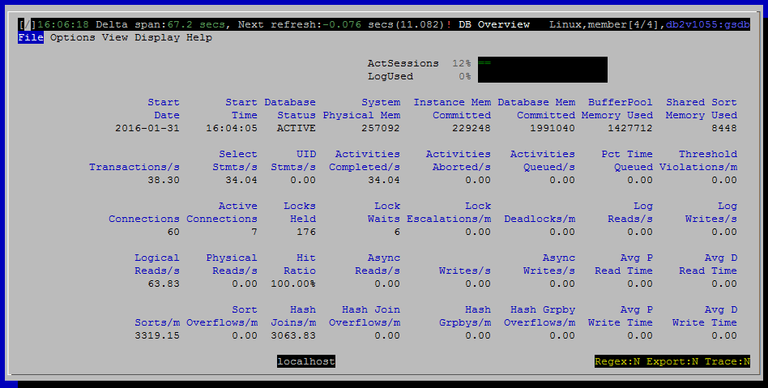

<h2>Purpose</h2>

The overview tells you at a glance how busy the monitored database is.  It provides basic information about the current level of activity.  For example:

<ul ><li>Number of connections</li><li>Memory consumption</li><li>I/O efficiency</li><li>Indicators of contention such as high lock wait time, lock escalations or deadlocks.</li></ul>

This is the view you see when you start dsmtop.

<h2>Metrics Shown</h2>

The DB Overview is presented in a tile layout, rather than the grid layout used for most views.  Each metrics appears with a short label above it.

<u>Start Date</u>

The date the monitored database was activated.

Source: <a href="http://www-01.ibm.com/support/knowledgecenter/SSEPGG_10.5.0/com.ibm.db2.luw.sql.rtn.doc/doc/r0060769.html?cp=SSEPGG_10.5.0&amp;lang=en">mon_get_database</a>.<a href="http://www-01.ibm.com/support/knowledgecenter/SSEPGG_10.5.0/com.ibm.db2.luw.admin.mon.doc/doc/r0001154.html?lang=en" style="font-family:'courier new' , 'courier' , monospace;line-height:1.5">db_conn_time</a>

<u>Start Time</u>

The time the monitored database was activated.

Source: <a href="http://www-01.ibm.com/support/knowledgecenter/SSEPGG_10.5.0/com.ibm.db2.luw.sql.rtn.doc/doc/r0060769.html?cp=SSEPGG_10.5.0&amp;lang=en" style="text-decoration:underline;color:rgb( 5 , 56 , 107 );font-family:'courier new' , 'courier' , monospace">mon_get_database</a>.<a href="http://www-01.ibm.com/support/knowledgecenter/SSEPGG_10.5.0/com.ibm.db2.luw.admin.mon.doc/doc/r0001154.html?lang=en" style="line-height:1.5;font-family:'courier new' , 'courier' , monospace">db_conn_time</a>

<u>Database Status</u>

According to the Knowledge Center, the possible values for this field are:

<ul ><li style="color:black;margin-bottom:0.0001pt;line-height:normal">ACTIVE</li><li style="color:black;margin-bottom:0.0001pt;line-height:normal">QUIESCE_PEND</li><li style="color:black;margin-bottom:0.0001pt;line-height:normal">QUIESCED</li><li style="color:black;margin-bottom:0.0001pt;line-height:normal">ROLLFWD</li><li style="color:black;margin-bottom:0.0001pt;line-height:normal">ACTIVE_STANDBY</li><li style="color:black;margin-bottom:0.0001pt;line-height:normal">STANDBY</li></ul>

This field is present for compatibility with db2top.  Most of these states will prevent dsmtop from connecting, so you will never see them.

Source: <a href="http://www-01.ibm.com/support/knowledgecenter/SSEPGG_10.5.0/com.ibm.db2.luw.sql.rtn.doc/doc/r0060769.html?cp=SSEPGG_10.5.0&amp;lang=en" style="text-decoration:underline;color:rgb( 5 , 56 , 107 );font-family:'courier new' , 'courier' , monospace">mon_get_database</a>.<a href="http://www-01.ibm.com/support/knowledgecenter/SSEPGG_10.5.0/com.ibm.db2.luw.admin.mon.doc/doc/r0001156.html?lang=en">db_status</a>

<u>System Physical Mem</u>

Total physical memory on this host.

Source: <a href="http://www-01.ibm.com/support/knowledgecenter/SSEPGG_10.5.0/com.ibm.db2.luw.sql.rtn.doc/doc/r0059355.html?cp=SSEPGG_10.5.0%2F3-6-1-3-7-7&amp;lang=en">env_get_system_resources</a>.<a href="http://www-01.ibm.com/support/knowledgecenter/SSEPGG_10.5.0/com.ibm.db2.luw.admin.mon.doc/doc/r0060193.html?lang=en" style="font-family:'courier new' , 'courier' , monospace">memory_total</a>

<u>Instance Mem Committed</u>

Memory committed, as opposed to used, is a better measure of the memory footprint of DB2.  That is, how much memory is committed by the OS for use by DB2 and hence unavailable for other processes.

Source: <a href="http://www-01.ibm.com/support/knowledgecenter/SSEPGG_10.5.0/com.ibm.db2.luw.sql.rtn.doc/doc/r0059463.html?cp=SSEPGG_10.5.0%2F3-6-1-3-10-38&amp;lang=en">mon_get_memory_set</a>

sum(<a href="http://www-01.ibm.com/support/knowledgecenter/SSEPGG_10.5.0/com.ibm.db2.luw.admin.mon.doc/doc/r0059448.html?cp=SSEPGG_10.5.0&amp;lang=en">memory_set_committed</a>) for all DBMS memory sets

<u>Database Mem Committed</u>

The portion of memory committed for just this database, as opposed to the whole instance.

Source: <a href="http://www-01.ibm.com/support/knowledgecenter/SSEPGG_10.5.0/com.ibm.db2.luw.sql.rtn.doc/doc/r0059463.html?cp=SSEPGG_10.5.0%2F3-6-1-3-10-38&amp;lang=en">mon_get_memory_set</a>

sum(<a href="http://www-01.ibm.com/support/knowledgecenter/SSEPGG_10.5.0/com.ibm.db2.luw.admin.mon.doc/doc/r0059448.html?cp=SSEPGG_10.5.0&amp;lang=en" style="font-family:'courier new' , 'courier' , monospace">memory_set_committed</a>) for all DATABASE memory sets

<u>Buffer Pool Memory Used</u>

Buffer pool memory is typically the largest component of memory usage by DB2.  So it is broken out separately here.

Source: <a href="http://www-01.ibm.com/support/knowledgecenter/SSEPGG_10.5.0/com.ibm.db2.luw.sql.rtn.doc/doc/r0059464.html?cp=SSEPGG_10.5.0%2F3-6-1-3-10-37&amp;lang=en">mon_get_memory_pool</a>

sum(<a href="http://www-01.ibm.com/support/knowledgecenter/SSEPGG_10.5.0/com.ibm.db2.luw.admin.mon.doc/doc/r0059534.html?lang=en">memory_pool_used</a>) for all BP memory pools

<u>Shared Sort Memory Used</u>

Source: <a href="http://www-01.ibm.com/support/knowledgecenter/SSEPGG_10.5.0/com.ibm.db2.luw.sql.rtn.doc/doc/r0059464.html?cp=SSEPGG_10.5.0%2F3-6-1-3-10-37&amp;lang=en" style="font-family:'helvetica neue' , 'helvetica' , 'arial' , sans-serif">mon_get_memory_pool</a>

sum(<a href="http://www-01.ibm.com/support/knowledgecenter/SSEPGG_10.5.0/com.ibm.db2.luw.admin.mon.doc/doc/r0059534.html?lang=en" style="text-decoration:underline;color:rgb( 5 , 56 , 107 );font-family:'courier new' , 'courier' , monospace">memory_pool_used</a>) for all SHARED_SORT memory pools

<u>Transactions / s</u>

Source: <a href="http://www-01.ibm.com/support/knowledgecenter/SSEPGG_10.5.0/com.ibm.db2.luw.sql.rtn.doc/doc/r0060769.html?cp=SSEPGG_10.5.0&amp;lang=en" style="text-decoration:underline;color:rgb( 5 , 56 , 107 );font-family:'courier new' , 'courier' , monospace">mon_get_database</a>

<a href="http://www-01.ibm.com/support/knowledgecenter/SSEPGG_10.5.0/com.ibm.db2.luw.admin.mon.doc/doc/r0056527.html?cp=SSEPGG_10.5.0&amp;lang=en">total_app_commits</a> + <a href="http://www-01.ibm.com/support/knowledgecenter/SSEPGG_10.5.0/com.ibm.db2.luw.admin.mon.doc/doc/r0056528.html?cp=SSEPGG_10.5.0&amp;lang=en">total_app_rollbacks</a>

<u>Select Stmts / s</u>

Source: <a href="http://www-01.ibm.com/support/knowledgecenter/SSEPGG_10.5.0/com.ibm.db2.luw.sql.rtn.doc/doc/r0060769.html?cp=SSEPGG_10.5.0&amp;lang=en" style="text-decoration:underline;color:rgb( 5 , 56 , 107 );font-family:'courier new' , 'courier' , monospace">mon_get_database</a>.<a href="http://www-01.ibm.com/support/knowledgecenter/SSEPGG_10.5.0/com.ibm.db2.luw.admin.mon.doc/doc/r0001334.html?lang=en">select_sql_stmts</a>

<u>UID /s</u>

Insert + update + delete statements / second.

Source: <a href="http://www-01.ibm.com/support/knowledgecenter/SSEPGG_10.5.0/com.ibm.db2.luw.sql.rtn.doc/doc/r0060769.html?cp=SSEPGG_10.5.0&amp;lang=en" style="text-decoration:underline;color:rgb( 5 , 56 , 107 );font-family:'courier new' , 'courier' , monospace">mon_get_database</a>.<a href="http://www-01.ibm.com/support/knowledgecenter/SSEPGG_10.5.0/com.ibm.db2.luw.admin.mon.doc/doc/r0001335.html?cp=SSEPGG_10.5.0&amp;lang=en">uid_sql_stmts</a>

<u>Activities Completed / s</u>

The number of activities completed per second is one measure of how much work is being accomplished by the data server.  Activities typically correspond to a query, although there a few additional things that count as an activity including LOAD and stored procedures calls.

Source: <a href="http://www-01.ibm.com/support/knowledgecenter/SSEPGG_10.5.0/com.ibm.db2.luw.sql.rtn.doc/doc/r0053941.html?lang=en" style="font-family:'courier new' , 'courier' , monospace">mon_get_service_subclass</a>.<a href="http://www-01.ibm.com/support/knowledgecenter/SSEPGG_10.5.0/com.ibm.db2.luw.admin.mon.doc/doc/r0054007.html?lang=en">act_completed_total</a>

<u>Activities Aborted / s</u>

This reflects how many activities failed due to errors of some sort, including being cancelled or violating a WLM threshold configured to stop execution.

Source: <a href="http://www-01.ibm.com/support/knowledgecenter/SSEPGG_10.5.0/com.ibm.db2.luw.sql.rtn.doc/doc/r0053941.html?lang=en" style="font-family:'courier new' , 'courier' , monospace">mon_get_service_subclass</a>.<a href="http://www-01.ibm.com/support/knowledgecenter/SSEPGG_10.5.0/com.ibm.db2.luw.admin.mon.doc/doc/r0054006.html?lang=en">act_aborted_total</a>

<u>Activities Queued / s</u>

Source: <a href="http://www-01.ibm.com/support/knowledgecenter/SSEPGG_10.5.0/com.ibm.db2.luw.sql.rtn.doc/doc/r0053941.html?lang=en" style="font-family:'courier new' , 'courier' , monospace">mon_get_service_subclass</a>.<a href="http://www-01.ibm.com/support/knowledgecenter/SSEPGG_10.5.0/com.ibm.db2.luw.admin.mon.doc/doc/r0054062.html?lang=en">wlm_queue_assignments_total</a>

<u>Pct Time Queued</u>

On average, what is the aggregate percentage of time do activities spend queued by WLM, waiting to begin execution.  This is averaged across all activities, including ones that are never queued.

Source: <a href="http://www-01.ibm.com/support/knowledgecenter/SSEPGG_10.5.0/com.ibm.db2.luw.sql.rtn.doc/doc/r0053941.html?lang=en" style="text-decoration:underline;color:rgb( 5 , 56 , 107 );font-family:'courier new' , 'courier' , monospace">mon_get_service_subclass</a>

<a href="http://www-01.ibm.com/support/knowledgecenter/SSEPGG_10.5.0/com.ibm.db2.luw.admin.mon.doc/doc/r0054063.html?cp=SSEPGG_10.5.0&amp;lang=en">wlm_queue_time_total</a> / (<a href="http://www-01.ibm.com/support/knowledgecenter/SSEPGG_10.5.0/com.ibm.db2.luw.admin.mon.doc/doc/r0054060.html?cp=SSEPGG_10.5.0&amp;lang=en">total_rqst_time</a> + <a href="http://www-01.ibm.com/support/knowledgecenter/SSEPGG_10.5.0/com.ibm.db2.luw.admin.mon.doc/doc/r0054017.html?cp=SSEPGG_10.5.0&amp;lang=en">client_idle_wait_time</a>)

<u>Threshold Violations / m</u>

WLM threshold violations are normalized to per minute instead of per second because threshold violations should be infrequent.

Source: <a href="http://www-01.ibm.com/support/knowledgecenter/SSEPGG_10.5.0/com.ibm.db2.luw.sql.rtn.doc/doc/r0053941.html?lang=en" style="font-family:'courier new' , 'courier' , monospace">mon_get_service_subclass</a>.<a href="http://www-01.ibm.com/support/knowledgecenter/SSEPGG_10.5.0/com.ibm.db2.luw.admin.mon.doc/doc/r0056501.html?lang=en">thresh_violations</a>

<u>Connections</u>

Source: <a href="http://www-01.ibm.com/support/knowledgecenter/SSEPGG_10.5.0/com.ibm.db2.luw.sql.rtn.doc/doc/r0060767.html?cp=SSEPGG_10.5.0%2F3-6-1-3-10-12&amp;lang=en">mon_get_agent</a>

Count of all agents where application_handle &lt;&gt; 0 and agent_state = 'ACTIVE'

<u>Active Connections</u>

Source: <a href="http://www-01.ibm.com/support/knowledgecenter/SSEPGG_10.5.0/com.ibm.db2.luw.sql.rtn.doc/doc/r0060767.html?cp=SSEPGG_10.5.0%2F3-6-1-3-10-12&amp;lang=en" style="text-decoration:underline;color:rgb( 5 , 56 , 107 );font-family:'helvetica neue' , 'helvetica' , 'arial' , sans-serif">mon_get_agent</a>

Count of all agents that meet the following conditions:

<ul ><li style='font-family: "helvetica neue", helvetica, arial, sans-serif; margin-left: 40px !important;'>application_handle &lt;&gt; 0</li><li style='font-family: "helvetica neue", helvetica, arial, sans-serif; margin-left: 40px !important;'>agent_state = 'ACTIVE'</li><li style='font-family: "helvetica neue", helvetica, arial, sans-serif; margin-left: 40px !important;'>event_state = 'EXECUTING'</li><li style='font-family: "helvetica neue", helvetica, arial, sans-serif; margin-left: 40px !important;'>event_type = 'PROCESS'</li><li style='font-family: "helvetica neue", helvetica, arial, sans-serif; margin-left: 40px !important;'>agent_state_last_update_time &lt; 15 seconds ago</li></ul>

<u>Locks Held</u>

Source: <a href="http://www-01.ibm.com/support/knowledgecenter/SSEPGG_10.5.0/com.ibm.db2.luw.sql.rtn.doc/doc/r0060769.html?cp=SSEPGG_10.5.0&amp;lang=en" style="text-decoration:underline;color:rgb( 5 , 56 , 107 );font-family:'courier new' , 'courier' , monospace">mon_get_database</a>.<a href="http://www-01.ibm.com/support/knowledgecenter/SSEPGG_10.5.0/com.ibm.db2.luw.admin.mon.doc/doc/r0001281.html?cp=SSEPGG_10.5.0&amp;lang=en">num_locks_held</a>

<u>Lock Waits</u>

Count of the number of agents currently waiting to acquire a lock.

Source: <a href="http://www-01.ibm.com/support/knowledgecenter/SSEPGG_10.5.0/com.ibm.db2.luw.sql.rtn.doc/doc/r0053941.html?lang=en" style="font-family:'courier new' , 'courier' , monospace">mon_get_service_subclass</a>.<a href="http://www-01.ibm.com/support/knowledgecenter/SSEPGG_10.5.0/com.ibm.db2.luw.admin.mon.doc/doc/r0001293.html?lang=en">lock_waits</a>

<u>Lock Escalations / m</u>

The number of times that locks have been escalated from several row locks to a table lock.

Source: <a href="http://www-01.ibm.com/support/knowledgecenter/SSEPGG_10.5.0/com.ibm.db2.luw.sql.rtn.doc/doc/r0053941.html?lang=en" style="font-family:'courier new' , 'courier' , monospace">mon_get_service_subclass</a>.<a href="http://www-01.ibm.com/support/knowledgecenter/SSEPGG_10.5.0/com.ibm.db2.luw.admin.mon.doc/doc/r0001284.html?cp=SSEPGG_10.5.0&amp;lang=en">lock_escals</a>

<u>Deadlocks / m</u>

The number of deadlocks that have occurred.

Deadlocks can be caused by the following situations:

<ul class="ul"  style="margin-top:0.1em;padding-top:0.1em;color:rgb( 0 , 0 , 0 );font-family:sans-serif;font-size:medium;line-height:normal"><li class="li" style="margin-top: 0em; margin-bottom: 0em; margin-left: 0em !important;">

Lock escalations are occurring for the database

</li><li class="li" style="margin-top: 0em; margin-bottom: 0em; margin-left: 0em !important;">

An application may be locking tables explicitly when system-generated row locks may be sufficient

</li><li class="li" style="margin-top: 0em; margin-bottom: 0em; margin-left: 0em !important;">

An application may be using an inappropriate isolation level when binding

</li><li class="li" style="margin-top: 0em; margin-bottom: 0em; margin-left: 0em !important;">

Catalog tables are locked for repeatable read

</li><li class="li" style="margin-top: 0em; margin-bottom: 0em; margin-left: 0em !important;">

Applications are getting the same locks in different orders, resulting in deadlock.

</li></ul>

Source: <a href="http://www-01.ibm.com/support/knowledgecenter/SSEPGG_10.5.0/com.ibm.db2.luw.sql.rtn.doc/doc/r0053941.html?lang=en" style="font-family:'courier new' , 'courier' , monospace">mon_get_service_subclass</a>.<a href="http://www-01.ibm.com/support/knowledgecenter/SSEPGG_10.5.0/com.ibm.db2.luw.admin.mon.doc/doc/r0001283.html?cp=SSEPGG_10.5.0&amp;lang=en">deadlocks</a>

<u>Log Reads / s</u>

Source: <a href="http://www-01.ibm.com/support/knowledgecenter/SSEPGG_10.5.0/com.ibm.db2.luw.sql.rtn.doc/doc/r0059253.html?cp=SSEPGG_10.5.0%2F3-6-1-3-10-61&amp;lang=en" style="text-decoration:underline;color:rgb( 5 , 56 , 107 );font-family:'courier new' , 'courier' , monospace">mon_get_transaction_log</a>.<a href="http://www-01.ibm.com/support/knowledgecenter/SSEPGG_10.5.0/com.ibm.db2.luw.admin.mon.doc/doc/r0001278.html?cp=SSEPGG_10.5.0&amp;lang=en">log_reads</a>

<u>Log Writes / s</u>

Source: <a href="http://www-01.ibm.com/support/knowledgecenter/SSEPGG_10.5.0/com.ibm.db2.luw.sql.rtn.doc/doc/r0059253.html?cp=SSEPGG_10.5.0%2F3-6-1-3-10-61&amp;lang=en">mon_get_transaction_log</a>.<a href="http://www-01.ibm.com/support/knowledgecenter/SSEPGG_10.5.0/com.ibm.db2.luw.admin.mon.doc/doc/r0001279.html?lang=en">log_writes</a>

<u>Logical Reads / s</u>

Source: <a href="http://www-01.ibm.com/support/knowledgecenter/SSEPGG_10.5.0/com.ibm.db2.luw.sql.rtn.doc/doc/r0053941.html?lang=en" style="font-family:'courier new' , 'courier' , monospace">mon_get_service_subclass</a>

<a href="http://www-01.ibm.com/support/knowledgecenter/SSEPGG_10.5.0/com.ibm.db2.luw.admin.mon.doc/doc/r0001235.html?cp=SSEPGG_10.5.0&amp;lang=en" style="font-family:'courier new' , 'courier' , monospace">pool_data_l_reads</a> + <a href="http://www-01.ibm.com/support/knowledgecenter/SSEPGG_10.5.0/com.ibm.db2.luw.admin.mon.doc/doc/r0001238.html?lang=en" style="font-family:'courier new' , 'courier' , monospace">pool_index_l_reads</a> + <a href="http://www-01.ibm.com/support/knowledgecenter/SSEPGG_10.5.0/com.ibm.db2.luw.admin.mon.doc/doc/r0022731.html?lang=en" style="font-family:'courier new' , 'courier' , monospace">pool_xda_l_reads</a> + <a href="http://www.ibm.com/support/knowledgecenter/SSEPGG_10.5.0/com.ibm.db2.luw.admin.mon.doc/doc/r0060763.html?lang=en">pool_col_l_reads</a> +

<a href="http://www.ibm.com/support/knowledgecenter/SSEPGG_10.5.0/com.ibm.db2.luw.admin.mon.doc/doc/r0011302.html?lang=en">pool_temp_data_l_reads </a>+ <a href="http://www.ibm.com/support/knowledgecenter/SSEPGG_10.5.0/com.ibm.db2.luw.admin.mon.doc/doc/r0011303.html?cp=SSEPGG_10.5.0&amp;lang=en">pool_temp_index_l_reads </a>+ <a href="http://www.ibm.com/support/knowledgecenter/SSEPGG_10.5.0/com.ibm.db2.luw.admin.mon.doc/doc/r0022738.html?cp=SSEPGG_10.5.0&amp;lang=en">pool_temp_xda_l_reads </a>+ <a href="http://www.ibm.com/support/knowledgecenter/SSEPGG_10.5.0/com.ibm.db2.luw.admin.mon.doc/doc/r0060873.html?cp=SSEPGG_10.5.0&amp;lang=en">pool_temp_col_l_reads</a>

<u>Physical Reads / s</u>

Source: <a href="http://www-01.ibm.com/support/knowledgecenter/SSEPGG_10.5.0/com.ibm.db2.luw.sql.rtn.doc/doc/r0053941.html?lang=en" style="font-family:'courier new' , 'courier' , monospace">mon_get_service_subclass</a>

pool_data_p_reads + pool_index_p_reads + pool_xda_p_reads +

pool_temp_data_p_reads + pool_temp_index_p_reads + pool_temp_xda_p_reads + pool_col_p_reads + pool_temp_col_p_reads

<u>Hit Ratio</u>

<u>Async Reads / s</u>

Source: <a href="http://www-01.ibm.com/support/knowledgecenter/SSEPGG_10.5.0/com.ibm.db2.luw.sql.rtn.doc/doc/r0060769.html?cp=SSEPGG_10.5.0&amp;lang=en" style="text-decoration:underline;color:rgb( 5 , 56 , 107 );font-family:'courier new' , 'courier' , monospace">mon_get_database</a>

pool_async_data_reads + pool_async_index_reads + pool_async_xda_reads + pool_async_col_reads

<u>Writes / s</u>

Source: <a href="http://www-01.ibm.com/support/knowledgecenter/SSEPGG_10.5.0/com.ibm.db2.luw.sql.rtn.doc/doc/r0053941.html?lang=en" style="font-family:'courier new' , 'courier' , monospace">mon_get_service_subclass</a>.<a href="http://www-01.ibm.com/support/knowledgecenter/SSEPGG_10.5.0/com.ibm.db2.luw.admin.mon.doc/doc/r0001261.html?cp=SSEPGG_10.5.0&amp;lang=en">direct_writes</a>

<u>Async Writes / s</u>

Source: <a href="http://www-01.ibm.com/support/knowledgecenter/SSEPGG_10.5.0/com.ibm.db2.luw.sql.rtn.doc/doc/r0060769.html?cp=SSEPGG_10.5.0&amp;lang=en" style="text-decoration:underline;color:rgb( 5 , 56 , 107 );font-family:'courier new' , 'courier' , monospace">mon_get_database</a>

pool_async_data_writes + pool_async_index_writes + pool_async_xda_writes + pool_async_col_writes

<u>Avg P Read Time</u>

Source: <a href="http://www-01.ibm.com/support/knowledgecenter/SSEPGG_10.5.0/com.ibm.db2.luw.sql.rtn.doc/doc/r0053941.html?lang=en" style="font-family:'courier new' , 'courier' , monospace">mon_get_service_subclass</a>

pool_read_time / (pool_data_p_reads + pool_index_p_reads + pool_xda_p_reads + pool_col_p_reads +

 pool_temp_data_p_reads + pool_temp_index_p_reads + pool_temp_xda_p_reads + pool_temp_col_p_reads)

<u>Avg D Read Time</u>

Source: <a href="http://www-01.ibm.com/support/knowledgecenter/SSEPGG_10.5.0/com.ibm.db2.luw.sql.rtn.doc/doc/r0053941.html?lang=en" style="font-family:'courier new' , 'courier' , monospace">mon_get_service_subclass</a>

direct_read_time / direct_reads

<u>Sorts / m</u>

Source: <a href="http://www-01.ibm.com/support/knowledgecenter/SSEPGG_10.5.0/com.ibm.db2.luw.sql.rtn.doc/doc/r0053941.html?lang=en" style="font-family:'courier new' , 'courier' , monospace">mon_get_service_subclass</a>.total_sorts

<u>Sort Overflows / m</u>

Source: <a href="http://www-01.ibm.com/support/knowledgecenter/SSEPGG_10.5.0/com.ibm.db2.luw.sql.rtn.doc/doc/r0053941.html?lang=en" style="font-family:'courier new' , 'courier' , monospace">mon_get_service_subclass</a>.sort_overflows

<u>Hash Joins / m</u>

Source: <a href="http://www-01.ibm.com/support/knowledgecenter/SSEPGG_10.5.0/com.ibm.db2.luw.sql.rtn.doc/doc/r0053941.html?lang=en" style="font-family:'courier new' , 'courier' , monospace">mon_get_service_subclass</a>.total_hash_joins

<u>Hash Join Overflows / m</u>

Source: <a href="http://www-01.ibm.com/support/knowledgecenter/SSEPGG_10.5.0/com.ibm.db2.luw.sql.rtn.doc/doc/r0053941.html?lang=en" style="font-family:'courier new' , 'courier' , monospace">mon_get_service_subclass</a>.hash_join_overflows

<u>Hash Grpbys / m</u>

Source: <a href="http://www-01.ibm.com/support/knowledgecenter/SSEPGG_10.5.0/com.ibm.db2.luw.sql.rtn.doc/doc/r0053941.html?lang=en" style="font-family:'courier new' , 'courier' , monospace">mon_get_service_subclass</a>.total_hash_grpbys

<u>Hash Grpby Overflows / m</u>

Source: <a href="http://www-01.ibm.com/support/knowledgecenter/SSEPGG_10.5.0/com.ibm.db2.luw.sql.rtn.doc/doc/r0053941.html?lang=en" style="font-family:'courier new' , 'courier' , monospace">mon_get_service_subclass</a>.hash_grpby_overflows

<u>Avg P Write Time</u>

Source: <a href="http://www-01.ibm.com/support/knowledgecenter/SSEPGG_10.5.0/com.ibm.db2.luw.sql.rtn.doc/doc/r0053941.html?lang=en" style="font-family:'courier new' , 'courier' , monospace">mon_get_service_subclass</a>

pool_write_time / (pool_data_writes + pool_index_writes + pool_xda_writes)

<u>Avg D Write Time</u>

Source: <a href="http://www-01.ibm.com/support/knowledgecenter/SSEPGG_10.5.0/com.ibm.db2.luw.sql.rtn.doc/doc/r0053941.html?lang=en" style="font-family:'courier new' , 'courier' , monospace">mon_get_service_subclass</a>

direct_write_time / direct_writes

<h2  style="font-size:1.5em;text-shadow:rgb( 255 , 255 , 255 ) 0px 1px 0px;font-family:'helvetica neue' , 'helvetica' , 'arial' , sans-serif;color:rgb( 0 , 0 , 0 ) !important;padding:2px !important;border:none !important">Default Sort Column</h2>

N / A - this is a tile display, not a grid.

<h2  style="font-size:1.5em;text-shadow:rgb( 255 , 255 , 255 ) 0px 1px 0px;font-family:'helvetica neue' , 'helvetica' , 'arial' , sans-serif;color:rgb( 0 , 0 , 0 ) !important;padding:2px !important;border:none !important">Navigation</h2>

Keyboard navigation: Vd

Dedicated shortcut key: alt-d

<h6>Author: KevinLBeck</h6>