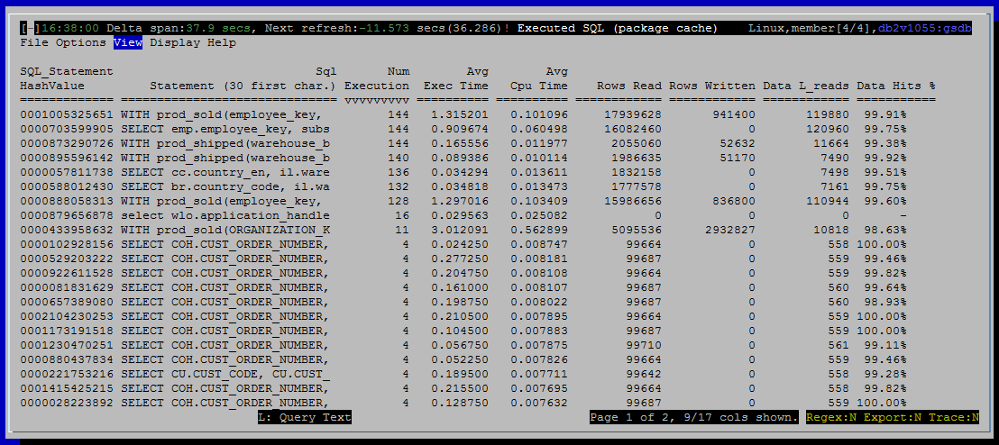

<h2>Purpose</h2>

<h2>Histograms</h2>

(none)

<h2>Summaries (Gauges)</h2>

(none)

<h2>Metrics Shown in Grid</h2>

<u>SQL_Statement HashValue</u>

A hash computed from the text of the SQL statement.

<u>Sql Statement (30 first char.) 
 Num Execution</u>

Number of times this statement has been executed.  This count is reset if a statement falls out of the cache.

Source: <a href="http://www.ibm.com/support/knowledgecenter/en/SSEPGG_10.5.0/com.ibm.db2.luw.admin.mon.doc/doc/c0059017.html">mon_get_pkg_cache_stmt</a>.<a href="http://www.ibm.com/support/knowledgecenter/en/SSEPGG_10.5.0/com.ibm.db2.luw.admin.mon.doc/doc/r0002515.html">num_executions</a>

<u>Exec Time</u>

Source: <a href="http://www.ibm.com/support/knowledgecenter/en/SSEPGG_10.5.0/com.ibm.db2.luw.admin.mon.doc/doc/c0059017.html" style="font-family:'courier new' , 'courier' , monospace">mon_get_pkg_cache_stmt</a>.<a href="http://www.ibm.com/support/knowledgecenter/en/SSEPGG_10.5.0/com.ibm.db2.luw.admin.mon.doc/doc/r0056454.html">stmt_exec_time</a>

 
<u>Avg Exec Time</u>

Source: <a href="http://www.ibm.com/support/knowledgecenter/en/SSEPGG_10.5.0/com.ibm.db2.luw.admin.mon.doc/doc/c0059017.html" style="font-family:'courier new' , 'courier' , monospace">mon_get_pkg_cache_stmt</a>

<a href="http://www.ibm.com/support/knowledgecenter/en/SSEPGG_10.5.0/com.ibm.db2.luw.admin.mon.doc/doc/r0056454.html">stmt_exec_time</a>/ num_exec_with_metrics

 
<u>Cpu Time</u>

Total CPU time consumed by all executions of this statement.

Source: <a href="http://www.ibm.com/support/knowledgecenter/en/SSEPGG_10.5.0/com.ibm.db2.luw.admin.mon.doc/doc/c0059017.html" style="font-family:'courier new' , 'courier' , monospace">mon_get_pkg_cache_stmt</a>.total_cpu_time

 
<u>Avg Cpu Time</u>

Average CPU time consumed by an execution of this statement.

Source: <a href="http://www.ibm.com/support/knowledgecenter/en/SSEPGG_10.5.0/com.ibm.db2.luw.admin.mon.doc/doc/c0059017.html" style="font-family:'courier new' , 'courier' , monospace">mon_get_pkg_cache_stmt</a>

total_cpu_time / num_exec_with_metrics

 
<u>Rows Read</u>

Source: <a href="http://www.ibm.com/support/knowledgecenter/en/SSEPGG_10.5.0/com.ibm.db2.luw.admin.mon.doc/doc/c0059017.html" style="font-family:'courier new' , 'courier' , monospace">mon_get_pkg_cache_stmt</a>.rows_read

 
<u>Rows Written</u>

Source: <a href="http://www.ibm.com/support/knowledgecenter/en/SSEPGG_10.5.0/com.ibm.db2.luw.admin.mon.doc/doc/c0059017.html" style="font-family:'courier new' , 'courier' , monospace">mon_get_pkg_cache_stmt</a>.rows_modified

 
<u>Data L_reads</u>

Source: <a href="http://www.ibm.com/support/knowledgecenter/en/SSEPGG_10.5.0/com.ibm.db2.luw.admin.mon.doc/doc/c0059017.html" style="font-family:'courier new' , 'courier' , monospace">mon_get_pkg_cache_stmt</a>.<a href="http://www-01.ibm.com/support/knowledgecenter/SSEPGG_10.5.0/com.ibm.db2.luw.admin.mon.doc/doc/r0001235.html?cp=SSEPGG_10.5.0&amp;lang=en" style="font-family:'courier new' , 'courier' , monospace">pool_data_l_reads</a>

 
<u>Data Hits %</u>

Approximate hit ratio for data (row based) reads experienced by this query.

This value does not account for data read asynchronously.

Source: <a href="http://www.ibm.com/support/knowledgecenter/en/SSEPGG_10.5.0/com.ibm.db2.luw.admin.mon.doc/doc/c0059017.html" style="font-family:'courier new' , 'courier' , monospace">mon_get_pkg_cache_stmt</a>

(1.0 - pool_data_p_reads / <a href="http://www-01.ibm.com/support/knowledgecenter/SSEPGG_10.5.0/com.ibm.db2.luw.admin.mon.doc/doc/r0001235.html?cp=SSEPGG_10.5.0&amp;lang=en" style="font-family:'courier new' , 'courier' , monospace">pool_data_l_reads</a>) * 100.0

 

<u>Index L_Reads</u>

Source: <a href="http://www.ibm.com/support/knowledgecenter/en/SSEPGG_10.5.0/com.ibm.db2.luw.admin.mon.doc/doc/c0059017.html" style="font-family:'courier new' , 'courier' , monospace">mon_get_pkg_cache_stmt</a>.<a href="http://www-01.ibm.com/support/knowledgecenter/SSEPGG_10.5.0/com.ibm.db2.luw.admin.mon.doc/doc/r0001238.html?lang=en" style="font-family:'courier new' , 'courier' , monospace">pool_index_l_reads</a>

 
<u>Index Hits %</u>

Approximate hit ratio for index reads experienced by this query. 
 This value does not account for index data read asynchronously.

Source: <a href="http://www.ibm.com/support/knowledgecenter/en/SSEPGG_10.5.0/com.ibm.db2.luw.admin.mon.doc/doc/c0059017.html" style="font-family:'courier new' , 'courier' , monospace">mon_get_pkg_cache_stmt</a>

(1.0 - pool_index_p_reads / <a href="http://www-01.ibm.com/support/knowledgecenter/SSEPGG_10.5.0/com.ibm.db2.luw.admin.mon.doc/doc/r0001238.html?lang=en" style="font-family:'courier new' , 'courier' , monospace">pool_index_l_reads</a>) * 100.0

 

<u>Temp L_Reads</u>

Source: <a href="http://www.ibm.com/support/knowledgecenter/en/SSEPGG_10.5.0/com.ibm.db2.luw.admin.mon.doc/doc/c0059017.html" style="font-family:'courier new' , 'courier' , monospace">mon_get_pkg_cache_stmt</a>

<a href="http://www-01.ibm.com/support/knowledgecenter/SSEPGG_10.5.0/com.ibm.db2.luw.admin.mon.doc/doc/r0011302.html?lang=en" style="text-decoration:underline;color:rgb( 5 , 56 , 107 );font-family:'courier new' , 'courier' , monospace">pool_temp_data_l_reads</a> + pool_temp_index_l_reads

 
<u>Temp Hits %</u>

Source: <a href="http://www.ibm.com/support/knowledgecenter/en/SSEPGG_10.5.0/com.ibm.db2.luw.admin.mon.doc/doc/c0059017.html" style="font-family:'courier new' , 'courier' , monospace">mon_get_pkg_cache_stmt</a>

(1.0 - (pool_temp_data_p_reads + pool_temp_index_p_reads) /

(<a href="http://www-01.ibm.com/support/knowledgecenter/SSEPGG_10.5.0/com.ibm.db2.luw.admin.mon.doc/doc/r0011302.html?lang=en" style="text-decoration:underline;color:rgb( 5 , 56 , 107 );font-family:'courier new' , 'courier' , monospace">pool_temp_data_l_reads</a> + pool_temp_index_l_reads)) * 100.0

 

 
<u>Avg Sort Per Exec</u>

Source: <a href="http://www.ibm.com/support/knowledgecenter/en/SSEPGG_10.5.0/com.ibm.db2.luw.admin.mon.doc/doc/c0059017.html" style="font-family:'courier new' , 'courier' , monospace">mon_get_pkg_cache_stmt</a>

total_section_sorts / num_exec_with_metrics

 
<u>Sort Time</u>

Source: <a href="http://www.ibm.com/support/knowledgecenter/en/SSEPGG_10.5.0/com.ibm.db2.luw.admin.mon.doc/doc/c0059017.html" style="font-family:'courier new' , 'courier' , monospace">mon_get_pkg_cache_stmt</a>.total_section_sort_time

<h2>Default Sort Order</h2>

Num Execution (descending)

<h2>Navigation</h2>

Keyboard navigation: VsD

Dedicated shortcut key: alt-D

<h6>Author: KevinLBeck</h6>