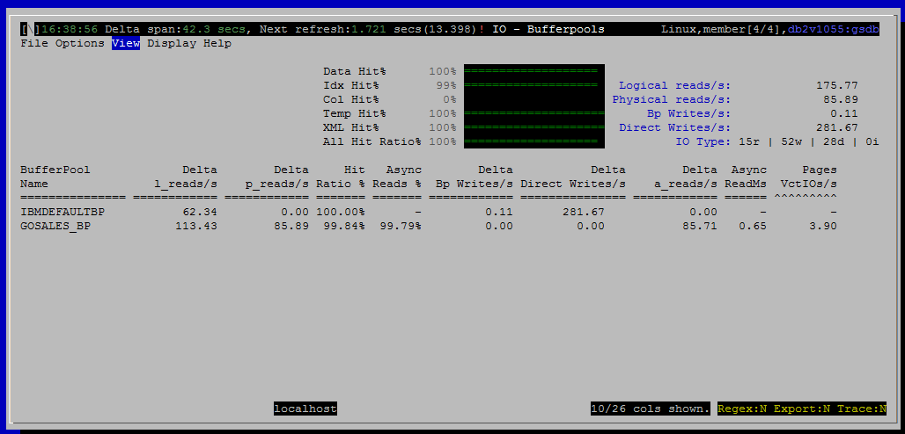

<h2>Purpose</h2>

Buffer pool hit ratios are one of the most fundamental metrics for measuring database performance.  They provide an important overall measure of how effectively the system is exploiting memory to avoid disk IO.  This view shows hit ratios for all buffer pools and for various data types.

<h2>Metrics Shown in Grid</h2>

In the grid portion of the view, we show the hit ratio and key metrics for each buffer pool, including size and number of logical and physical reads.  In the summary and gauges above the grid, we show some of the same metrics summarized across all buffer pools.

<u>BufferPool Name</u>

Source: mon_get_bufferpool.bp_name

 
<u>Delta l_reads/s</u>

Source: mon_get_bufferpool

<a href="http://www-01.ibm.com/support/knowledgecenter/SSEPGG_10.5.0/com.ibm.db2.luw.admin.mon.doc/doc/r0001235.html?cp=SSEPGG_10.5.0&amp;lang=en" style="font-family:'courier new' , 'courier' , monospace">pool_data_l_reads</a> + <a href="http://www-01.ibm.com/support/knowledgecenter/SSEPGG_10.5.0/com.ibm.db2.luw.admin.mon.doc/doc/r0001238.html?lang=en" style="font-family:'courier new' , 'courier' , monospace">pool_index_l_reads</a> + <a href="http://www-01.ibm.com/support/knowledgecenter/SSEPGG_10.5.0/com.ibm.db2.luw.admin.mon.doc/doc/r0022731.html?lang=en" style="font-family:'courier new' , 'courier' , monospace">pool_xda_l_reads</a> + <a href="http://www.ibm.com/support/knowledgecenter/SSEPGG_10.5.0/com.ibm.db2.luw.admin.mon.doc/doc/r0060763.html?lang=en">pool_col_l_reads</a> +

<a href="http://www.ibm.com/support/knowledgecenter/SSEPGG_10.5.0/com.ibm.db2.luw.admin.mon.doc/doc/r0011302.html?lang=en">pool_temp_data_l_reads </a>+ <a href="http://www.ibm.com/support/knowledgecenter/SSEPGG_10.5.0/com.ibm.db2.luw.admin.mon.doc/doc/r0011303.html?cp=SSEPGG_10.5.0&amp;lang=en">pool_temp_index_l_reads </a>+ <a href="http://www.ibm.com/support/knowledgecenter/SSEPGG_10.5.0/com.ibm.db2.luw.admin.mon.doc/doc/r0022738.html?cp=SSEPGG_10.5.0&amp;lang=en">pool_temp_xda_l_reads </a>+ <a href="http://www.ibm.com/support/knowledgecenter/SSEPGG_10.5.0/com.ibm.db2.luw.admin.mon.doc/doc/r0060873.html?cp=SSEPGG_10.5.0&amp;lang=en">pool_temp_col_l_reads</a>

<u>Delta p_reads/s</u>

Source: mon_get_bufferpool

pool_data_p_reads + pool_index_p_reads + pool_xda_p_reads + pool_col_p_reads +

pool_temp_data_p_reads + pool_temp_index_p_reads + pool_temp_xda_p_reads + pool_temp_col_p_reads

 
<u>Hit Ratio %</u>

 
<u>Async Reads %</u>

 
<u>Delta Bp Writes/s</u>

Source: mon_get_bufferpool

pool_data_writes + pool_index_writes + pool_xda_writes + pool_col_writes

 
<u>Delta Direct Writes/s</u>

Source: mon_get_activity.direct_writes

 
<u>Delta a_reads/s 
 Async ReadMs 
 Delta a_writes/s 
 Async WrtMs 
 Async Wrt % 
 # of DBP</u>

For this bufferpool, the number of database partitions for which buffer pool information is being reported.

 
<u>BP Pages 
 Files Closed/s 
 Block IOs/s 
 Pages BlkIOs/s 
 Vectored IOs/s 
 Pages VctIOs/s 
 Victim Pages/s 
 Unread PrefPages/s 
 %Unread PrefPages 
 XDA l_reads/s 
 XDA p_reads/s 
 XDA writes/s</u>

<h2>Default Sort Column</h2>
<h2>Navigation</h2>

Keyboard navigation: VIb

Dedicated shortcut key: alt-b

<h6>Author: KevinLBeck</h6>