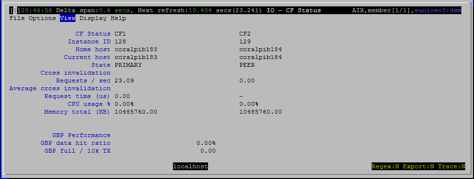

<h2>Purpose</h2>

Show the current status of the cluster caching facility (CF).  A few items about the global buffer pool are also shown here.

 

There are normally 2 CFs, the current primary and a peer.  It is possible, but not recommended, to run with a single CF. 

 

The purpose of the peer CF is for high availability.  If the primary CF fails, then the peer can take over.  The “State” property tracks failover and other HA type events with values such as BECOMING_PRIMARY and CATCHUP.

 

The global buffer pool (GBP) is part of the CF, so a few metrics about it are shown here.  There is only one GBP even if two CFs have been configured.  So items for the GBP are shown in a separate section at the bottom.

 

This view is populated only if the monitored database is pureScale.  For non pureScale databases, dsmtop opens a pop-up with the message “Available only for pureScale”.

<h2>Histograms and Summaries (Gauges)</h2>

(none)

 

<h2>Metrics Shown</h2>

Metrics are presented in two columns, one for each CF.  The name of each CF is shown at the top of its column.  There is a small separate section at the bottom with two metrics for the global buffer pool.

 

<u>Instance ID</u>

The instance ID is a member number, except that CF members are special purpose members that don’t show up in most of the monitoring.

 

Source: <a href="http://www.ibm.com/support/knowledgecenter/en/SSEPGG_10.5.0/com.ibm.db2.luw.sql.rtn.doc/doc/r0056576.html">sysibmadm.env_cf_sys_resources</a>.<a href="http://www.ibm.com/support/knowledgecenter/en/SSEPGG_10.5.0/com.ibm.db2.luw.admin.mon.doc/doc/r0056210.html">id</a>

 

<u>Home Host</u>

The machine which was associated with the member when it was first added to the instance.

 

Source: <a href="http://www.ibm.com/support/knowledgecenter/en/SSEPGG_10.5.0/com.ibm.db2.luw.sql.rtn.doc/doc/r0056718.html">db2_get_instance_info</a>.home_host

 

<u>Current Host</u>

The machine name on which the member is currently running.

 

Source: <a href="http://www.ibm.com/support/knowledgecenter/en/SSEPGG_10.5.0/com.ibm.db2.luw.sql.rtn.doc/doc/r0056718.html">db2_get_instance_info</a>.current_host

<u>State</u>

Normally one CF will be PRIMARY and one PEER.

Possible values are

<ul ><li style="margin-bottom:0in;margin-bottom:0.0001pt;line-height:normal">STOPPED</li><li style="margin-bottom:0in;margin-bottom:0.0001pt;line-height:normal">RESTARTING</li><li style="margin-bottom:0in;margin-bottom:0.0001pt;line-height:normal">BECOMING_PRIMARY</li><li style="margin-bottom:0in;margin-bottom:0.0001pt;line-height:normal">PRIMARY</li><li style="margin-bottom:0in;margin-bottom:0.0001pt;line-height:normal">CATCHUP1</li><li style="margin-bottom:0in;margin-bottom:0.0001pt;line-height:normal">PEER, ERROR</li><li style="margin-bottom:0in;margin-bottom:0.0001pt">UNKNOWN</li></ul>

Source: <a href="http://www.ibm.com/support/knowledgecenter/en/SSEPGG_10.5.0/com.ibm.db2.luw.sql.rtn.doc/doc/r0056718.html">db2_get_instance_info</a>.<a href="http://www.ibm.com/support/knowledgecenter/en/SSEPGG_10.5.0/com.ibm.db2.luw.admin.mon.doc/doc/r0056799.html">state</a>

<u>Cross Invalidation Requests / sec</u>

Source: <a href="http://www.ibm.com/support/knowledgecenter/en/SSEPGG_10.5.0/com.ibm.db2.luw.sql.rtn.doc/doc/r0059806.html">mon_get_cf_cmd</a>.total_cf_requests

Where cf_cmd_name='CrossInvalidate'

<u>Average Cross Invalidation Request Time (us)</u>

Average time for a cross invalidation command.  This should be less than 10 us, more than 20 us indicates a bottleneck.

Source: <a href="http://www.ibm.com/support/knowledgecenter/en/SSEPGG_10.5.0/com.ibm.db2.luw.admin.mon.doc/doc/r0056210.html">mon_get_cf_cmd</a>

total_cf_cmd_time_micro / total_cf_requests

Where cf_cmd_name='CrossInvalidate'

<u>CPU Usage %</u>

Source: <a href="http://www.ibm.com/support/knowledgecenter/en/SSEPGG_10.5.0/com.ibm.db2.luw.sql.rtn.doc/doc/c0061227.html" style="font-family:'helvetica neue' , 'helvetica' , 'arial' , sans-serif;line-height:normal">sysibmadm.env_cf_sys_resources</a>.cpu_usage_total

<u>Memory Total (KB)</u>

Source: <a href="http://www.ibm.com/support/knowledgecenter/en/SSEPGG_10.5.0/com.ibm.db2.luw.sql.rtn.doc/doc/c0061227.html" style="font-family:'helvetica neue' , 'helvetica' , 'arial' , sans-serif;line-height:normal">sysibmadm.env_cf_sys_resources</a>.memory_total

<u>GBP Data Hit Ratio</u>

Source: <a href="http://www.ibm.com/support/knowledgecenter/en/SSEPGG_10.5.0/com.ibm.db2.luw.sql.rtn.doc/doc/r0053941.html">mon_get_service_subclass</a>

100.0 * (pool_data_gbp_l_reads - pool_data_gbp_p_reads) / pool_data_gbp_l_reads

<u>GBP Full / 10k TX</u>

Ideally, this is zero.  Up to about 5 is acceptable.  Higher values indicate possible configuration problems, including:

<ul ><li style="text-indent: -0.25in; margin-bottom: 0.0001pt; line-height: normal; margin-left: 0.5in !important;">GBP configured too small</li><li style="text-indent: -0.25in; margin-bottom: 0.0001pt; line-height: normal; margin-left: 0.5in !important;">Too few castout engines configured</li><li style="text-indent: -0.25in; margin-bottom: 0.0001pt; line-height: normal; margin-left: 0.5in !important;">SOFTMAX set too high</li></ul>

Source: <a href="http://www.ibm.com/support/knowledgecenter/en/SSEPGG_10.5.0/com.ibm.db2.luw.sql.rtn.doc/doc/r0059811.html">mon_get_group_bufferpool</a>

10,000 * (num_gbp_full) / total_app_commits

<h2>Default Sort Column</h2>

N / A – this view is not a grid.

<h2>Navigation</h2>

Keyboard navigation: Vic

Dedicated shortcut key: (none)

<h6>Author: KevinLBeck</h6>