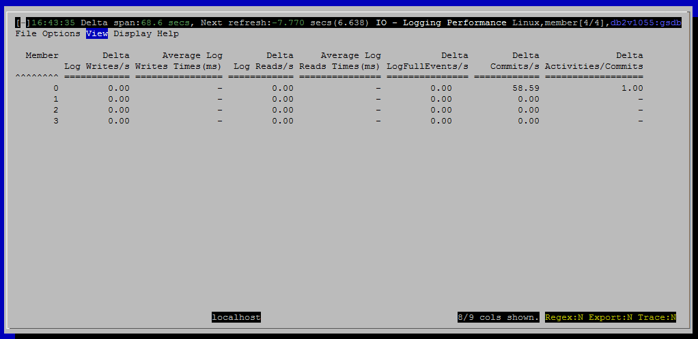

<h2>Purpose</h2>

This view shows the performance of transaction logging.

<h2>Metrics Shown in Grid</h2>

<u>Member</u>

Source: <a href="http://www-01.ibm.com/support/knowledgecenter/SSEPGG_10.5.0/com.ibm.db2.luw.sql.rtn.doc/doc/r0053941.html?lang=en">mon_get_service_subclass</a>.<a href="http://www-01.ibm.com/support/knowledgecenter/SSEPGG_10.5.0/com.ibm.db2.luw.admin.mon.doc/doc/r0054432.html?cp=SSEPGG_10.5.0&amp;lang=en">member</a>

 
<u>Delta Log Writes/s</u>

This is the number of write IO operations per second to the transaction log.

Source: <a href="http://www-01.ibm.com/support/knowledgecenter/SSEPGG_10.5.0/com.ibm.db2.luw.sql.rtn.doc/doc/r0059253.html?cp=SSEPGG_10.5.0%2F3-6-1-3-10-61&amp;lang=en">mon_get_transaction_log</a>.<a href="http://www-01.ibm.com/support/knowledgecenter/SSEPGG_10.5.0/com.ibm.db2.luw.admin.mon.doc/doc/r0011681.html?cp=SSEPGG_10.5.0&amp;lang=en">num_log_write_io</a>

 
<u>Average Log Writes Times(ms)</u>

 
<u>Delta Log Reads/s</u>

Number of read IO operations from the transaction log.  DB2 reads from the transaction log when rolling back a transaction, during log replay and in HADR the primary reads logs to send to the standby.

Source: <a href="http://www-01.ibm.com/support/knowledgecenter/SSEPGG_10.5.0/com.ibm.db2.luw.sql.rtn.doc/doc/r0059253.html?cp=SSEPGG_10.5.0%2F3-6-1-3-10-61&amp;lang=en">mon_get_transaction_log</a>.<a href="http://www-01.ibm.com/support/knowledgecenter/SSEPGG_10.5.0/com.ibm.db2.luw.admin.mon.doc/doc/r0011682.html?cp=SSEPGG_10.5.0&amp;lang=en">num_log_read_io</a>

 
<u>Average Log Reads Times(ms)</u>

 
<u>Delta LogFullEvents/s</u>

Normally, there should be no log buffer full events.  If this is non-zero, and the log buffer size is &lt; 1024 pages, try increasing the log buffer size.

Source: <a href="http://www-01.ibm.com/support/knowledgecenter/SSEPGG_10.5.0/com.ibm.db2.luw.sql.rtn.doc/doc/r0059253.html?cp=SSEPGG_10.5.0%2F3-6-1-3-10-61&amp;lang=en">mon_get_transaction_log</a>.<a href="http://www-01.ibm.com/support/knowledgecenter/SSEPGG_10.5.0/com.ibm.db2.luw.admin.mon.doc/doc/r0011684.html?cp=SSEPGG_10.5.0&amp;lang=en">num_log_buffer_full</a>

 
<u>Delta Commits/s</u>

High numbers of commits drive much IO for transaction logging.  This is not necessarily a bad thing – it can just indicate that the data server is doing a lot of work.  However, it can also indicated excessive numbers of small transactions.

Source: <a href="http://www-01.ibm.com/support/knowledgecenter/SSEPGG_10.5.0/com.ibm.db2.luw.sql.rtn.doc/doc/r0053941.html?lang=en" style="text-decoration:underline;color:rgb( 5 , 56 , 107 )">mon_get_service_subclass</a>.<a href="http://www-01.ibm.com/support/knowledgecenter/SSEPGG_10.5.0/com.ibm.db2.luw.admin.mon.doc/doc/r0056527.html?cp=SSEPGG_10.5.0&amp;lang=en">total_app_commits</a>

 
<u>Delta Activities/Commits</u>

This provides one indication of transaction size.  If the number of activities per commit is close to 1.0, it indicates that you could reduce the load on the logging subsystem by reworking applications to bundle more updates into each transaction (unit of work).  Not all applications are amenable to doing larger transactions.  Also, there is a trade-off: larger transactions hold more locks for longer, possibly leading to lock contention, timeouts and deadlocks.

<u>Average Commits Times(ms)</u>

High values for the average commit processing time can indicate that that the transaction logging subsystem is overloaded.  Coupled with a high value for log writes it can indicate that IO is saturated for the file system where the logs reside.  High values for average log write time without particularly high values for the number of log writes can indicate that logging is competing with other activities for IO.  An important best practice is to put the transactions logs on their own fast, dedicated file system.

<h2>Default Sort Column</h2>

Member, descending

<h2>Navigation</h2>

Keyboard navigation: VIg

Dedicated shortcut key: (none)

<h6>Author: KevinLBeck</h6>