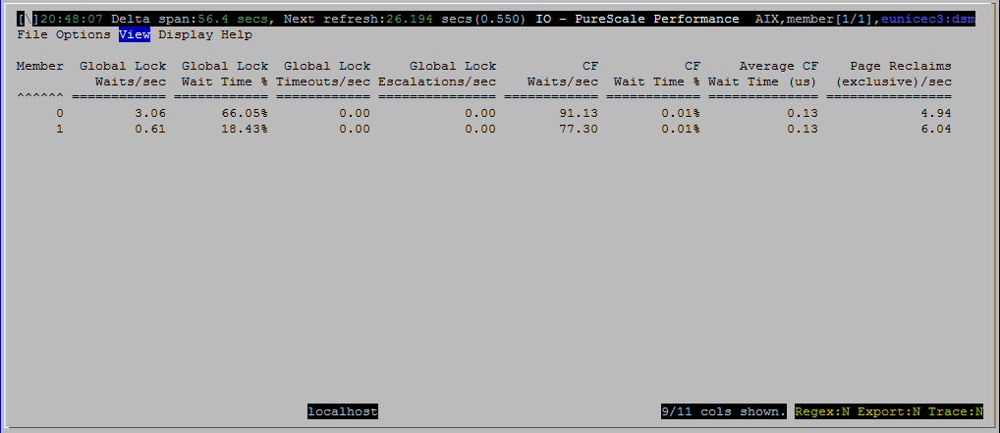

<h2>Purpose</h2>

<h2>Histograms and Summaries (Gauges)</h2>

(none)

<h2>Metrics Shown</h2>

<u>Member</u>

Source: <a href="http://www-01.ibm.com/support/knowledgecenter/SSEPGG_10.5.0/com.ibm.db2.luw.sql.rtn.doc/doc/r0053941.html?lang=en" style="font-family:'courier new' , 'courier' , monospace">mon_get_service_subclass</a>.<a href="http://www.ibm.com/support/knowledgecenter/SSEPGG_10.5.0/com.ibm.db2.luw.admin.mon.doc/doc/r0054432.html?cp=SSEPGG_10.5.0&amp;lang=en">member</a>

 
<u>Global Lock Waits/sec</u>

Source: <a href="http://www-01.ibm.com/support/knowledgecenter/SSEPGG_10.5.0/com.ibm.db2.luw.sql.rtn.doc/doc/r0053941.html?lang=en" style="font-family:'courier new' , 'courier' , monospace">mon_get_service_subclass</a>.<a href="http://www.ibm.com/support/knowledgecenter/SSEPGG_10.5.0/com.ibm.db2.luw.admin.mon.doc/doc/r0056233.html?cp=SSEPGG_10.5.0&amp;lang=en">lock_waits_global</a>

 
<u>Global Lock Wait Time %</u>

Source: <a href="http://www-01.ibm.com/support/knowledgecenter/SSEPGG_10.5.0/com.ibm.db2.luw.sql.rtn.doc/doc/r0053941.html?lang=en" style="font-family:'courier new' , 'courier' , monospace">mon_get_service_subclass</a>

<a href="http://www.ibm.com/support/knowledgecenter/SSEPGG_10.5.0/com.ibm.db2.luw.admin.mon.doc/doc/r0056234.html?cp=SSEPGG_10.5.0&amp;lang=en">lock_wait_time_global </a>/ <a href="http://www.ibm.com/support/knowledgecenter/SSEPGG_10.5.0/com.ibm.db2.luw.admin.mon.doc/doc/r0054060.html?cp=SSEPGG_10.5.0&amp;lang=en">total_rqst_time</a>

 
<u>Global Lock Timeouts/sec</u>

Source: <a href="http://www-01.ibm.com/support/knowledgecenter/SSEPGG_10.5.0/com.ibm.db2.luw.sql.rtn.doc/doc/r0053941.html?lang=en" style="font-family:'courier new' , 'courier' , monospace">mon_get_service_subclass</a>.<a href="http://www.ibm.com/support/knowledgecenter/SSEPGG_10.5.0/com.ibm.db2.luw.admin.mon.doc/doc/r0056235.html?cp=SSEPGG_10.5.0&amp;lang=en">lock_timeouts_global</a>

 
<u>Global Lock Escalations/sec</u>

Source: <a href="http://www-01.ibm.com/support/knowledgecenter/SSEPGG_10.5.0/com.ibm.db2.luw.sql.rtn.doc/doc/r0053941.html?lang=en" style="font-family:'courier new' , 'courier' , monospace">mon_get_service_subclass</a>.<a href="http://www.ibm.com/support/knowledgecenter/SSEPGG_10.5.0/com.ibm.db2.luw.admin.mon.doc/doc/r0056238.html?cp=SSEPGG_10.5.0&amp;lang=en">lock_escals_global</a>

 
<u>CF Waits/sec</u>

Source: <a href="http://www-01.ibm.com/support/knowledgecenter/SSEPGG_10.5.0/com.ibm.db2.luw.sql.rtn.doc/doc/r0053941.html?lang=en" style="font-family:'courier new' , 'courier' , monospace">mon_get_service_subclass</a>.<a href="http://www.ibm.com/support/knowledgecenter/SSEPGG_10.5.0/com.ibm.db2.luw.admin.mon.doc/doc/r0056239.html?cp=SSEPGG_10.5.0&amp;lang=en">cf_waits</a>

 
<u>CF Wait Time %</u>

Source: <a href="http://www-01.ibm.com/support/knowledgecenter/SSEPGG_10.5.0/com.ibm.db2.luw.sql.rtn.doc/doc/r0053941.html?lang=en" style="font-family:'courier new' , 'courier' , monospace">mon_get_service_subclass</a>

<a href="http://www.ibm.com/support/knowledgecenter/SSEPGG_10.5.0/com.ibm.db2.luw.admin.mon.doc/doc/r0056240.html?cp=SSEPGG_10.5.0&amp;lang=en" style="text-decoration:underline;color:rgb( 5 , 56 , 107 );font-family:'helvetica neue' , 'helvetica' , 'arial' , sans-serif">cf_wait_time</a> / <a href="http://www.ibm.com/support/knowledgecenter/SSEPGG_10.5.0/com.ibm.db2.luw.admin.mon.doc/doc/r0054060.html?cp=SSEPGG_10.5.0&amp;lang=en" style="font-family:'helvetica neue' , 'helvetica' , 'arial' , sans-serif">total_rqst_time</a>

 
<u>Average CF Wait Time (us)</u>

Source: <a href="http://www-01.ibm.com/support/knowledgecenter/SSEPGG_10.5.0/com.ibm.db2.luw.sql.rtn.doc/doc/r0053941.html?lang=en" style="font-family:'courier new' , 'courier' , monospace">mon_get_service_subclass</a>

<a href="http://www.ibm.com/support/knowledgecenter/SSEPGG_10.5.0/com.ibm.db2.luw.admin.mon.doc/doc/r0056240.html?cp=SSEPGG_10.5.0&amp;lang=en" style="text-decoration:underline;color:rgb( 5 , 56 , 107 );font-family:'helvetica neue' , 'helvetica' , 'arial' , sans-serif">cf_wait_time</a> / <a href="http://www.ibm.com/support/knowledgecenter/SSEPGG_10.5.0/com.ibm.db2.luw.admin.mon.doc/doc/r0056239.html?cp=SSEPGG_10.5.0&amp;lang=en" style="text-decoration:underline;color:rgb( 5 , 56 , 107 );font-family:'helvetica neue' , 'helvetica' , 'arial' , sans-serif">cf_waits</a>

 
<u>Page Reclaims  (exclusive)/sec</u>

Source: <a href="http://www.ibm.com/support/knowledgecenter/SSEPGG_10.5.0/com.ibm.db2.luw.sql.rtn.doc/doc/r0056577.html?cp=SSEPGG_10.5.0%2F3-6-1-3-10-39&amp;lang=en">mon_get_page_access_info</a>.<a href="http://www.ibm.com/support/knowledgecenter/SSEPGG_10.5.0/com.ibm.db2.luw.admin.mon.doc/doc/r0056223.html?cp=SSEPGG_10.5.0&amp;lang=en">page_reclaims_x</a> 
 
<u>Page Reclaims  (shared)/sec</u>

Source: <a href="http://www.ibm.com/support/knowledgecenter/SSEPGG_10.5.0/com.ibm.db2.luw.sql.rtn.doc/doc/r0056577.html?cp=SSEPGG_10.5.0%2F3-6-1-3-10-39&amp;lang=en">mon_get_page_access_info</a>.<a href="http://www.ibm.com/support/knowledgecenter/SSEPGG_10.5.0/com.ibm.db2.luw.admin.mon.doc/doc/r0056228.html?cp=SSEPGG_10.5.0&amp;lang=en">page_reclaims_s</a> 
 
<u>Reclaim Wait Time %</u>

Source: <a href="http://www-01.ibm.com/support/knowledgecenter/SSEPGG_10.5.0/com.ibm.db2.luw.sql.rtn.doc/doc/r0053941.html?lang=en" style="font-family:'courier new' , 'courier' , monospace">mon_get_service_subclass</a>

<a href="http://www.ibm.com/support/knowledgecenter/SSEPGG_10.5.0/com.ibm.db2.luw.admin.mon.doc/doc/r0056231.html?cp=SSEPGG_10.5.0&amp;lang=en">reclaim_wait_time </a>/ <a href="http://www.ibm.com/support/knowledgecenter/SSEPGG_10.5.0/com.ibm.db2.luw.admin.mon.doc/doc/r0054060.html?cp=SSEPGG_10.5.0&amp;lang=en" style="font-family:'helvetica neue' , 'helvetica' , 'arial' , sans-serif">total_rqst_time</a>

<h2>Default Sort Column</h2>

Member, ascending

<h2>Navigation</h2>

Keyboard navigation: VIs

Dedicated shortcut key: (none)

<h6>Author: KevinLBeck</h6>