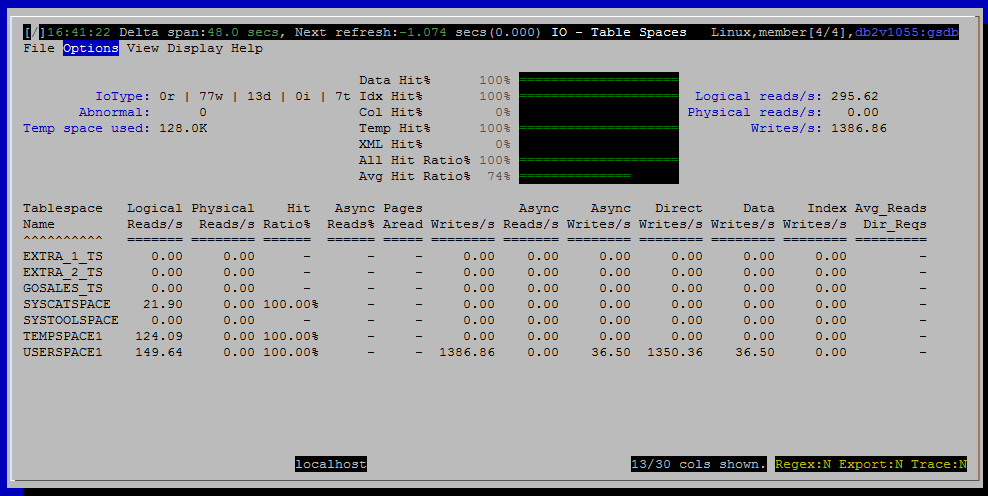

<h2>Purpose</h2>

<h2>Histograms and Summaries (Gauges)</h2>

(link TBD)

<h2>Metrics Shown in Grid</h2>

<u>Tablespace Name</u>

THe name is prepended with '!' if the tablespace state is not "NORMAL".  For example "OFFLINE" or "ROLLFORWARD_IN_PROGRESS".

Source: <a href="http://www.ibm.com/support/knowledgecenter/SSEPGG_10.5.0/com.ibm.db2.luw.sql.rtn.doc/doc/r0053943.html?cp=SSEPGG_10.5.0%2F3-6-1-3-10-57&amp;lang=en">mon_get_tablespace</a>.<a href="http://www.ibm.com/support/knowledgecenter/SSEPGG_10.5.0/com.ibm.db2.luw.admin.mon.doc/doc/r0001295.html?cp=SSEPGG_10.5.0&amp;lang=en">tbsp_name</a>

 
<u>Logical Reads/s</u>

Source: <a href="http://www.ibm.com/support/knowledgecenter/SSEPGG_10.5.0/com.ibm.db2.luw.sql.rtn.doc/doc/r0053943.html?cp=SSEPGG_10.5.0%2F3-6-1-3-10-57&amp;lang=en">mon_get_tablespace</a>

<a href="http://www-01.ibm.com/support/knowledgecenter/SSEPGG_10.5.0/com.ibm.db2.luw.admin.mon.doc/doc/r0001235.html?cp=SSEPGG_10.5.0&amp;lang=en" style="font-family:'courier new' , 'courier' , monospace">pool_data_l_reads</a> + <a href="http://www-01.ibm.com/support/knowledgecenter/SSEPGG_10.5.0/com.ibm.db2.luw.admin.mon.doc/doc/r0001238.html?lang=en" style="font-family:'courier new' , 'courier' , monospace">pool_index_l_reads</a> + <a href="http://www-01.ibm.com/support/knowledgecenter/SSEPGG_10.5.0/com.ibm.db2.luw.admin.mon.doc/doc/r0022731.html?lang=en" style="font-family:'courier new' , 'courier' , monospace">pool_xda_l_reads</a> + <a href="http://www.ibm.com/support/knowledgecenter/SSEPGG_10.5.0/com.ibm.db2.luw.admin.mon.doc/doc/r0060763.html?lang=en">pool_col_l_reads</a> +

<a href="http://www.ibm.com/support/knowledgecenter/SSEPGG_10.5.0/com.ibm.db2.luw.admin.mon.doc/doc/r0011302.html?lang=en">pool_temp_data_l_reads </a>+ <a href="http://www.ibm.com/support/knowledgecenter/SSEPGG_10.5.0/com.ibm.db2.luw.admin.mon.doc/doc/r0011303.html?cp=SSEPGG_10.5.0&amp;lang=en">pool_temp_index_l_reads </a>+ <a href="http://www.ibm.com/support/knowledgecenter/SSEPGG_10.5.0/com.ibm.db2.luw.admin.mon.doc/doc/r0022738.html?cp=SSEPGG_10.5.0&amp;lang=en">pool_temp_xda_l_reads </a>+ <a href="http://www.ibm.com/support/knowledgecenter/SSEPGG_10.5.0/com.ibm.db2.luw.admin.mon.doc/doc/r0060873.html?cp=SSEPGG_10.5.0&amp;lang=en">pool_temp_col_l_reads</a>

 
<u>Physical Reads/s</u>

Source: <a href="http://www.ibm.com/support/knowledgecenter/SSEPGG_10.5.0/com.ibm.db2.luw.sql.rtn.doc/doc/r0053943.html?cp=SSEPGG_10.5.0%2F3-6-1-3-10-57&amp;lang=en">mon_get_tablespace</a>

 
<u>Hit Ratio%</u>

Source: <a href="http://www.ibm.com/support/knowledgecenter/SSEPGG_10.5.0/com.ibm.db2.luw.sql.rtn.doc/doc/r0053943.html?cp=SSEPGG_10.5.0%2F3-6-1-3-10-57&amp;lang=en">mon_get_tablespace</a>

 
<u>Async Reads%</u>

Source: <a href="http://www.ibm.com/support/knowledgecenter/SSEPGG_10.5.0/com.ibm.db2.luw.sql.rtn.doc/doc/r0053943.html?cp=SSEPGG_10.5.0%2F3-6-1-3-10-57&amp;lang=en">mon_get_tablespace</a>

 
<u>Pages Aread</u>

Source: <a href="http://www.ibm.com/support/knowledgecenter/SSEPGG_10.5.0/com.ibm.db2.luw.sql.rtn.doc/doc/r0053943.html?cp=SSEPGG_10.5.0%2F3-6-1-3-10-57&amp;lang=en">mon_get_tablespace</a>

 
<u>Writes/s</u>

Source: <a href="http://www.ibm.com/support/knowledgecenter/SSEPGG_10.5.0/com.ibm.db2.luw.sql.rtn.doc/doc/r0053943.html?cp=SSEPGG_10.5.0%2F3-6-1-3-10-57&amp;lang=en">mon_get_tablespace</a>

 
<u>Async Reads/s</u>

Source: <a href="http://www.ibm.com/support/knowledgecenter/SSEPGG_10.5.0/com.ibm.db2.luw.sql.rtn.doc/doc/r0053943.html?cp=SSEPGG_10.5.0%2F3-6-1-3-10-57&amp;lang=en">mon_get_tablespace</a>

 
<u>Async Writes/s</u>

Source: <a href="http://www.ibm.com/support/knowledgecenter/SSEPGG_10.5.0/com.ibm.db2.luw.sql.rtn.doc/doc/r0053943.html?cp=SSEPGG_10.5.0%2F3-6-1-3-10-57&amp;lang=en">mon_get_tablespace</a>

 
<u>Direct Writes/s</u>

Source: <a href="http://www.ibm.com/support/knowledgecenter/SSEPGG_10.5.0/com.ibm.db2.luw.sql.rtn.doc/doc/r0053943.html?cp=SSEPGG_10.5.0%2F3-6-1-3-10-57&amp;lang=en">mon_get_tablespace</a>

 
<u>Data Writes/s</u>

Source: <a href="http://www.ibm.com/support/knowledgecenter/SSEPGG_10.5.0/com.ibm.db2.luw.sql.rtn.doc/doc/r0053943.html?cp=SSEPGG_10.5.0%2F3-6-1-3-10-57&amp;lang=en">mon_get_tablespace</a>

 
<u>Index Writes/s</u>

Source: <a href="http://www.ibm.com/support/knowledgecenter/SSEPGG_10.5.0/com.ibm.db2.luw.sql.rtn.doc/doc/r0053943.html?cp=SSEPGG_10.5.0%2F3-6-1-3-10-57&amp;lang=en">mon_get_tablespace</a>

 
<u>Avg_Reads Dir_Reqs</u>

Source: <a href="http://www.ibm.com/support/knowledgecenter/SSEPGG_10.5.0/com.ibm.db2.luw.sql.rtn.doc/doc/r0053943.html?cp=SSEPGG_10.5.0%2F3-6-1-3-10-57&amp;lang=en">mon_get_tablespace</a>

 
<u>Avg RdTime(ms)</u>

Source: <a href="http://www.ibm.com/support/knowledgecenter/SSEPGG_10.5.0/com.ibm.db2.luw.sql.rtn.doc/doc/r0053943.html?cp=SSEPGG_10.5.0%2F3-6-1-3-10-57&amp;lang=en">mon_get_tablespace</a>

 
<u>Avg WrTime(ms)</u>

Source: <a href="http://www.ibm.com/support/knowledgecenter/SSEPGG_10.5.0/com.ibm.db2.luw.sql.rtn.doc/doc/r0053943.html?cp=SSEPGG_10.5.0%2F3-6-1-3-10-57&amp;lang=en">mon_get_tablespace</a>

 
<u>Tbsp Type</u>

Possible values are:

<ul ><li>Regular</li><li>Large</li><li>System temporary</li><li>User temporary</li></ul>

Source: <a href="http://www.ibm.com/support/knowledgecenter/SSEPGG_10.5.0/com.ibm.db2.luw.sql.rtn.doc/doc/r0053943.html?cp=SSEPGG_10.5.0%2F3-6-1-3-10-57&amp;lang=en">mon_get_tablespace</a>.<a href="http://www.ibm.com/support/knowledgecenter/SSEPGG_10.5.0/com.ibm.db2.luw.admin.mon.doc/doc/r0007532.html?cp=SSEPGG_10.5.0&amp;lang=en">tbsp_content_type</a>

 
<u># of DBP</u>

Source: <a href="http://www.ibm.com/support/knowledgecenter/SSEPGG_10.5.0/com.ibm.db2.luw.sql.rtn.doc/doc/r0053943.html?cp=SSEPGG_10.5.0%2F3-6-1-3-10-57&amp;lang=en">mon_get_tablespace</a>

 
<u>Avg PrefSize</u>

Source: <a href="http://www.ibm.com/support/knowledgecenter/SSEPGG_10.5.0/com.ibm.db2.luw.sql.rtn.doc/doc/r0053943.html?cp=SSEPGG_10.5.0%2F3-6-1-3-10-57&amp;lang=en">mon_get_tablespace</a>

 
<u>I/O Skew</u>

 
<u>Tbspace Status</u>

For example, "NORMAL", "BACKUP_PENDING", "OFFLINE".  Click <a href="http://www.ibm.com/support/knowledgecenter/SSEPGG_10.5.0/com.ibm.db2.luw.admin.mon.doc/doc/r0007533.html?cp=SSEPGG_10.5.0&amp;lang=en" style="text-decoration:underline;color:rgb( 5 , 56 , 107 );font-family:'courier new' , 'courier' , monospace">tbsp_state</a> for the full list of possible values.

Source: <a href="http://www.ibm.com/support/knowledgecenter/SSEPGG_10.5.0/com.ibm.db2.luw.sql.rtn.doc/doc/r0053943.html?cp=SSEPGG_10.5.0%2F3-6-1-3-10-57&amp;lang=en">mon_get_tablespace</a>.<a href="http://www.ibm.com/support/knowledgecenter/SSEPGG_10.5.0/com.ibm.db2.luw.admin.mon.doc/doc/r0007533.html?cp=SSEPGG_10.5.0&amp;lang=en">tbsp_state</a>

 
<u>Tbspace Type</u>

Source: <a href="http://www.ibm.com/support/knowledgecenter/SSEPGG_10.5.0/com.ibm.db2.luw.sql.rtn.doc/doc/r0053943.html?cp=SSEPGG_10.5.0%2F3-6-1-3-10-57&amp;lang=en">mon_get_tablespace</a>

 
<u>FSC On</u>

Source: <a href="http://www.ibm.com/support/knowledgecenter/SSEPGG_10.5.0/com.ibm.db2.luw.sql.rtn.doc/doc/r0053943.html?cp=SSEPGG_10.5.0%2F3-6-1-3-10-57&amp;lang=en">mon_get_tablespace</a>

 
<u>File Closed/s</u>

Source: <a href="http://www.ibm.com/support/knowledgecenter/SSEPGG_10.5.0/com.ibm.db2.luw.sql.rtn.doc/doc/r0053943.html?cp=SSEPGG_10.5.0%2F3-6-1-3-10-57&amp;lang=en">mon_get_tablespace</a>

 
<u>Victim Buffers/s</u>

Source: <a href="http://www.ibm.com/support/knowledgecenter/SSEPGG_10.5.0/com.ibm.db2.luw.sql.rtn.doc/doc/r0053943.html?cp=SSEPGG_10.5.0%2F3-6-1-3-10-57&amp;lang=en">mon_get_tablespace</a>

 
<u>Unread PrefPages/s</u>

Source: <a href="http://www.ibm.com/support/knowledgecenter/SSEPGG_10.5.0/com.ibm.db2.luw.sql.rtn.doc/doc/r0053943.html?cp=SSEPGG_10.5.0%2F3-6-1-3-10-57&amp;lang=en">mon_get_tablespace</a>

 
<u>XDA l_reads/s</u>

Source: <a href="http://www.ibm.com/support/knowledgecenter/SSEPGG_10.5.0/com.ibm.db2.luw.sql.rtn.doc/doc/r0053943.html?cp=SSEPGG_10.5.0%2F3-6-1-3-10-57&amp;lang=en">mon_get_tablespace</a>

 
<u>XDA p_reads/s</u>

Source: <a href="http://www.ibm.com/support/knowledgecenter/SSEPGG_10.5.0/com.ibm.db2.luw.sql.rtn.doc/doc/r0053943.html?cp=SSEPGG_10.5.0%2F3-6-1-3-10-57&amp;lang=en">mon_get_tablespace</a>

 
<u>XDA l_writes/s</u>

Source: <a href="http://www.ibm.com/support/knowledgecenter/SSEPGG_10.5.0/com.ibm.db2.luw.sql.rtn.doc/doc/r0053943.html?cp=SSEPGG_10.5.0%2F3-6-1-3-10-57&amp;lang=en">mon_get_tablespace</a>

 
<u>Prefetch Size</u>

Source: <a href="http://www.ibm.com/support/knowledgecenter/SSEPGG_10.5.0/com.ibm.db2.luw.sql.rtn.doc/doc/r0053943.html?cp=SSEPGG_10.5.0%2F3-6-1-3-10-57&amp;lang=en">mon_get_tablespace</a>

 
<u>IO/s</u>

Source: <a href="http://www.ibm.com/support/knowledgecenter/SSEPGG_10.5.0/com.ibm.db2.luw.sql.rtn.doc/doc/r0053943.html?cp=SSEPGG_10.5.0%2F3-6-1-3-10-57&amp;lang=en">mon_get_tablespace</a>

<h2>Default Sort Column</h2>

Tablespace Name: Ascending

<h2>Navigation</h2>

Keyboard navigation: VIt

Dedicated shortcut key: alt-t

<h6>Author: KevinLBeck</h6>