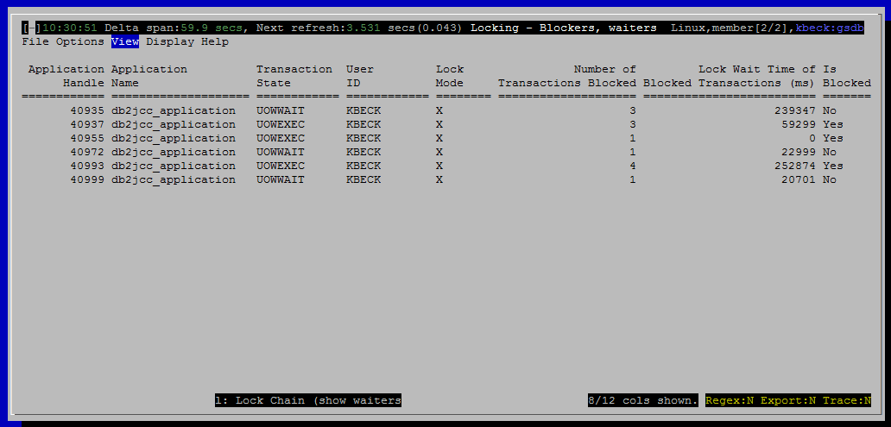

<h2>Purpose</h2>

This card shows transactions that are blocking others.  In scenarios where work is hung, waiting on locks, this shows you the root cause of the problem.  You can easily see which connections could be forced to resolve the hang.

<h2>Histograms and Summaries (Gauges)</h2>

(none)

<h2>Metrics Shown in Grid</h2>

<u>Application Handle</u>

Source: <a href="http://www-01.ibm.com/support/knowledgecenter/SSEPGG_10.5.0/com.ibm.db2.luw.sql.rtn.doc/doc/r0056428.html?cp=SSEPGG_10.5.0%2F3-6-1-3-10-36&amp;lang=en">mon_get_locks</a>.<a href="http://www.ibm.com/support/knowledgecenter/en/SSEPGG_10.5.0/com.ibm.db2.luw.admin.mon.doc/doc/r0054410.html?cp=SSEPGG_10.5.0">application_handle</a>

 
<u>Member</u>

Source: <a href="http://www-01.ibm.com/support/knowledgecenter/SSEPGG_10.5.0/com.ibm.db2.luw.sql.rtn.doc/doc/r0056428.html?cp=SSEPGG_10.5.0%2F3-6-1-3-10-36&amp;lang=en">mon_get_locks</a>.<a href="http://www.ibm.com/support/knowledgecenter/en/SSEPGG_10.5.0/com.ibm.db2.luw.admin.mon.doc/doc/r0054432.html?cp=SSEPGG_10.5.0">member</a>

<u>Application Name</u>

Source: <a href="http://www-01.ibm.com/support/knowledgecenter/SSEPGG_10.5.0/com.ibm.db2.luw.sql.rtn.doc/doc/r0054685.html?cp=SSEPGG_10.5.0%2F3-6-1-3-18-9&amp;lang=en">wlm_get_service_class_workload_occurrences</a>.<a href="http://www.ibm.com/support/knowledgecenter/en/SSEPGG_10.5.0/com.ibm.db2.luw.admin.mon.doc/doc/r0054410.html?cp=SSEPGG_10.5.0">application_name</a>

 
<u>Transaction State</u>

Source: <a href="http://www-01.ibm.com/support/knowledgecenter/SSEPGG_10.5.0/com.ibm.db2.luw.sql.rtn.doc/doc/r0053939.html?cp=SSEPGG_10.5.0%2F3-6-1-3-10-62&amp;lang=en">mon_get_unit_of_work</a>.workload_occurrence_state

 
<u>User ID</u>

Source: <a href="http://www-01.ibm.com/support/knowledgecenter/SSEPGG_10.5.0/com.ibm.db2.luw.sql.rtn.doc/doc/r0054685.html?cp=SSEPGG_10.5.0%2F3-6-1-3-18-9&amp;lang=en">wlm_get_service_class_workload_occurrences</a>.<a href="http://www.ibm.com/support/knowledgecenter/en/SSEPGG_10.5.0/com.ibm.db2.luw.admin.mon.doc/doc/r0010880.html?cp=SSEPGG_10.5.0">session_auth_id</a>

 
<u>Lock Mode</u>

Lock mode for the transaction holding the lock.

Source: <a href="http://www-01.ibm.com/support/knowledgecenter/SSEPGG_10.5.0/com.ibm.db2.luw.sql.rtn.doc/doc/r0056428.html?cp=SSEPGG_10.5.0%2F3-6-1-3-10-36&amp;lang=en">mon_get_locks</a>.<a href="http://www.ibm.com/support/knowledgecenter/en/SSEPGG_10.5.0/com.ibm.db2.luw.admin.mon.doc/doc/r0001286.html?cp=SSEPGG_10.5.0">lock_mode</a>

 
<u>Number of Lock Waits</u>

Number of times the transaction holding the lock has waited for a lock during its lifetime.

Source: <a href="http://www-01.ibm.com/support/knowledgecenter/SSEPGG_10.5.0/com.ibm.db2.luw.sql.rtn.doc/doc/r0053939.html?cp=SSEPGG_10.5.0%2F3-6-1-3-10-62&amp;lang=en">mon_get_unit_of_work</a>.lock_waits

 
<u>Number of Lock Held</u>

Number of locks currently held by the transaction holding this lock.

Source: <a href="http://www-01.ibm.com/support/knowledgecenter/SSEPGG_10.5.0/com.ibm.db2.luw.sql.rtn.doc/doc/r0053939.html?cp=SSEPGG_10.5.0%2F3-6-1-3-10-62&amp;lang=en">mon_get_unit_of_work</a>.num_locks_held

 
<u>Number of Transactions Blocked</u>

Number of other transactions that are currently waiting on this lock (i.e. blocked by this transaction).

Source: (query)

 
<u>Lock Wait Time of Blocked Transactions (ms)</u>

The total time spent waiting on locks for all transactions currently waiting on this lock.

This time includes time previously spent waiting on other locks.

Source: <a href="http://www-01.ibm.com/support/knowledgecenter/SSEPGG_10.5.0/com.ibm.db2.luw.sql.rtn.doc/doc/r0053939.html?cp=SSEPGG_10.5.0%2F3-6-1-3-10-62&amp;lang=en">mon_get_unit_of_work</a>

sum(lock_wait_time) for all transactions waiting on this lock

 
<u>Maximum Wait Time</u>

The largest value for total time spent waiting on locks for a transaction blocked by this lock.

This time includes time previously spent waiting on other locks.

Source: <a href="http://www-01.ibm.com/support/knowledgecenter/SSEPGG_10.5.0/com.ibm.db2.luw.sql.rtn.doc/doc/r0053939.html?cp=SSEPGG_10.5.0%2F3-6-1-3-10-62&amp;lang=en">mon_get_unit_of_work</a>

max(lock_wait_time) for all transactions waiting on this lock

 
<u>Is Blocked</u>

Flag (Yes or No) indicating whether the transaction holding this lock is itself blocked waiting on another lock.

Source: (query)

<h2>Default Sort Order</h2>
<h2>Navigation</h2>

Keyboard navigation: VLb

Dedicated shortcut key: (none)

<h6>Author: KevinLBeck</h6>