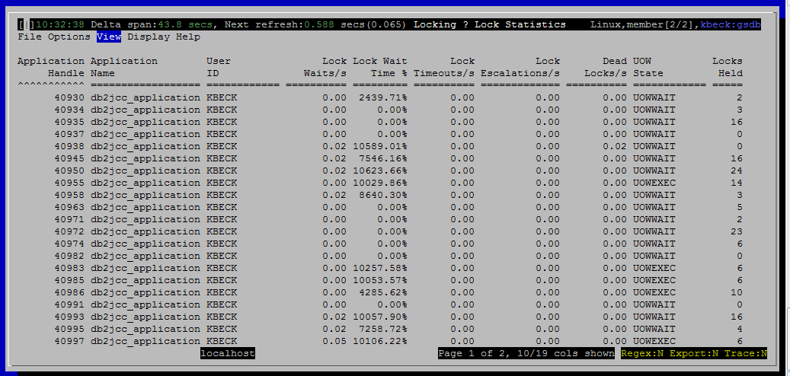

<h2>Purpose</h2>

Use this view to find sessions (connections) that have been involved in locking problems:

<ul ><li>Sessions that have recently experienced excessive lock waits, time outs, escalations or deadlocks</li><li>Sessions that have consumed excessive log space over their lifetime</li><li>Sessions that are currently holding many locks</li><li>Idle sessions</li></ul>

For context, this view also shows some basic information to help you identify the session without needing to jump to another view:

<ul ><li>Application Name</li><li>User ID</li><li>Workload Name</li></ul>

<h2>Histograms and Summaries (Gauges)</h2>

(none)

<h2>Metrics Shown</h2>

<u>Application Handle 
 Application Name 
 User ID 
 Lock Waits/s 
 Lock Wait Time % 
 Lock Timeouts/s 
 Lock Escalations/s 
 Dead Locks/s 
 UOW State 
 Conection Start Time 
 Coordinator Number 
 % CPU Time 
 Memory Pool Used(KB) 
 Rows Read/s 
 Logical reads/s 
 Locks Held 
 Log Used (KB) 
 Idle Time 
 Workload Name</u>

<h2>Default Sort Column</h2>

Application Handle, descending

<h2>Navigation</h2>

Keyboard navigation: VLs

Dedicated shortcut key: (none)

<h6>Author: KevinLBeck</h6>