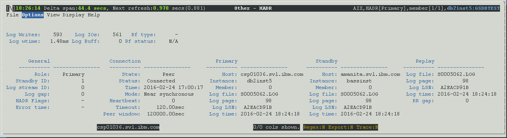

<h2>Purpose</h2>

HADR stands for High Availability Disaster Recovery, which is a technology used for protecting your database against data loss and allows the database to be highly available through partial or complete site failure. HADR is achieved by replicating data changes from one database (the primary) to another (the standby). When the primary database encounters a failure, the standby database can take over and become the new primary database.

This view is available only if the database is configured as an HADR database.  dsmtop can monitor the primary or the standby, but only if reads on standby (ROS) is enabled.

<h2>Summaries and Histograms (Gauges)</h2>

<u>Log Writes</u>

Source: <a href="http://www-01.ibm.com/support/knowledgecenter/SSEPGG_10.5.0/com.ibm.db2.luw.sql.rtn.doc/doc/r0059253.html?cp=SSEPGG_10.5.0%2F3-6-1-3-10-61&amp;lang=en">mon_get_transaction_log</a>.<a href="http://www-01.ibm.com/support/knowledgecenter/SSEPGG_10.5.0/com.ibm.db2.luw.admin.mon.doc/doc/r0001279.html?cp=SSEPGG_10.5.0&amp;lang=en">log_writes</a>

<u>Log wtime</u>

Source: <a href="http://www-01.ibm.com/support/knowledgecenter/SSEPGG_10.5.0/com.ibm.db2.luw.sql.rtn.doc/doc/r0059253.html?cp=SSEPGG_10.5.0%2F3-6-1-3-10-61&amp;lang=en" style="font-family:'helvetica neue' , 'helvetica' , 'arial' , sans-serif">mon_get_transaction_log</a>

<a href="http://www-01.ibm.com/support/knowledgecenter/SSEPGG_10.5.0/com.ibm.db2.luw.admin.mon.doc/doc/r0011679.html?cp=SSEPGG_10.5.0&amp;lang=en">log_write_time </a>/ <a href="http://www-01.ibm.com/support/knowledgecenter/SSEPGG_10.5.0/com.ibm.db2.luw.admin.mon.doc/doc/r0001279.html?cp=SSEPGG_10.5.0&amp;lang=en">log_writes</a>

 

<u>Log IOs</u>

Source: <a href="http://www-01.ibm.com/support/knowledgecenter/SSEPGG_10.5.0/com.ibm.db2.luw.sql.rtn.doc/doc/r0059253.html?cp=SSEPGG_10.5.0%2F3-6-1-3-10-61&amp;lang=en" style="font-family:'helvetica neue' , 'helvetica' , 'arial' , sans-serif">mon_get_transaction_log</a>.<a href="http://www-01.ibm.com/support/knowledgecenter/SSEPGG_10.5.0/com.ibm.db2.luw.admin.mon.doc/doc/r0011681.html?cp=SSEPGG_10.5.0&amp;lang=en">num_log_write_io</a>

<u>Log Buff</u>

Source: <a href="http://www-01.ibm.com/support/knowledgecenter/SSEPGG_10.5.0/com.ibm.db2.luw.sql.rtn.doc/doc/r0059253.html?cp=SSEPGG_10.5.0%2F3-6-1-3-10-61&amp;lang=en" style="font-family:'helvetica neue' , 'helvetica' , 'arial' , sans-serif">mon_get_transaction_log</a>.<a href="http://www-01.ibm.com/support/knowledgecenter/SSEPGG_10.5.0/com.ibm.db2.luw.admin.mon.doc/doc/r0011685.html?cp=SSEPGG_10.5.0&amp;lang=en">num_log_data_found_in_buffer</a>

<u>Rf type</u>

Type of object. One of:

<ul ><li>DATABASE</li><li>INDEX</li><li>PARTITIONGROUP</li><li>TABLE</li><li>TABLESPACE</li><li>VIEW</li></ul>

Source: <a href="http://www-01.ibm.com/support/knowledgecenter/SSEPGG_10.5.0/com.ibm.db2.luw.sql.rtn.doc/doc/r0060768.html?cp=SSEPGG_10.5.0%2F3-6-1-3-10-65&amp;lang=en">mon_get_utility</a>.object_type

<u>Rf status</u>

Source: <a href="http://www-01.ibm.com/support/knowledgecenter/SSEPGG_10.5.0/com.ibm.db2.luw.sql.rtn.doc/doc/r0022001.html?lang=en">snap_get_util_progress</a>.<a href="http://www-01.ibm.com/support/knowledgecenter/SSEPGG_10.5.0/com.ibm.db2.luw.admin.mon.doc/doc/r0011406.html?cp=SSEPGG_10.5.0&amp;lang=en">progress_description</a>

<h2>Metrics Shown</h2>

<h2>General</h2>

<u>Role</u>

<u>Standby ID</u>

<u>Log stream ID</u>

<u>Log gap</u>

<u>HADR Flags</u>

<u>Error time</u>

<h2>Connection</h2>

<u>State</u>

<u>Status</u>

<u>Time</u>

<u>Mode</u>

<u>Hearbeat</u>

<u>Timeout</u>

<u>Peer window</u>

<h2>Primary</h2>

<u>Host</u>

<u>Instance</u>

<u>Member</u>

<u>Log file</u>

<u>Log page</u>

<u>Log LSN</u>

<u>Log time</u>

<h2>Standby</h2>

<u>Host</u>

<u>Instance</u>

<u>Member</u>

<u>Log file</u>

<u>Log page</u>

<u>Log LSN</u>

<u>Log time</u>

<h2>Replay</h2>

<u>Log file</u>

<u>Log page</u>

<u>Log LSN</u>

<u>Log time</u>

<u>RR gap</u>

<h2>Default Sort Column</h2>

N / A - This is a tile display, not a grid.

<h2>Navigation</h2>

Keyboard Navigation: VoA

Dedicated shortcut key: alt-A

<h6>Author: KevinLBeck</h6>