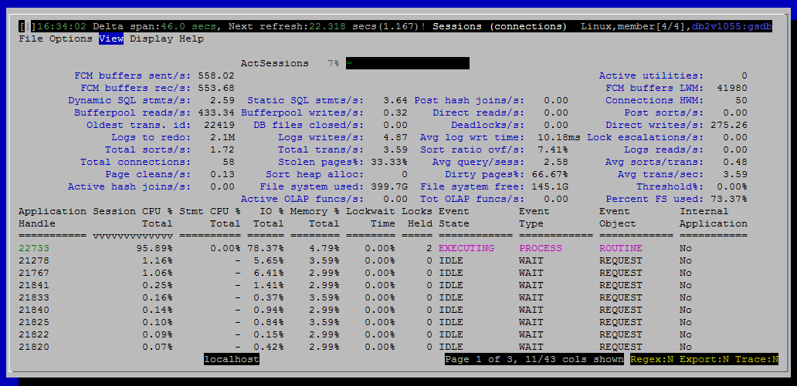

<h2>Purpose</h2>

Connections (sometimes also known as sessions) are tied to users and applications.  This view shows who is connected, what applications they are running and how much of various resources they are consuming.

<h2>Histograms and Summaries (Gauges)</h2>

<a href="/developerworks/community/wikis/home?lang=en#!/wiki/Text%20Based%20Monitoring%20for%20DB2%20LUW%20-%20dsmtop/page/Sessions%20%28connections%29%20-%20Gauges">Sessions (connections) - Gauges</a>

<h2>Metrics Shown in Grid</h2>

<u>Application Handle</u>

Source: <a href="http://www-01.ibm.com/support/knowledgecenter/SSEPGG_10.5.0/com.ibm.db2.luw.sql.rtn.doc/doc/r0053938.html?cp=SSEPGG_10.5.0%2F3-6-1-3-10-22&amp;lang=en">mon_get_connection</a>.application_handle

<u>Session CPU % Total</u>

This connection's CPU time as a percentage of CPU time for all connections.

Source: <a href="http://www-01.ibm.com/support/knowledgecenter/SSEPGG_10.5.0/com.ibm.db2.luw.sql.rtn.doc/doc/r0053938.html?cp=SSEPGG_10.5.0%2F3-6-1-3-10-22&amp;lang=en" style="text-decoration:underline;color:rgb( 5 , 56 , 107 );font-family:'courier new' , 'courier' , monospace">mon_get_connection</a>.total_cpu_time

 
<u>Stmt CPU % Total</u>

Source: mon_get_activity.stmt_total_cpu_time_us

 
<u>IO % Total</u>

This connection's logical reads as a percentage of logical reads for all connections.

Source: <a href="http://www-01.ibm.com/support/knowledgecenter/SSEPGG_10.5.0/com.ibm.db2.luw.sql.rtn.doc/doc/r0053938.html?cp=SSEPGG_10.5.0%2F3-6-1-3-10-22&amp;lang=en">mon_get_connection</a>

<a href="http://www-01.ibm.com/support/knowledgecenter/SSEPGG_10.5.0/com.ibm.db2.luw.admin.mon.doc/doc/r0001235.html?cp=SSEPGG_10.5.0&amp;lang=en" style="font-family:'courier new' , 'courier' , monospace">pool_data_l_reads</a> + <a href="http://www-01.ibm.com/support/knowledgecenter/SSEPGG_10.5.0/com.ibm.db2.luw.admin.mon.doc/doc/r0001238.html?lang=en" style="font-family:'courier new' , 'courier' , monospace">pool_index_l_reads</a> + <a href="http://www-01.ibm.com/support/knowledgecenter/SSEPGG_10.5.0/com.ibm.db2.luw.admin.mon.doc/doc/r0022731.html?lang=en" style="font-family:'courier new' , 'courier' , monospace">pool_xda_l_reads</a> + <a href="http://www.ibm.com/support/knowledgecenter/SSEPGG_10.5.0/com.ibm.db2.luw.admin.mon.doc/doc/r0060763.html?lang=en">pool_col_l_reads </a>+

<a href="http://www.ibm.com/support/knowledgecenter/SSEPGG_10.5.0/com.ibm.db2.luw.admin.mon.doc/doc/r0011302.html?lang=en">pool_temp_data_l_reads </a>+ pool_temp_index_l_reads + pool_temp_xda_l_reads + pool_temp_col_l_reads

 
<u>Memory % Total</u>

 
<u>Event State</u>

Source: <a href="http://www-01.ibm.com/support/knowledgecenter/SSEPGG_10.5.0/com.ibm.db2.luw.sql.rtn.doc/doc/r0060767.html?cp=SSEPGG_10.5.0&amp;lang=en">mon_get_agent</a>.event_state

 
<u>Event Type</u>

Source: <a href="http://www-01.ibm.com/support/knowledgecenter/SSEPGG_10.5.0/com.ibm.db2.luw.sql.rtn.doc/doc/r0060767.html?cp=SSEPGG_10.5.0&amp;lang=en" style="text-decoration:underline;color:rgb( 5 , 56 , 107 );font-family:'helvetica neue' , 'helvetica' , 'arial' , sans-serif">mon_get_agent</a>.event_type

 
<u>Event Object</u>

Source: <a href="http://www-01.ibm.com/support/knowledgecenter/SSEPGG_10.5.0/com.ibm.db2.luw.sql.rtn.doc/doc/r0060767.html?cp=SSEPGG_10.5.0&amp;lang=en" style="text-decoration:underline;color:rgb( 5 , 56 , 107 );font-family:'helvetica neue' , 'helvetica' , 'arial' , sans-serif">mon_get_agent</a>.event_object

 
<u>Application Name</u>

Source: <a href="http://www-01.ibm.com/support/knowledgecenter/SSEPGG_10.5.0/com.ibm.db2.luw.sql.rtn.doc/doc/r0053938.html?cp=SSEPGG_10.5.0%2F3-6-1-3-10-22&amp;lang=en" style="text-decoration:underline;color:rgb( 5 , 56 , 107 );font-family:'courier new' , 'courier' , monospace">mon_get_connection</a>.application_name

 
<u>Rows Read/s</u>

Source: <a href="http://www-01.ibm.com/support/knowledgecenter/SSEPGG_10.5.0/com.ibm.db2.luw.sql.rtn.doc/doc/r0053938.html?cp=SSEPGG_10.5.0%2F3-6-1-3-10-22&amp;lang=en" style="text-decoration:underline;color:rgb( 5 , 56 , 107 );font-family:'courier new' , 'courier' , monospace">mon_get_connection</a>.rows_read

 
<u>Rows Written/s</u>

Source: <a href="http://www-01.ibm.com/support/knowledgecenter/SSEPGG_10.5.0/com.ibm.db2.luw.sql.rtn.doc/doc/r0053938.html?cp=SSEPGG_10.5.0%2F3-6-1-3-10-22&amp;lang=en" style="text-decoration:underline;color:rgb( 5 , 56 , 107 );font-family:'courier new' , 'courier' , monospace">mon_get_connection</a>.rows_modified

<u>IO Reads/s 
 IO Writes/s 
 Session Memory</u>

Total memory used by all memory pools associated with this connection.

In this case, "associated with this connection" means that the application handle for this connection matches what is returned by mon_get_memory_pool.  Most memory pools shown by mon_get_memory_pool show null for the application handle, indicating that they are not associated with a particular connection.

Source: mon_get_memory_pool.memory_pool_used

 
<u>Assoc. Agents</u>

Source: <a href="http://www-01.ibm.com/support/knowledgecenter/SSEPGG_10.5.0/com.ibm.db2.luw.sql.rtn.doc/doc/r0053938.html?cp=SSEPGG_10.5.0%2F3-6-1-3-10-22&amp;lang=en" style="text-decoration:underline;color:rgb( 5 , 56 , 107 );font-family:'courier new' , 'courier' , monospace">mon_get_connection</a>.num_assoc_agents

 
<u>Paral. Degree</u>

Degree of intraparition parallelism for a statement currently executing on this connection.  If there is no statement currently executing, this will be null.

In the case of multiple statements executing concurrently on the same connection, the maximum parallelism will be shown.

Source: mon_get_activity.query_actual_degree

 
<u>Lockwait Time 
 Locks Held</u>

Source: <a href="http://www-01.ibm.com/support/knowledgecenter/SSEPGG_10.5.0/com.ibm.db2.luw.sql.rtn.doc/doc/r0053938.html?cp=SSEPGG_10.5.0%2F3-6-1-3-10-22&amp;lang=en" style="text-decoration:underline;color:rgb( 5 , 56 , 107 );font-family:'courier new' , 'courier' , monospace">mon_get_connection</a>.num_locks_held

 
<u>Sort Time(s) 
 Log Used</u>

Source: mon_get_unit_of_work.uow_log_space_used

<u>Rows Returned/s</u>

Source: mon_get_connection.rows_returned

 
<u>Fetch Count (Stmt)/s</u>

Total number of rows returned so far from all statements currently in-flight for this connection.

This is always a shown as a counter, not a delta.

Source: mon_get_activity.rows_returned

 
<u>Dynamic SQL/s</u>

Source: <a href="http://www-01.ibm.com/support/knowledgecenter/SSEPGG_10.5.0/com.ibm.db2.luw.sql.rtn.doc/doc/r0053938.html?cp=SSEPGG_10.5.0%2F3-6-1-3-10-22&amp;lang=en" style="text-decoration:underline;color:rgb( 5 , 56 , 107 );font-family:'courier new' , 'courier' , monospace">mon_get_connection</a>.dynamic_sql_stmts

 
<u>Static SQL/s</u>

Source: <a href="http://www-01.ibm.com/support/knowledgecenter/SSEPGG_10.5.0/com.ibm.db2.luw.sql.rtn.doc/doc/r0053938.html?cp=SSEPGG_10.5.0%2F3-6-1-3-10-22&amp;lang=en" style="text-decoration:underline;color:rgb( 5 , 56 , 107 );font-family:'courier new' , 'courier' , monospace">mon_get_connection</a>.static_sql_stmts

 
<u>#of XQueries/s</u>

Source: <a href="http://www-01.ibm.com/support/knowledgecenter/SSEPGG_10.5.0/com.ibm.db2.luw.sql.rtn.doc/doc/r0053938.html?cp=SSEPGG_10.5.0%2F3-6-1-3-10-22&amp;lang=en" style="text-decoration:underline;color:rgb( 5 , 56 , 107 );font-family:'courier new' , 'courier' , monospace">mon_get_connection</a>.xquery_stmts

 
<u>OS User</u>

The ID that the user specified when logging in to the operating system. This ID is distinct from auth_id, which the user specifies when connecting to the database.

Source: <a href="http://www-01.ibm.com/support/knowledgecenter/SSEPGG_10.5.0/com.ibm.db2.luw.sql.rtn.doc/doc/r0053938.html?cp=SSEPGG_10.5.0%2F3-6-1-3-10-22&amp;lang=en" style="text-decoration:underline;color:rgb( 5 , 56 , 107 );font-family:'courier new' , 'courier' , monospace">mon_get_connection</a>.<a href="http://www-01.ibm.com/support/knowledgecenter/SSEPGG_10.5.0/com.ibm.db2.luw.admin.mon.doc/doc/r0001175.html?cp=SSEPGG_10.5.0&amp;lang=en">execution_id</a>

Availability: DB2 v10.5 and above.  Null is shown for older versions of DB2.

 
<u>DB User</u>

Source: <a href="http://www-01.ibm.com/support/knowledgecenter/SSEPGG_10.5.0/com.ibm.db2.luw.sql.rtn.doc/doc/r0053938.html?cp=SSEPGG_10.5.0%2F3-6-1-3-10-22&amp;lang=en" style="text-decoration:underline;color:rgb( 5 , 56 , 107 );font-family:'courier new' , 'courier' , monospace">mon_get_connection</a>.system_auth_id

 
<u>Client HostName</u>

Source: <a href="http://www-01.ibm.com/support/knowledgecenter/SSEPGG_10.5.0/com.ibm.db2.luw.sql.rtn.doc/doc/r0053938.html?cp=SSEPGG_10.5.0%2F3-6-1-3-10-22&amp;lang=en" style="text-decoration:underline;color:rgb( 5 , 56 , 107 );font-family:'courier new' , 'courier' , monospace">mon_get_connection</a>.client_hostname

 
<u>Client Platform</u>

Source: <a href="http://www-01.ibm.com/support/knowledgecenter/SSEPGG_10.5.0/com.ibm.db2.luw.sql.rtn.doc/doc/r0053938.html?cp=SSEPGG_10.5.0%2F3-6-1-3-10-22&amp;lang=en" style="text-decoration:underline;color:rgb( 5 , 56 , 107 );font-family:'courier new' , 'courier' , monospace">mon_get_connection</a>.client_platform

 
<u>Conection Start Time</u>

Source: <a href="http://www-01.ibm.com/support/knowledgecenter/SSEPGG_10.5.0/com.ibm.db2.luw.sql.rtn.doc/doc/r0053938.html?cp=SSEPGG_10.5.0%2F3-6-1-3-10-22&amp;lang=en" style="text-decoration:underline;color:rgb( 5 , 56 , 107 );font-family:'courier new' , 'courier' , monospace">mon_get_connection</a>.connection_start_time

 
<u>Status Enter Time 
 TimeIn Status(s) 
 IO Type (Data/Index/Temp) 
 Sort Overflow/s</u>

Source: <a href="http://www-01.ibm.com/support/knowledgecenter/SSEPGG_10.5.0/com.ibm.db2.luw.sql.rtn.doc/doc/r0053938.html?cp=SSEPGG_10.5.0%2F3-6-1-3-10-22&amp;lang=en" style="text-decoration:underline;color:rgb( 5 , 56 , 107 );font-family:'courier new' , 'courier' , monospace">mon_get_connection</a>.sort_overflows

 
<u>Hash Join Overflow/s</u>

Source: <a href="http://www-01.ibm.com/support/knowledgecenter/SSEPGG_10.5.0/com.ibm.db2.luw.sql.rtn.doc/doc/r0053938.html?cp=SSEPGG_10.5.0%2F3-6-1-3-10-22&amp;lang=en" style="text-decoration:underline;color:rgb( 5 , 56 , 107 );font-family:'courier new' , 'courier' , monospace">mon_get_connection</a>.hash_join_overflows

 
<u>Client PID</u>

The process ID of the client application that made the connection to the database.

Source: <a href="http://www-01.ibm.com/support/knowledgecenter/SSEPGG_10.5.0/com.ibm.db2.luw.sql.rtn.doc/doc/r0053938.html?cp=SSEPGG_10.5.0%2F3-6-1-3-10-22&amp;lang=en" style="text-decoration:underline;color:rgb( 5 , 56 , 107 );font-family:'courier new' , 'courier' , monospace">mon_get_connection</a>.client_pid

 
<u>Coordinator Number</u>

Source: <a href="http://www-01.ibm.com/support/knowledgecenter/SSEPGG_10.5.0/com.ibm.db2.luw.sql.rtn.doc/doc/r0053938.html?cp=SSEPGG_10.5.0%2F3-6-1-3-10-22&amp;lang=en" style="text-decoration:underline;color:rgb( 5 , 56 , 107 );font-family:'courier new' , 'courier' , monospace">mon_get_connection</a>.coord_member

 
<u>Last Operation</u>

The statement operation currently being processed or most recently processed, if none currently running.

Source: <a href="http://www-01.ibm.com/support/knowledgecenter/SSEPGG_10.5.0/com.ibm.db2.luw.sql.rtn.doc/doc/r0053938.html?cp=SSEPGG_10.5.0%2F3-6-1-3-10-22&amp;lang=en" style="text-decoration:underline;color:rgb( 5 , 56 , 107 );font-family:'courier new' , 'courier' , monospace">mon_get_connection</a>.<a href="http://www-01.ibm.com/support/knowledgecenter/SSEPGG_10.5.0/com.ibm.db2.luw.admin.mon.doc/doc/r0056665.html?lang=en">last_request_type</a>

 
<u>TimeTo Connect(ms)</u>

The time it took for this session's connection to be established.

Source: <a href="http://www-01.ibm.com/support/knowledgecenter/SSEPGG_10.5.0/com.ibm.db2.luw.sql.rtn.doc/doc/r0053938.html?cp=SSEPGG_10.5.0%2F3-6-1-3-10-22&amp;lang=en" style="text-decoration:underline;color:rgb( 5 , 56 , 107 );font-family:'courier new' , 'courier' , monospace">mon_get_connection</a>

total_connect_request_time + total_connect_authentication_time

 

<u>Session CPU</u>

Source: <a href="http://www-01.ibm.com/support/knowledgecenter/SSEPGG_10.5.0/com.ibm.db2.luw.sql.rtn.doc/doc/r0053938.html?cp=SSEPGG_10.5.0%2F3-6-1-3-10-22&amp;lang=en" style="text-decoration:underline;color:rgb( 5 , 56 , 107 );font-family:'courier new' , 'courier' , monospace">mon_get_connection</a>.total_cpu_time

 
<u>Statement CPU(us)</u>

Sum of CPU time consumed so far by all activities currently associated with this connection.

This is always a shown as a counter, not a delta.

Source: mon_get_activity.total_cpu_time

 
<u>Max Cost Estimate</u>

Estimated cost (timerons) of a statement currently executing on this connection.  If there is no statement currently executing, this will be null.

In the case of multiple statements executing concurrently on the same connection, the estimated cost of the most expensive statement will be shown.

Source: mon_get_activity.query_cost_estimate

 
<u>Internal Application</u>

"Yes" if DB2 considers this an internal connection, "No" for user initiated connections.

This is available only in DB2 v10.5 and higher.  For older versions of DB2, dsmtop shows "?".

There is a user preference (option) provided by dsmtop to hide internal queries that depends on this column.  &lt;link TBD&gt;

Source: mon_get_activity.is_system_appl

<h2>Default Sort Column</h2>

Sessions CPU % Total, descending

<h2>Navigation</h2>

Keyboard navigation: Vl

Dedicated shortcut key: alt-l

<h6>Author: KevinLBeck</h6>