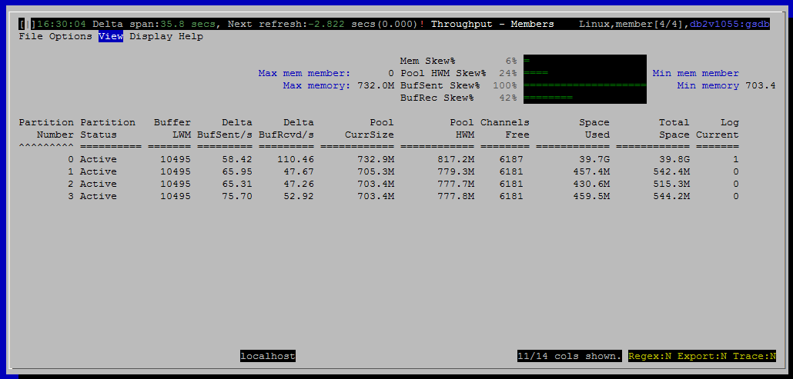

<h2>Purpose</h2>

Show some basic statistics about individual members.  Member specific memory and transaction log usage are found here.

<h2>Histograms and Summaries (Gauges)</h2>

(link TBD)

<h2>Metrics Shown in Grid</h2>

<u>Partition Number</u>

Source: <a href="http://www.ibm.com/support/knowledgecenter/SSEPGG_10.5.0/com.ibm.db2.luw.sql.rtn.doc/doc/r0057172.html?cp=SSEPGG_10.5.0%2F3-6-1-3-10-30&amp;lang=en">mon_get_fcm_connection_list</a>.<a href="http://www.ibm.com/support/knowledgecenter/SSEPGG_10.5.0/com.ibm.db2.luw.admin.mon.doc/doc/r0054432.html?cp=SSEPGG_10.5.0&amp;lang=en">member</a>

 
<u>Partition Status</u>

Source: <a href="http://www.ibm.com/support/knowledgecenter/SSEPGG_10.5.0/com.ibm.db2.luw.sql.rtn.doc/doc/r0057172.html?cp=SSEPGG_10.5.0%2F3-6-1-3-10-30&amp;lang=en" style="font-family:'courier new' , 'courier' , monospace">mon_get_fcm_connection_list</a>.<a href="http://www.ibm.com/support/knowledgecenter/SSEPGG_10.5.0/com.ibm.db2.luw.admin.mon.doc/doc/r0001232.html?cp=SSEPGG_10.5.0&amp;lang=en">connection_status</a>

 
<u>Buffer LWM</u>

Source: <a href="http://www.ibm.com/support/knowledgecenter/SSEPGG_10.5.0/com.ibm.db2.luw.sql.rtn.doc/doc/r0057171.html?cp=SSEPGG_10.5.0%2F3-6-1-3-10-29&amp;lang=en">mon_get_fcm</a>.<a href="http://www.ibm.com/support/knowledgecenter/SSEPGG_10.5.0/com.ibm.db2.luw.admin.mon.doc/doc/r0023395.html?cp=SSEPGG_10.5.0&amp;lang=en">buff_free_bottom</a>

 
<u>Delta BufSent/s</u>

Source: <a href="http://www.ibm.com/support/knowledgecenter/SSEPGG_10.5.0/com.ibm.db2.luw.sql.rtn.doc/doc/r0057172.html?cp=SSEPGG_10.5.0%2F3-6-1-3-10-30&amp;lang=en" style="font-family:'courier new' , 'courier' , monospace">mon_get_fcm_connection_list</a>.<a href="http://www.ibm.com/support/knowledgecenter/SSEPGG_10.5.0/com.ibm.db2.luw.admin.mon.doc/doc/r0001233.html?cp=SSEPGG_10.5.0&amp;lang=en" style="font-family:'courier new' , 'courier' , monospace">total_buffers_sent</a>

 
<u>Delta BufRcvd/s</u>

Source: <a href="http://www.ibm.com/support/knowledgecenter/SSEPGG_10.5.0/com.ibm.db2.luw.sql.rtn.doc/doc/r0057172.html?cp=SSEPGG_10.5.0%2F3-6-1-3-10-30&amp;lang=en" style="font-family:'courier new' , 'courier' , monospace">mon_get_fcm_connection_list</a>.<a href="http://www.ibm.com/support/knowledgecenter/SSEPGG_10.5.0/com.ibm.db2.luw.admin.mon.doc/doc/r0001234.html?cp=SSEPGG_10.5.0&amp;lang=en">total_buffers_rcvd</a>

 
<u>Pool CurrSize</u>

Source: <a href="http://www.ibm.com/support/knowledgecenter/SSEPGG_10.5.0/com.ibm.db2.luw.sql.rtn.doc/doc/r0059464.html?cp=SSEPGG_10.5.0%2F3-6-1-3-10-37&amp;lang=en">mon_get_memory_pool</a>.<a href="http://www.ibm.com/support/knowledgecenter/SSEPGG_10.5.0/com.ibm.db2.luw.admin.mon.doc/doc/r0059534.html?cp=SSEPGG_10.5.0&amp;lang=en">mem_pool_used</a>

 
<u>Pool HWM</u>

Source: <a href="http://www.ibm.com/support/knowledgecenter/SSEPGG_10.5.0/com.ibm.db2.luw.sql.rtn.doc/doc/r0059464.html?cp=SSEPGG_10.5.0%2F3-6-1-3-10-37&amp;lang=en" style="text-decoration:underline;color:rgb( 5 , 56 , 107 );font-family:'courier new' , 'courier' , monospace">mon_get_memory_pool</a>.<a href="http://www.ibm.com/support/knowledgecenter/SSEPGG_10.5.0/com.ibm.db2.luw.admin.mon.doc/doc/r0059453.html?cp=SSEPGG_10.5.0&amp;lang=en">mem_pool_used_hwm</a>

 
<u>Channels Free</u>

Source: <a href="http://www.ibm.com/support/knowledgecenter/SSEPGG_10.5.0/com.ibm.db2.luw.sql.rtn.doc/doc/r0057171.html?cp=SSEPGG_10.5.0%2F3-6-1-3-10-29&amp;lang=en" style="text-decoration:underline;color:rgb( 5 , 56 , 107 );font-family:'courier new' , 'courier' , monospace">mon_get_fcm</a>.<a href="http://www.ibm.com/support/knowledgecenter/SSEPGG_10.5.0/com.ibm.db2.luw.admin.mon.doc/doc/r0023394.html?cp=SSEPGG_10.5.0&amp;lang=en">ch_free</a>

 
<u>Space Used</u>

Source: <a href="http://www.ibm.com/support/knowledgecenter/SSEPGG_10.5.0/com.ibm.db2.luw.sql.rtn.doc/doc/r0053943.html?cp=SSEPGG_10.5.0%2F3-6-1-3-10-57&amp;lang=en">mon_get_tablespace</a>

sum(<a href="http://www.ibm.com/support/knowledgecenter/SSEPGG_10.5.0/com.ibm.db2.luw.admin.mon.doc/doc/r0007541.html?cp=SSEPGG_10.5.0&amp;lang=en" style="font-family:'courier new' , 'courier' , monospace">tbsp_used_pages </a>* <a href="http://www.ibm.com/support/knowledgecenter/SSEPGG_10.5.0/com.ibm.db2.luw.admin.mon.doc/doc/r0007534.html?cp=SSEPGG_10.5.0&amp;lang=en" style="font-family:'courier new' , 'courier' , monospace">tbsp_page_size</a>)

 
<u>Total Space</u>

Source: <a href="http://www.ibm.com/support/knowledgecenter/SSEPGG_10.5.0/com.ibm.db2.luw.sql.rtn.doc/doc/r0053943.html?cp=SSEPGG_10.5.0%2F3-6-1-3-10-57&amp;lang=en" style="text-decoration:underline;color:rgb( 5 , 56 , 107 );font-family:'courier new' , 'courier' , monospace">mon_get_tablespace</a>

sum(<a href="http://www.ibm.com/support/knowledgecenter/SSEPGG_10.5.0/com.ibm.db2.luw.admin.mon.doc/doc/r0007539.html?cp=SSEPGG_10.5.0&amp;lang=en" style="font-family:'courier new' , 'courier' , monospace">tbsp_total_pages </a>* <a href="http://www.ibm.com/support/knowledgecenter/SSEPGG_10.5.0/com.ibm.db2.luw.admin.mon.doc/doc/r0007534.html?cp=SSEPGG_10.5.0&amp;lang=en" style="font-family:'courier new' , 'courier' , monospace">tbsp_page_size</a>)

 
<u>Log Current</u>

Source: <a href="http://www.ibm.com/support/knowledgecenter/SSEPGG_10.5.0/com.ibm.db2.luw.sql.rtn.doc/doc/r0059253.html?cp=SSEPGG_10.5.0%2F3-6-1-3-10-61&amp;lang=en">mon_get_transaction_log</a>.<a href="http://www.ibm.com/support/knowledgecenter/SSEPGG_10.5.0/com.ibm.db2.luw.admin.mon.doc/doc/r0011688.html?cp=SSEPGG_10.5.0&amp;lang=en">current_active_log</a>

 
<u>Log First</u>

Source: <a href="http://www.ibm.com/support/knowledgecenter/SSEPGG_10.5.0/com.ibm.db2.luw.sql.rtn.doc/doc/r0059253.html?cp=SSEPGG_10.5.0%2F3-6-1-3-10-61&amp;lang=en" style="text-decoration:underline;color:rgb( 5 , 56 , 107 );font-family:'courier new' , 'courier' , monospace">mon_get_transaction_log</a>.<a href="http://www.ibm.com/support/knowledgecenter/SSEPGG_10.5.0/com.ibm.db2.luw.admin.mon.doc/doc/r0011686.html?cp=SSEPGG_10.5.0&amp;lang=en">first_active_log</a>

 
<u>Log Last</u>

Source: <a href="http://www.ibm.com/support/knowledgecenter/SSEPGG_10.5.0/com.ibm.db2.luw.sql.rtn.doc/doc/r0059253.html?cp=SSEPGG_10.5.0%2F3-6-1-3-10-61&amp;lang=en" style="text-decoration:underline;color:rgb( 5 , 56 , 107 );font-family:'courier new' , 'courier' , monospace">mon_get_transaction_log</a>.<a href="http://www.ibm.com/support/knowledgecenter/SSEPGG_10.5.0/com.ibm.db2.luw.admin.mon.doc/doc/r0011687.html?cp=SSEPGG_10.5.0&amp;lang=en">last_active_log</a>

 
<u>Number of Pools</u>

Count the number of memory application and database memory pools.

Source: <a href="http://www.ibm.com/support/knowledgecenter/SSEPGG_10.5.0/com.ibm.db2.luw.sql.rtn.doc/doc/r0059464.html?cp=SSEPGG_10.5.0%2F3-6-1-3-10-37&amp;lang=en" style="text-decoration:underline;color:rgb( 5 , 56 , 107 );font-family:'courier new' , 'courier' , monospace">mon_get_memory_pool</a>

select member, count(*) from table(<a href="http://www.ibm.com/support/knowledgecenter/SSEPGG_10.5.0/com.ibm.db2.luw.sql.rtn.doc/doc/r0059464.html?cp=SSEPGG_10.5.0%2F3-6-1-3-10-37&amp;lang=en" style="text-decoration:underline;color:rgb( 5 , 56 , 107 );font-family:'courier new' , 'courier' , monospace">mon_get_memory_pool</a>(...))

where <a href="http://www.ibm.com/support/knowledgecenter/SSEPGG_10.5.0/com.ibm.db2.luw.admin.mon.doc/doc/r0059444.html?cp=SSEPGG_10.5.0&amp;lang=en">memory_set_type </a>in('APPLICATION','DATABASE')

group by member

 
<u>Log Space Used</u>

Source: <a href="http://www.ibm.com/support/knowledgecenter/SSEPGG_10.5.0/com.ibm.db2.luw.sql.rtn.doc/doc/r0059253.html?cp=SSEPGG_10.5.0%2F3-6-1-3-10-61&amp;lang=en" style="text-decoration:underline;color:rgb( 5 , 56 , 107 );font-family:'courier new' , 'courier' , monospace">mon_get_transaction_log</a>.<a href="http://www.ibm.com/support/knowledgecenter/SSEPGG_10.5.0/com.ibm.db2.luw.admin.mon.doc/doc/r0002530.html?cp=SSEPGG_10.5.0&amp;lang=en">total_log_used</a>

 
<u>Percent of Log Used</u>

Source: <a href="http://www.ibm.com/support/knowledgecenter/SSEPGG_10.5.0/com.ibm.db2.luw.sql.rtn.doc/doc/r0059253.html?cp=SSEPGG_10.5.0%2F3-6-1-3-10-61&amp;lang=en" style="text-decoration:underline;color:rgb( 5 , 56 , 107 );font-family:'courier new' , 'courier' , monospace">mon_get_transaction_log</a>

<a href="http://www.ibm.com/support/knowledgecenter/SSEPGG_10.5.0/com.ibm.db2.luw.admin.mon.doc/doc/r0002530.html?cp=SSEPGG_10.5.0&amp;lang=en" style="font-family:'helvetica neue' , 'helvetica' , 'arial' , sans-serif">total_log_used</a> / (<a href="http://www.ibm.com/support/knowledgecenter/SSEPGG_10.5.0/com.ibm.db2.luw.admin.mon.doc/doc/r0002530.html?cp=SSEPGG_10.5.0&amp;lang=en" style="font-family:'helvetica neue' , 'helvetica' , 'arial' , sans-serif">total_log_used</a> + <a href="http://www.ibm.com/support/knowledgecenter/SSEPGG_10.5.0/com.ibm.db2.luw.admin.mon.doc/doc/r0002531.html?cp=SSEPGG_10.5.0&amp;lang=en">total_log_available</a>)

 
<u>Agent ID Holding 1st Log</u>

Source: <a href="http://www.ibm.com/support/knowledgecenter/SSEPGG_10.5.0/com.ibm.db2.luw.sql.rtn.doc/doc/r0059253.html?cp=SSEPGG_10.5.0%2F3-6-1-3-10-61&amp;lang=en" style="text-decoration:underline;color:rgb( 5 , 56 , 107 );font-family:'courier new' , 'courier' , monospace">mon_get_transaction_log</a>.applid_holding_oldest_xact

<h2>Default Sort Column</h2>

Partition number (Member): Ascending

<h2>Navigation</h2>

Keyboard navigation: Vtp

Dedicated shortcut key: alt-p

<h6>Author: KevinLBeck</h6>