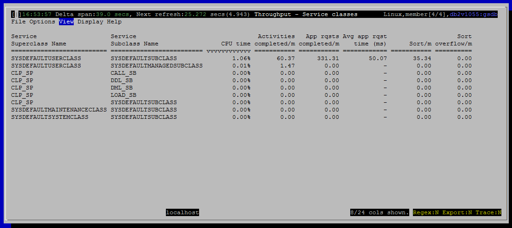

<h2>Purpose</h2>

Show how much work is happening in each WLM service class.

One of the main purposes of WLM service classes is to apply different priorities and or policies to different types of work.  For example, limiting the number of large queries allowed to run concurrently.  Service classes are also used to give higher priority to business critical applications.

Validating that service classes are serving their intended purpose requires monitoring the performance of activities that are running in them.

Each row in this view shows a service subclass.  You can use filtering or sorting to group the service subclasses by service superclass.

<h2>Metrics Shown</h2>

<u>Service Superclass Name</u>

Source: <a href="http://www-01.ibm.com/support/knowledgecenter/SSEPGG_10.5.0/com.ibm.db2.luw.sql.rtn.doc/doc/r0053941.html?lang=en" style="font-family:'courier new' , 'courier' , monospace">mon_get_service_subclass</a>.service_superclass_name

<u>Service Subclass Name</u>

Source: <a href="http://www-01.ibm.com/support/knowledgecenter/SSEPGG_10.5.0/com.ibm.db2.luw.sql.rtn.doc/doc/r0053941.html?lang=en" style="font-family:'courier new' , 'courier' , monospace">mon_get_service_subclass</a>.service_subclass_name

<u>CPU Time</u>

Source: <a href="http://www-01.ibm.com/support/knowledgecenter/SSEPGG_10.5.0/com.ibm.db2.luw.sql.rtn.doc/doc/r0053941.html?lang=en" style="font-family:'courier new' , 'courier' , monospace">mon_get_service_subclass</a>.total_cpu_time

<u>Activities Completed / m</u>

The number of activities completed per minute is one measure of how much work is being accomplished by connections associated with this service subclass.  Activities typically correspond to a query, although there a few additional things that count as an activity including LOAD and stored procedures calls.

Source: <a href="http://www-01.ibm.com/support/knowledgecenter/SSEPGG_10.5.0/com.ibm.db2.luw.sql.rtn.doc/doc/r0053941.html?lang=en" style="font-family:'courier new' , 'courier' , monospace">mon_get_service_subclass</a>.act_completed_total

<u>Activities Aborted / m</u>

Source: <a href="http://www-01.ibm.com/support/knowledgecenter/SSEPGG_10.5.0/com.ibm.db2.luw.sql.rtn.doc/doc/r0053941.html?lang=en" style="font-family:'courier new' , 'courier' , monospace">mon_get_service_subclass</a>.act_aborted_total

<u>Activities Rejected / m</u>

Source: <a href="http://www-01.ibm.com/support/knowledgecenter/SSEPGG_10.5.0/com.ibm.db2.luw.sql.rtn.doc/doc/r0053941.html?lang=en" style="font-family:'courier new' , 'courier' , monospace">mon_get_service_subclass</a>.act_rejected_total

<u>App Rqsts Completed / m</u>

Source: <a href="http://www-01.ibm.com/support/knowledgecenter/SSEPGG_10.5.0/com.ibm.db2.luw.sql.rtn.doc/doc/r0053941.html?lang=en" style="font-family:'courier new' , 'courier' , monospace">mon_get_service_subclass</a>.app_rqsts_completed_total

<u>Avg App Rqst Time (ms)</u>

<u>Activities Queued / m</u>

Source: <a href="http://www-01.ibm.com/support/knowledgecenter/SSEPGG_10.5.0/com.ibm.db2.luw.sql.rtn.doc/doc/r0053941.html?lang=en" style="font-family:'courier new' , 'courier' , monospace">mon_get_service_subclass</a>.wlm_queue_assignments_total

<u>Rows Read / m</u>

Source: <a href="http://www-01.ibm.com/support/knowledgecenter/SSEPGG_10.5.0/com.ibm.db2.luw.sql.rtn.doc/doc/r0053941.html?lang=en" style="font-family:'courier new' , 'courier' , monospace">mon_get_service_subclass</a>.rows_read

<u>Rows Modified / m</u>

Source: <a href="http://www-01.ibm.com/support/knowledgecenter/SSEPGG_10.5.0/com.ibm.db2.luw.sql.rtn.doc/doc/r0053941.html?lang=en" style="font-family:'courier new' , 'courier' , monospace">mon_get_service_subclass</a>.rows_modified

<u>Rows Returned / m</u>

Source: <a href="http://www-01.ibm.com/support/knowledgecenter/SSEPGG_10.5.0/com.ibm.db2.luw.sql.rtn.doc/doc/r0053941.html?lang=en" style="font-family:'courier new' , 'courier' , monospace">mon_get_service_subclass</a>.rows_returned

<u>Logical Reads / m</u>

Source: <a href="http://www-01.ibm.com/support/knowledgecenter/SSEPGG_10.5.0/com.ibm.db2.luw.sql.rtn.doc/doc/r0053941.html?lang=en" style="font-family:'courier new' , 'courier' , monospace">mon_get_service_subclass</a>

 

<a href="http://www-01.ibm.com/support/knowledgecenter/SSEPGG_10.5.0/com.ibm.db2.luw.admin.mon.doc/doc/r0001235.html?cp=SSEPGG_10.5.0&amp;lang=en" style="text-decoration:underline;color:rgb( 5 , 56 , 107 );font-family:'courier new' , 'courier' , monospace">pool_data_l_reads</a> + <a href="http://www-01.ibm.com/support/knowledgecenter/SSEPGG_10.5.0/com.ibm.db2.luw.admin.mon.doc/doc/r0001238.html?lang=en" style="font-family:'courier new' , 'courier' , monospace">pool_index_l_reads</a> + <a href="http://www-01.ibm.com/support/knowledgecenter/SSEPGG_10.5.0/com.ibm.db2.luw.admin.mon.doc/doc/r0022731.html?lang=en" style="font-family:'courier new' , 'courier' , monospace">pool_xda_l_reads</a> + <a href="http://www.ibm.com/support/knowledgecenter/SSEPGG_10.5.0/com.ibm.db2.luw.admin.mon.doc/doc/r0060763.html?lang=en">pool_col_l_reads</a> +

<a href="http://www.ibm.com/support/knowledgecenter/SSEPGG_10.5.0/com.ibm.db2.luw.admin.mon.doc/doc/r0011302.html?lang=en">pool_temp_data_l_reads </a>+ <a href="http://www.ibm.com/support/knowledgecenter/SSEPGG_10.5.0/com.ibm.db2.luw.admin.mon.doc/doc/r0011303.html?cp=SSEPGG_10.5.0&amp;lang=en">pool_temp_index_l_reads </a>+ <a href="http://www.ibm.com/support/knowledgecenter/SSEPGG_10.5.0/com.ibm.db2.luw.admin.mon.doc/doc/r0022738.html?cp=SSEPGG_10.5.0&amp;lang=en">pool_temp_xda_l_reads </a>+ <a href="http://www.ibm.com/support/knowledgecenter/SSEPGG_10.5.0/com.ibm.db2.luw.admin.mon.doc/doc/r0060873.html?cp=SSEPGG_10.5.0&amp;lang=en">pool_temp_col_l_reads</a>

<u>Direct Reads / m</u>

Source: <a href="http://www-01.ibm.com/support/knowledgecenter/SSEPGG_10.5.0/com.ibm.db2.luw.sql.rtn.doc/doc/r0053941.html?lang=en" style="font-family:'courier new' , 'courier' , monospace">mon_get_service_subclass</a>.direct_reads

<u>Direct Writes / m</u>

Source: <a href="http://www-01.ibm.com/support/knowledgecenter/SSEPGG_10.5.0/com.ibm.db2.luw.sql.rtn.doc/doc/r0053941.html?lang=en" style="font-family:'courier new' , 'courier' , monospace">mon_get_service_subclass</a>.direct_writes

<u>Lock Waits / m</u>

Source: <a href="http://www-01.ibm.com/support/knowledgecenter/SSEPGG_10.5.0/com.ibm.db2.luw.sql.rtn.doc/doc/r0053941.html?lang=en" style="font-family:'courier new' , 'courier' , monospace">mon_get_service_subclass</a>.lock_waits

<u>Lock Timeouts / m</u>

Source: <a href="http://www-01.ibm.com/support/knowledgecenter/SSEPGG_10.5.0/com.ibm.db2.luw.sql.rtn.doc/doc/r0053941.html?lang=en" style="font-family:'courier new' , 'courier' , monospace">mon_get_service_subclass</a>.lock_timeouts

<u>Lock Escal / m</u>

Source: <a href="http://www-01.ibm.com/support/knowledgecenter/SSEPGG_10.5.0/com.ibm.db2.luw.sql.rtn.doc/doc/r0053941.html?lang=en" style="font-family:'courier new' , 'courier' , monospace">mon_get_service_subclass</a>.lock_escals

<u>Deadlocks / m</u>

Source: <a href="http://www-01.ibm.com/support/knowledgecenter/SSEPGG_10.5.0/com.ibm.db2.luw.sql.rtn.doc/doc/r0053941.html?lang=en" style="font-family:'courier new' , 'courier' , monospace">mon_get_service_subclass</a>.deadlocks

<u>Threshold Violations / m</u>

Source: <a href="http://www-01.ibm.com/support/knowledgecenter/SSEPGG_10.5.0/com.ibm.db2.luw.sql.rtn.doc/doc/r0053941.html?lang=en" style="font-family:'courier new' , 'courier' , monospace">mon_get_service_subclass</a>.thresh_violations

<u>Sorts / m</u>

Source: <a href="http://www-01.ibm.com/support/knowledgecenter/SSEPGG_10.5.0/com.ibm.db2.luw.sql.rtn.doc/doc/r0053941.html?lang=en" style="font-family:'courier new' , 'courier' , monospace">mon_get_service_subclass</a>.total_sorts

<u>Sort Overflows / m</u>

Source: <a href="http://www-01.ibm.com/support/knowledgecenter/SSEPGG_10.5.0/com.ibm.db2.luw.sql.rtn.doc/doc/r0053941.html?lang=en" style="font-family:'courier new' , 'courier' , monospace">mon_get_service_subclass</a>.sort_overflows

<u>Hash Group By Ops / m</u>

Source: <a href="http://www-01.ibm.com/support/knowledgecenter/SSEPGG_10.5.0/com.ibm.db2.luw.sql.rtn.doc/doc/r0053941.html?lang=en" style="font-family:'courier new' , 'courier' , monospace">mon_get_service_subclass</a>.total_hash_grpbys

<u>Hash Group By Overflows / m</u>

Source: <a href="http://www-01.ibm.com/support/knowledgecenter/SSEPGG_10.5.0/com.ibm.db2.luw.sql.rtn.doc/doc/r0053941.html?lang=en" style="font-family:'courier new' , 'courier' , monospace">mon_get_service_subclass</a>.hash_grpby_overflows

<h2  style="font-size:1.5em;text-shadow:rgb( 255 , 255 , 255 ) 0px 1px 0px;font-family:'helvetica neue' , 'helvetica' , 'arial' , sans-serif;color:rgb( 0 , 0 , 0 ) !important;padding:2px !important;border:none !important">Default Sort Column</h2>

CPU Time, descending

<h2  style="font-size:1.5em;text-shadow:rgb( 255 , 255 , 255 ) 0px 1px 0px;font-family:'helvetica neue' , 'helvetica' , 'arial' , sans-serif;color:rgb( 0 , 0 , 0 ) !important;padding:2px !important;border:none !important">Navigation</h2>

Keyboard navigation: Vts

Dedicated shortcut key: (none)

<h6>Author: KevinLBeck</h6>