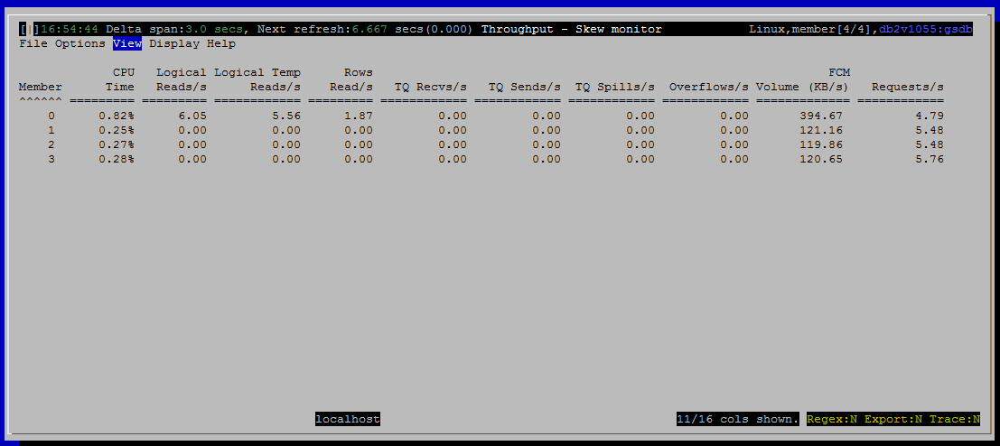

<h2>Purpose</h2>

This view presents data useful in assessing skew in access patterns.  When a query accesses more data on some members than on others, the more heavily loaded members become bottlenecks, making the whole query take longer.

<h2>Histograms and Summaries (Gauges)</h2>

(none)

<h2>Metrics Shown in Grid</h2>

<u>Member</u>

Source: <a href="http://www-01.ibm.com/support/knowledgecenter/SSEPGG_10.5.0/com.ibm.db2.luw.sql.rtn.doc/doc/r0053941.html?lang=en">mon_get_service_subclass</a>.<a href="http://www.ibm.com/support/knowledgecenter/SSEPGG_10.5.0/com.ibm.db2.luw.admin.mon.doc/doc/r0054432.html?cp=SSEPGG_10.5.0&amp;lang=en">member</a>

 
<u>CPU Time</u>

Source: <a href="http://www-01.ibm.com/support/knowledgecenter/SSEPGG_10.5.0/com.ibm.db2.luw.sql.rtn.doc/doc/r0053941.html?lang=en" style="font-family:'courier new' , 'courier' , monospace">mon_get_service_subclass</a>.total_cpu_time

 
<u>Logical Reads/s</u>

Logical reads is a better measure of access patterns than rows read because it includes index accesses.

Source: <a href="http://www-01.ibm.com/support/knowledgecenter/SSEPGG_10.5.0/com.ibm.db2.luw.sql.rtn.doc/doc/r0053941.html?lang=en" style="font-family:'courier new' , 'courier' , monospace">mon_get_service_subclass</a>

<a href="http://www-01.ibm.com/support/knowledgecenter/SSEPGG_10.5.0/com.ibm.db2.luw.admin.mon.doc/doc/r0001235.html?cp=SSEPGG_10.5.0&amp;lang=en" style="font-family:'courier new' , 'courier' , monospace">pool_data_l_reads</a> + <a href="http://www-01.ibm.com/support/knowledgecenter/SSEPGG_10.5.0/com.ibm.db2.luw.admin.mon.doc/doc/r0001238.html?lang=en" style="font-family:'courier new' , 'courier' , monospace">pool_index_l_reads</a> + <a href="http://www-01.ibm.com/support/knowledgecenter/SSEPGG_10.5.0/com.ibm.db2.luw.admin.mon.doc/doc/r0022731.html?lang=en" style="font-family:'courier new' , 'courier' , monospace">pool_xda_l_reads</a> + <a href="http://www.ibm.com/support/knowledgecenter/SSEPGG_10.5.0/com.ibm.db2.luw.admin.mon.doc/doc/r0060763.html?lang=en">pool_col_l_reads</a> +

<a href="http://www.ibm.com/support/knowledgecenter/SSEPGG_10.5.0/com.ibm.db2.luw.admin.mon.doc/doc/r0011302.html?lang=en">pool_temp_data_l_reads </a>+ <a href="http://www.ibm.com/support/knowledgecenter/SSEPGG_10.5.0/com.ibm.db2.luw.admin.mon.doc/doc/r0011303.html?cp=SSEPGG_10.5.0&amp;lang=en">pool_temp_index_l_reads </a>+ <a href="http://www.ibm.com/support/knowledgecenter/SSEPGG_10.5.0/com.ibm.db2.luw.admin.mon.doc/doc/r0022738.html?cp=SSEPGG_10.5.0&amp;lang=en">pool_temp_xda_l_reads </a>+ <a href="http://www.ibm.com/support/knowledgecenter/SSEPGG_10.5.0/com.ibm.db2.luw.admin.mon.doc/doc/r0060873.html?cp=SSEPGG_10.5.0&amp;lang=en">pool_temp_col_l_reads</a>

 
<u>Logical Temp Reads/s</u>

Source: <a href="http://www-01.ibm.com/support/knowledgecenter/SSEPGG_10.5.0/com.ibm.db2.luw.sql.rtn.doc/doc/r0053941.html?lang=en" style="font-family:'courier new' , 'courier' , monospace">mon_get_service_subclass</a>

<a href="http://www-01.ibm.com/support/knowledgecenter/SSEPGG_10.5.0/com.ibm.db2.luw.admin.mon.doc/doc/r0011302.html?lang=en" style="text-decoration:underline;color:rgb( 5 , 56 , 107 );font-family:'courier new' , 'courier' , monospace">pool_temp_data_l_reads</a> + pool_temp_index_l_reads + pool_temp_xda_l_reads + pool_temp_col_l_reads

 
<u>Rows Read/s</u>

Source: <a href="http://www-01.ibm.com/support/knowledgecenter/SSEPGG_10.5.0/com.ibm.db2.luw.sql.rtn.doc/doc/r0053941.html?lang=en" style="font-family:'courier new' , 'courier' , monospace">mon_get_service_subclass</a>.rows_read

 
<u>Rows Modified/s</u>

Source: <a href="http://www-01.ibm.com/support/knowledgecenter/SSEPGG_10.5.0/com.ibm.db2.luw.sql.rtn.doc/doc/r0053941.html?lang=en" style="font-family:'courier new' , 'courier' , monospace">mon_get_service_subclass</a>.rows_modified

 
<u>TQ Recvs/s</u>

Source: <a href="http://www-01.ibm.com/support/knowledgecenter/SSEPGG_10.5.0/com.ibm.db2.luw.sql.rtn.doc/doc/r0053941.html?lang=en" style="font-family:'courier new' , 'courier' , monospace">mon_get_service_subclass</a>.fcm_tq_recvs_total

 
<u>TQ Sends/s</u>

Source: <a href="http://www-01.ibm.com/support/knowledgecenter/SSEPGG_10.5.0/com.ibm.db2.luw.sql.rtn.doc/doc/r0053941.html?lang=en" style="font-family:'courier new' , 'courier' , monospace">mon_get_service_subclass</a>.fcm_tq_sends_total

 
<u>TQ Spills/s</u>

Source: <a href="http://www-01.ibm.com/support/knowledgecenter/SSEPGG_10.5.0/com.ibm.db2.luw.sql.rtn.doc/doc/r0053941.html?lang=en" style="font-family:'courier new' , 'courier' , monospace">mon_get_service_subclass</a>.tq_tot_send_spills

 
<u>Overflows/s</u>

Source: <a href="http://www-01.ibm.com/support/knowledgecenter/SSEPGG_10.5.0/com.ibm.db2.luw.sql.rtn.doc/doc/r0053941.html?lang=en" style="font-family:'courier new' , 'courier' , monospace">mon_get_service_subclass</a>

sort_overflows + hash_join_overflows + olap_func_overflows + hash_grpby_overflows

 
<u>FCM Volume (KB/s)</u>

Source: <a href="http://www-01.ibm.com/support/knowledgecenter/SSEPGG_10.5.0/com.ibm.db2.luw.sql.rtn.doc/doc/r0053941.html?lang=en" style="font-family:'courier new' , 'courier' , monospace">mon_get_service_subclass</a>

(fcm_recv_volume + fcm_send_volume) / 1024.0

 
<u>FCM Buffers Sent/s</u>

Source: <a href="http://www-01.ibm.com/support/knowledgecenter/SSEPGG_10.5.0/com.ibm.db2.luw.sql.rtn.doc/doc/r0053941.html?lang=en" style="font-family:'courier new' , 'courier' , monospace">mon_get_service_subclass</a>.fcm_sends_total

 
<u>FCM Buffers Recvd/s</u>

Source: <a href="http://www-01.ibm.com/support/knowledgecenter/SSEPGG_10.5.0/com.ibm.db2.luw.sql.rtn.doc/doc/r0053941.html?lang=en" style="font-family:'courier new' , 'courier' , monospace">mon_get_service_subclass</a>.fcm_recvs_total

 
<u>Activities Completed/s</u>

Source: <a href="http://www-01.ibm.com/support/knowledgecenter/SSEPGG_10.5.0/com.ibm.db2.luw.sql.rtn.doc/doc/r0053941.html?lang=en" style="font-family:'courier new' , 'courier' , monospace">mon_get_service_subclass</a>.act_completed_total

 
<u>Requests/s</u>

Source: <a href="http://www-01.ibm.com/support/knowledgecenter/SSEPGG_10.5.0/com.ibm.db2.luw.sql.rtn.doc/doc/r0053941.html?lang=en" style="font-family:'courier new' , 'courier' , monospace">mon_get_service_subclass</a>.rqsts_completed_total

 
<u>In-flight Activities</u>

Source:

select count(*) from table(wlm_get_workload_occurrence_activities(null,member))

<h2>Default Sort Column</h2>

Member, ascending

<h2>Navigation</h2>

Keyboard navigation: VtJ

Dedicated shortcut key: alt-J

<h6>Author: KevinLBeck</h6>