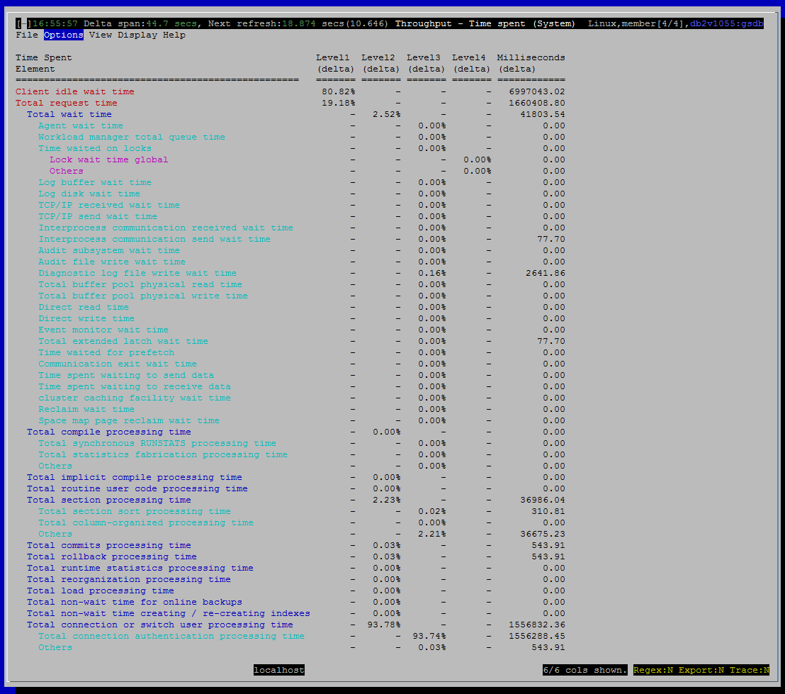

<h2>Purpose</h2>

This view shows where the database is spending its time.  You should be able to see at a glance if excessive time is being spent in non-productive areas, such as waiting on locks or writing to event monitors.  There are some uncommon but important scenarios that are difficult to diagnose other than by noticing that the server is spending time on something strange.

DB2 organizes the monitor elements for time spent in a hierarchy.  For example, there is a monitor element for time spent waiting, which is broken down into many individual elements covering the various things that activities wait for, such as locks, prefetchers, logging, etc.  The particular hierarchy shown by dsmtop is the “System Dimension” one, documented here:

<a href="http://www-01.ibm.com/support/knowledgecenter/SSEPGG_10.5.0/com.ibm.db2.luw.admin.mon.doc/doc/c0055434.html?lang=en">http://www-01.ibm.com/support/knowledgecenter/SSEPGG_10.5.0/com.ibm.db2.luw.admin.mon.doc/doc/c0055434.html?lang=en</a>

For each element shown, we show what percentage it constitutes of each of its parent element.  In the current implementation, we present only a summarized view across all members, which means that the stats for the Fast Communication Subsystem (FCM), which routes data and requests between members, is excluded because there is no meaningful aggregation possible for these monitor elements.

Nesting (position in the hierarchy) is shown by indenting the names of the time monitor elements.

The last column shows the raw values for the elements.  So if the display mode is “count”, this is the number of milliseconds the data server spent in that category since it was activated.

&lt;TBD investigate and write-up what is shown in the last column when display mode is "delta"&gt;.  

<h2>Summaries and Histograms (Gauges)</h2>

(none)

<h2>Metrics Shown</h2>

<u>Client idle wait time</u>

Time spent waiting for the client to send its next request.

Source: <a href="http://www-01.ibm.com/support/knowledgecenter/SSEPGG_10.5.0/com.ibm.db2.luw.sql.rtn.doc/doc/r0053941.html?lang=en">mon_get_service_subclass</a>.<a href="http://www-01.ibm.com/support/knowledgecenter/SSEPGG_10.5.0/com.ibm.db2.luw.admin.mon.doc/doc/r0054017.html?cp=SSEPGG_10.5.0&amp;lang=en">client_idle_wait_time</a>

 
<u>Total request time</u>

The total amount of time spent working on requests.

Source: <a href="http://www-01.ibm.com/support/knowledgecenter/SSEPGG_10.5.0/com.ibm.db2.luw.sql.rtn.doc/doc/r0053941.html?lang=en">mon_get_service_subclass</a>.<a href="http://www-01.ibm.com/support/knowledgecenter/SSEPGG_10.5.0/com.ibm.db2.luw.admin.mon.doc/doc/r0054060.html?cp=SSEPGG_10.5.0&amp;lang=en">total_rqst_time</a>

 
<u>Total wait time</u>

The total time spent waiting within the DB2 database server.

Source: <a href="http://www-01.ibm.com/support/knowledgecenter/SSEPGG_10.5.0/com.ibm.db2.luw.sql.rtn.doc/doc/r0053941.html?lang=en">mon_get_service_subclass</a>.<a href="http://www-01.ibm.com/support/knowledgecenter/SSEPGG_10.5.0/com.ibm.db2.luw.admin.mon.doc/doc/r0054061.html?cp=SSEPGG_10.5.0&amp;lang=en">total_wait_time</a>

 

<u>Agent wait time</u>

Time spent by an application queued to wait for an agent under concentrator configurations.

 

Source: <a href="http://www-01.ibm.com/support/knowledgecenter/SSEPGG_10.5.0/com.ibm.db2.luw.sql.rtn.doc/doc/r0053941.html?lang=en">mon_get_service_subclass</a>.<a href="http://www-01.ibm.com/support/knowledgecenter/SSEPGG_10.5.0/com.ibm.db2.luw.admin.mon.doc/doc/r0054009.html?cp=SSEPGG_10.5.0&amp;lang=en">agent_wait_time</a>

 

<u>Workload manager total queue time</u>

The time spent waiting on a WLM queuing threshold.

Source: <a href="http://www-01.ibm.com/support/knowledgecenter/SSEPGG_10.5.0/com.ibm.db2.luw.sql.rtn.doc/doc/r0053941.html?lang=en">mon_get_service_subclass</a>.<a href="http://www-01.ibm.com/support/knowledgecenter/SSEPGG_10.5.0/com.ibm.db2.luw.admin.mon.doc/doc/r0054063.html?cp=SSEPGG_10.5.0&amp;lang=en">wlm_queue_time_total</a>

 
<u>Time waited on locks</u>

The total elapsed time spent waiting for locks.

Source: <a href="http://www-01.ibm.com/support/knowledgecenter/SSEPGG_10.5.0/com.ibm.db2.luw.sql.rtn.doc/doc/r0053941.html?lang=en">mon_get_service_subclass</a>.<a href="http://www-01.ibm.com/support/knowledgecenter/SSEPGG_10.5.0/com.ibm.db2.luw.admin.mon.doc/doc/r0001294.html?cp=SSEPGG_10.5.0&amp;lang=en">lock_wait_time</a>

 
<u>Lock wait time global</u>

Time spent on global lock waits.  This is relevant only for pureScale.

Source: <a href="http://www-01.ibm.com/support/knowledgecenter/SSEPGG_10.5.0/com.ibm.db2.luw.sql.rtn.doc/doc/r0053941.html?lang=en">mon_get_service_subclass</a>.<a href="http://www-01.ibm.com/support/knowledgecenter/SSEPGG_10.5.0/com.ibm.db2.luw.admin.mon.doc/doc/r0056234.html?cp=SSEPGG_10.5.0&amp;lang=en">lock_wait_time_global</a>

<u>Others (nested under "Time waited on locks")</u>

Source: <a href="http://www-01.ibm.com/support/knowledgecenter/SSEPGG_10.5.0/com.ibm.db2.luw.sql.rtn.doc/doc/r0053941.html?lang=en" style="text-decoration:underline;color:rgb( 5 , 56 , 107 )">mon_get_service_subclass</a>

<a href="http://www-01.ibm.com/support/knowledgecenter/SSEPGG_10.5.0/com.ibm.db2.luw.admin.mon.doc/doc/r0001294.html?cp=SSEPGG_10.5.0&amp;lang=en" style="text-decoration:underline;color:rgb( 5 , 56 , 107 );font-family:'courier new' , 'courier' , monospace">lock_wait_time</a> - <a href="http://www-01.ibm.com/support/knowledgecenter/SSEPGG_10.5.0/com.ibm.db2.luw.admin.mon.doc/doc/r0056234.html?cp=SSEPGG_10.5.0&amp;lang=en" style="text-decoration:underline;color:rgb( 5 , 56 , 107 );font-family:'courier new' , 'courier' , monospace">lock_wait_time_global</a>

 
<u>Log buffer wait time</u>

The amount of time an agent spends waiting for space in the log buffer.

Source: <a href="http://www-01.ibm.com/support/knowledgecenter/SSEPGG_10.5.0/com.ibm.db2.luw.sql.rtn.doc/doc/r0053941.html?lang=en">mon_get_service_subclass</a>.<a href="http://www-01.ibm.com/support/knowledgecenter/SSEPGG_10.5.0/com.ibm.db2.luw.admin.mon.doc/doc/r0054044.html?cp=SSEPGG_10.5.0&amp;lang=en">log_buffer_wait_time</a>

 
<u>Log disk wait time</u>

The amount of time an agent spends waiting for log records to be flushed to disk.

Source: <a href="http://www-01.ibm.com/support/knowledgecenter/SSEPGG_10.5.0/com.ibm.db2.luw.sql.rtn.doc/doc/r0053941.html?lang=en">mon_get_service_subclass</a>.<a href="http://www-01.ibm.com/support/knowledgecenter/SSEPGG_10.5.0/com.ibm.db2.luw.admin.mon.doc/doc/r0054045.html?cp=SSEPGG_10.5.0&amp;lang=en">log_disk_wait_time</a>

 
<u>TCP/IP received wait time</u>

The time spent waiting for an incoming client request over TCP/IP excluding idle time.

Source: <a href="http://www-01.ibm.com/support/knowledgecenter/SSEPGG_10.5.0/com.ibm.db2.luw.sql.rtn.doc/doc/r0053941.html?lang=en">mon_get_service_subclass</a>.<a href="http://www-01.ibm.com/support/knowledgecenter/SSEPGG_10.5.0/com.ibm.db2.luw.admin.mon.doc/doc/r0054051.html?cp=SSEPGG_10.5.0&amp;lang=en">tcpip_recv_wait_time</a>

 
<u>TCP/IP send wait time</u>

Time spent blocking on a TCP/IP send to the client.

Source: <a href="http://www-01.ibm.com/support/knowledgecenter/SSEPGG_10.5.0/com.ibm.db2.luw.sql.rtn.doc/doc/r0053941.html?lang=en">mon_get_service_subclass</a>.<a href="http://www-01.ibm.com/support/knowledgecenter/SSEPGG_10.5.0/com.ibm.db2.luw.admin.mon.doc/doc/r0054054.html?cp=SSEPGG_10.5.0&amp;lang=en">tcpip_send_wait_time</a>

 
<u>Interprocess communication received wait time</u>

Source: <a href="http://www-01.ibm.com/support/knowledgecenter/SSEPGG_10.5.0/com.ibm.db2.luw.sql.rtn.doc/doc/r0053941.html?lang=en">mon_get_service_subclass</a>.

 
<u>Interprocess communication send wait time</u>

Source: <a href="http://www-01.ibm.com/support/knowledgecenter/SSEPGG_10.5.0/com.ibm.db2.luw.sql.rtn.doc/doc/r0053941.html?lang=en">mon_get_service_subclass</a>.

 
<u>Audit subsystem wait time</u>

Source: <a href="http://www-01.ibm.com/support/knowledgecenter/SSEPGG_10.5.0/com.ibm.db2.luw.sql.rtn.doc/doc/r0053941.html?lang=en">mon_get_service_subclass</a>.

 
<u>Audit file write wait time</u>

 

Source: <a href="http://www-01.ibm.com/support/knowledgecenter/SSEPGG_10.5.0/com.ibm.db2.luw.sql.rtn.doc/doc/r0053941.html?lang=en">mon_get_service_subclass</a>.

 

<u>Diagnostic log file write wait time</u>

Source: <a href="http://www-01.ibm.com/support/knowledgecenter/SSEPGG_10.5.0/com.ibm.db2.luw.sql.rtn.doc/doc/r0053941.html?lang=en">mon_get_service_subclass</a>.

 
<u>Total buffer pool physical read time</u>

Source: <a href="http://www-01.ibm.com/support/knowledgecenter/SSEPGG_10.5.0/com.ibm.db2.luw.sql.rtn.doc/doc/r0053941.html?lang=en">mon_get_service_subclass</a>.

 
<u>Total buffer pool physical write time</u>

Source: <a href="http://www-01.ibm.com/support/knowledgecenter/SSEPGG_10.5.0/com.ibm.db2.luw.sql.rtn.doc/doc/r0053941.html?lang=en">mon_get_service_subclass</a>.

 
<u>Direct read time</u>

Source: <a href="http://www-01.ibm.com/support/knowledgecenter/SSEPGG_10.5.0/com.ibm.db2.luw.sql.rtn.doc/doc/r0053941.html?lang=en">mon_get_service_subclass</a>.

 
<u>Direct write time</u>

Source: <a href="http://www-01.ibm.com/support/knowledgecenter/SSEPGG_10.5.0/com.ibm.db2.luw.sql.rtn.doc/doc/r0053941.html?lang=en">mon_get_service_subclass</a>.

 
<u>Event monitor wait time</u>

Source: <a href="http://www-01.ibm.com/support/knowledgecenter/SSEPGG_10.5.0/com.ibm.db2.luw.sql.rtn.doc/doc/r0053941.html?lang=en">mon_get_service_subclass</a>.

 
<u>Total extended latch wait time</u>

Source: <a href="http://www-01.ibm.com/support/knowledgecenter/SSEPGG_10.5.0/com.ibm.db2.luw.sql.rtn.doc/doc/r0053941.html?lang=en">mon_get_service_subclass</a>.

 
<u>Time waited for prefetch</u>

Source: <a href="http://www-01.ibm.com/support/knowledgecenter/SSEPGG_10.5.0/com.ibm.db2.luw.sql.rtn.doc/doc/r0053941.html?lang=en">mon_get_service_subclass</a>.

 
<u>Communication exit wait time</u>

Source: <a href="http://www-01.ibm.com/support/knowledgecenter/SSEPGG_10.5.0/com.ibm.db2.luw.sql.rtn.doc/doc/r0053941.html?lang=en">mon_get_service_subclass</a>.

 
<u>Time spent waiting to send data</u>

Source: <a href="http://www-01.ibm.com/support/knowledgecenter/SSEPGG_10.5.0/com.ibm.db2.luw.sql.rtn.doc/doc/r0053941.html?lang=en">mon_get_service_subclass</a>.

 
<u>Time spent waiting to receive data</u>

 

Source: <a href="http://www-01.ibm.com/support/knowledgecenter/SSEPGG_10.5.0/com.ibm.db2.luw.sql.rtn.doc/doc/r0053941.html?lang=en">mon_get_service_subclass</a>.

 
<u>cluster caching facility wait time</u>

 

Source: <a href="http://www-01.ibm.com/support/knowledgecenter/SSEPGG_10.5.0/com.ibm.db2.luw.sql.rtn.doc/doc/r0053941.html?lang=en">mon_get_service_subclass</a>.

 
<u>Reclaim wait time</u>

 

Source: <a href="http://www-01.ibm.com/support/knowledgecenter/SSEPGG_10.5.0/com.ibm.db2.luw.sql.rtn.doc/doc/r0053941.html?lang=en">mon_get_service_subclass</a>.

 
<u>Space map page reclaim wait time</u>

 

Source: <a href="http://www-01.ibm.com/support/knowledgecenter/SSEPGG_10.5.0/com.ibm.db2.luw.sql.rtn.doc/doc/r0053941.html?lang=en">mon_get_service_subclass</a>.

 
<u>Total compile processing time</u>

 

Source: <a href="http://www-01.ibm.com/support/knowledgecenter/SSEPGG_10.5.0/com.ibm.db2.luw.sql.rtn.doc/doc/r0053941.html?lang=en">mon_get_service_subclass</a>.

 
<u>Total synchronous RUNSTATS processing time</u>

 

Source: <a href="http://www-01.ibm.com/support/knowledgecenter/SSEPGG_10.5.0/com.ibm.db2.luw.sql.rtn.doc/doc/r0053941.html?lang=en">mon_get_service_subclass</a>.

 
<u>Total statistics fabrication processing time</u>

 

Source: <a href="http://www-01.ibm.com/support/knowledgecenter/SSEPGG_10.5.0/com.ibm.db2.luw.sql.rtn.doc/doc/r0053941.html?lang=en">mon_get_service_subclass</a>.

 
<u>Total implicit compile processing time</u>

 

Source: <a href="http://www-01.ibm.com/support/knowledgecenter/SSEPGG_10.5.0/com.ibm.db2.luw.sql.rtn.doc/doc/r0053941.html?lang=en">mon_get_service_subclass</a>.

 
<u>Total routine user code processing time</u>

 

Source: <a href="http://www-01.ibm.com/support/knowledgecenter/SSEPGG_10.5.0/com.ibm.db2.luw.sql.rtn.doc/doc/r0053941.html?lang=en">mon_get_service_subclass</a>.

 
<u>Total section processing time</u>

 

Source: <a href="http://www-01.ibm.com/support/knowledgecenter/SSEPGG_10.5.0/com.ibm.db2.luw.sql.rtn.doc/doc/r0053941.html?lang=en">mon_get_service_subclass</a>.

 
<u>Total section sort processing time</u>

 

Source: <a href="http://www-01.ibm.com/support/knowledgecenter/SSEPGG_10.5.0/com.ibm.db2.luw.sql.rtn.doc/doc/r0053941.html?lang=en">mon_get_service_subclass</a>.

 
<u>Total column-organized processing time</u>

 

Source: <a href="http://www-01.ibm.com/support/knowledgecenter/SSEPGG_10.5.0/com.ibm.db2.luw.sql.rtn.doc/doc/r0053941.html?lang=en">mon_get_service_subclass</a>.

 
<u>Total commits processing time</u>

 

Source: <a href="http://www-01.ibm.com/support/knowledgecenter/SSEPGG_10.5.0/com.ibm.db2.luw.sql.rtn.doc/doc/r0053941.html?lang=en">mon_get_service_subclass</a>.

 
<u>Total rollback processing time</u>

 

Source: <a href="http://www-01.ibm.com/support/knowledgecenter/SSEPGG_10.5.0/com.ibm.db2.luw.sql.rtn.doc/doc/r0053941.html?lang=en">mon_get_service_subclass</a>.

 
<u>Total runtime statistics processing time</u>

 

Source: <a href="http://www-01.ibm.com/support/knowledgecenter/SSEPGG_10.5.0/com.ibm.db2.luw.sql.rtn.doc/doc/r0053941.html?lang=en">mon_get_service_subclass</a>.

 
<u>Total reorganization processing time</u>

 

Source: <a href="http://www-01.ibm.com/support/knowledgecenter/SSEPGG_10.5.0/com.ibm.db2.luw.sql.rtn.doc/doc/r0053941.html?lang=en">mon_get_service_subclass</a>.

 
<u>Total load processing time</u>

 

Source: <a href="http://www-01.ibm.com/support/knowledgecenter/SSEPGG_10.5.0/com.ibm.db2.luw.sql.rtn.doc/doc/r0053941.html?lang=en">mon_get_service_subclass</a>.

 
<u>Total non-wait time for online backups</u>

 

Source: <a href="http://www-01.ibm.com/support/knowledgecenter/SSEPGG_10.5.0/com.ibm.db2.luw.sql.rtn.doc/doc/r0053941.html?lang=en">mon_get_service_subclass</a>.

 
<u>Total non-wait time creating / re-creating indexes</u>

 

Source: <a href="http://www-01.ibm.com/support/knowledgecenter/SSEPGG_10.5.0/com.ibm.db2.luw.sql.rtn.doc/doc/r0053941.html?lang=en">mon_get_service_subclass</a>.

 
<u>Total connection or switch user processing time</u>

 

Source: <a href="http://www-01.ibm.com/support/knowledgecenter/SSEPGG_10.5.0/com.ibm.db2.luw.sql.rtn.doc/doc/r0053941.html?lang=en">mon_get_service_subclass</a>.

 
<u>Total connection authentication processing time</u>

 

Source: <a href="http://www-01.ibm.com/support/knowledgecenter/SSEPGG_10.5.0/com.ibm.db2.luw.sql.rtn.doc/doc/r0053941.html?lang=en">mon_get_service_subclass</a>.

<h2>Default Sort Column</h2>

N / A - sorting is disabled for this view, since any rearrangement of the rows would scramble the time-spent hierarchy.

<h2>Navigation</h2>

Keyboard navigation: VTx

Dedicated shortcut key: (none)

<h6>Author: KevinLBeck</h6>