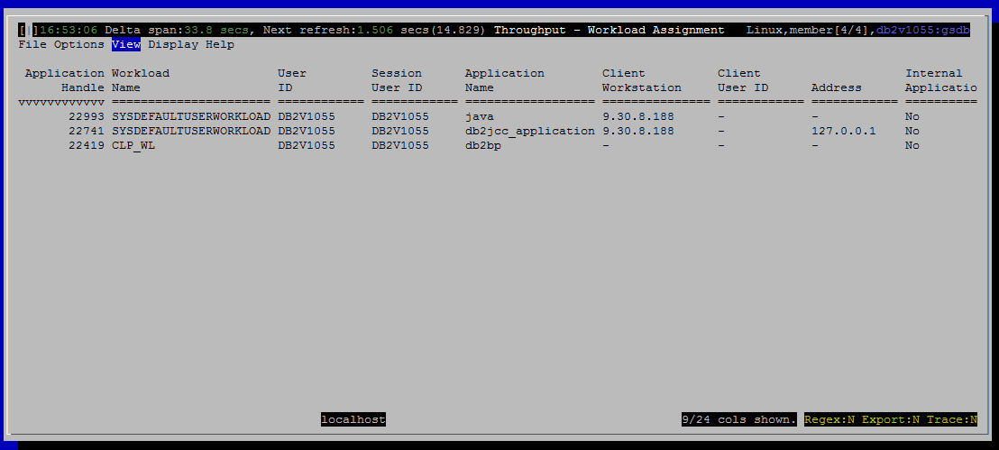

<h2>Purpose</h2>

Show what workload each connection is mapped to, and the client info fields.  This is useful for debugging connections that are not being mapped as expected.  This view also shows some WLM specific metrics related to connections.

The primary fields shown are the application handle (identifies the connection), the workload it is currently mapped to and the connection attributes (aka client info fields) for the connection.

<h2>Histograms and Summaries (Gauges)</h2>

(none)

<h2>Metrics Shown in Grid</h2>

<u>Application Handle</u>

Source: wlm_get_service_class_workload_occurrences.application_handle

 
<u>Event State</u>

Source: mon_get_agent.event_state

 
<u>Event Type</u>

Source: mon_get_agent.event_type

 
<u>Event Object</u>

Source: mon_get_agent.event_object

 
<u>Coordinator Member</u>

Source: wlm_get_service_class_workload_occurrences.coord_member

 
<u>Connection Start Time</u>

Source: mon_get_connection.connection_start_time

 
<u>Workload Name</u>

Source: wlm_get_service_class_workload_occurrences.workload_name

 
<u>User ID</u>

Source: wlm_get_service_class_workload_occurrences.system_auth_id

 
<u>Session User ID</u>

Source: wlm_get_service_class_workload_occurrences.session_auth_id

 
<u>Application Name</u>

Source: wlm_get_service_class_workload_occurrences.application_name

 
<u>Client Workstation</u>

Source: wlm_get_service_class_workload_occurrences.client_wrkstnname

 
<u>Client Accounting String</u>

Source: wlm_get_service_class_workload_occurrences.client_acctng

 
<u>Client User ID</u>

Source: wlm_get_service_class_workload_occurrences.client_user

 
<u>Client Application Name</u>

Source: wlm_get_service_class_workload_occurrences.client_applname

 
<u>Role ID</u>

Source: syscat.roleauth

Lookup rolename in syscat.roleauth

For each workload occurrence, find all rolename's where the grantee matches wlm_get_service_class_workload_occurrences.system_auth_id and present them as a comma separated list. 

 
<u>Group ID 
 Activities Completed/m 
 Activities Aborted/m 
 Activities Rejected/m 
 WLM Queue Assignments/m 
 Threshold Violations/m 
 Recent SQL 
 Address 
 Internal Application</u>

<h2>Default Sort Column</h2>

Application handle, descending

<h2>Navigation</h2>

Keyboard navigation: Vta

Dedicated shortcut key: (none)

<h6>Author: KevinLBeck</h6>