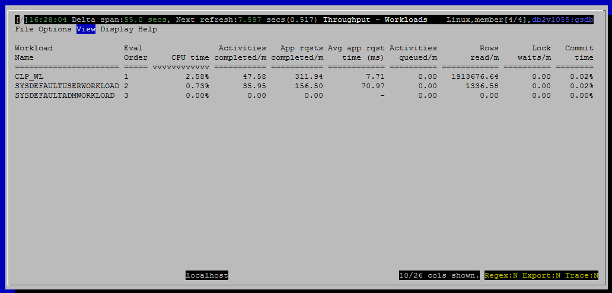

<h2>Purpose</h2>

Show how much work is happening in each WLM workload.

One of the intended purposes of workloads in WLM is to split particular users or applications into separate categories for monitoring and reporting purposes.  For example, you might create a workload where all Cognos reports will run so that you can track the impact of Cognos on your production database.

<h2>Histograms and Summaries (Gauges)</h2>

(none)

<h2>Metrics Shown</h2>

<u>Workload Name</u>

Source: mon_get_workload.workload_name

<u>Eval Order</u>

Source: syscat.workloads.evaluationorder

<u>CPU Time</u>

Source: <a href="http://www.ibm.com/support/knowledgecenter/SSEPGG_10.5.0/com.ibm.db2.luw.sql.rtn.doc/doc/r0053940.html?cp=SSEPGG_10.5.0%2F3-6-1-3-10-66&amp;lang=en">mon_get_workload</a>.total_cpu_time

<u>Activities Completed / m</u>

The number of activities completed per minute is one measure of how much work is being accomplished by connections associated with this workload.  Activities typically correspond to a query, although there a few additional things that count as an activity including LOAD and stored procedures calls.

Source: <a href="http://www.ibm.com/support/knowledgecenter/SSEPGG_10.5.0/com.ibm.db2.luw.sql.rtn.doc/doc/r0053940.html?cp=SSEPGG_10.5.0%2F3-6-1-3-10-66&amp;lang=en" style="text-decoration:underline;color:rgb( 5 , 56 , 107 );font-family:'courier new' , 'courier' , monospace">mon_get_workload</a>.act_completed_total

<u>Activities Aborted / m</u>

Source: <a href="http://www.ibm.com/support/knowledgecenter/SSEPGG_10.5.0/com.ibm.db2.luw.sql.rtn.doc/doc/r0053940.html?cp=SSEPGG_10.5.0%2F3-6-1-3-10-66&amp;lang=en" style="text-decoration:underline;color:rgb( 5 , 56 , 107 );font-family:'courier new' , 'courier' , monospace">mon_get_workload</a>.act_aborted_total

<u>Activities Rejected / m</u>

Source: <a href="http://www.ibm.com/support/knowledgecenter/SSEPGG_10.5.0/com.ibm.db2.luw.sql.rtn.doc/doc/r0053940.html?cp=SSEPGG_10.5.0%2F3-6-1-3-10-66&amp;lang=en" style="text-decoration:underline;color:rgb( 5 , 56 , 107 );font-family:'courier new' , 'courier' , monospace">mon_get_workload</a>.act_rejected_total

<u>App Rqsts Completed / m</u>

Source: <a href="http://www.ibm.com/support/knowledgecenter/SSEPGG_10.5.0/com.ibm.db2.luw.sql.rtn.doc/doc/r0053940.html?cp=SSEPGG_10.5.0%2F3-6-1-3-10-66&amp;lang=en" style="text-decoration:underline;color:rgb( 5 , 56 , 107 );font-family:'courier new' , 'courier' , monospace">mon_get_workload</a>.app_rqsts_completed_total

<u>Avg App Rqst Time (ms)</u>

<u>Activities Queued / m</u>

Source: <a href="http://www.ibm.com/support/knowledgecenter/SSEPGG_10.5.0/com.ibm.db2.luw.sql.rtn.doc/doc/r0053940.html?cp=SSEPGG_10.5.0%2F3-6-1-3-10-66&amp;lang=en" style="text-decoration:underline;color:rgb( 5 , 56 , 107 );font-family:'courier new' , 'courier' , monospace">mon_get_workload</a>.wlm_queue_assignments_total

<u>Rows Read / m</u>

Source: <a href="http://www.ibm.com/support/knowledgecenter/SSEPGG_10.5.0/com.ibm.db2.luw.sql.rtn.doc/doc/r0053940.html?cp=SSEPGG_10.5.0%2F3-6-1-3-10-66&amp;lang=en" style="text-decoration:underline;color:rgb( 5 , 56 , 107 );font-family:'courier new' , 'courier' , monospace">mon_get_workload</a>.rows_read

<u>Rows Modified / m</u>

Source: <a href="http://www.ibm.com/support/knowledgecenter/SSEPGG_10.5.0/com.ibm.db2.luw.sql.rtn.doc/doc/r0053940.html?cp=SSEPGG_10.5.0%2F3-6-1-3-10-66&amp;lang=en" style="text-decoration:underline;color:rgb( 5 , 56 , 107 );font-family:'courier new' , 'courier' , monospace">mon_get_workload</a>.rows_modified

<u>Rows Returned / m</u>

Source: <a href="http://www.ibm.com/support/knowledgecenter/SSEPGG_10.5.0/com.ibm.db2.luw.sql.rtn.doc/doc/r0053940.html?cp=SSEPGG_10.5.0%2F3-6-1-3-10-66&amp;lang=en" style="text-decoration:underline;color:rgb( 5 , 56 , 107 );font-family:'courier new' , 'courier' , monospace">mon_get_workload</a>.rows_returned

<u>Logical Reads / m</u>

Source: <a href="http://www.ibm.com/support/knowledgecenter/SSEPGG_10.5.0/com.ibm.db2.luw.sql.rtn.doc/doc/r0053940.html?cp=SSEPGG_10.5.0%2F3-6-1-3-10-66&amp;lang=en" style="text-decoration:underline;color:rgb( 5 , 56 , 107 );font-family:'courier new' , 'courier' , monospace">mon_get_workload</a>

<a href="http://www-01.ibm.com/support/knowledgecenter/SSEPGG_10.5.0/com.ibm.db2.luw.admin.mon.doc/doc/r0001235.html?cp=SSEPGG_10.5.0&amp;lang=en" style="font-family:'courier new' , 'courier' , monospace">pool_data_l_reads</a> + <a href="http://www-01.ibm.com/support/knowledgecenter/SSEPGG_10.5.0/com.ibm.db2.luw.admin.mon.doc/doc/r0001238.html?lang=en" style="font-family:'courier new' , 'courier' , monospace">pool_index_l_reads</a> + <a href="http://www-01.ibm.com/support/knowledgecenter/SSEPGG_10.5.0/com.ibm.db2.luw.admin.mon.doc/doc/r0022731.html?lang=en" style="font-family:'courier new' , 'courier' , monospace">pool_xda_l_reads</a> + <a href="http://www.ibm.com/support/knowledgecenter/SSEPGG_10.5.0/com.ibm.db2.luw.admin.mon.doc/doc/r0060763.html?lang=en">pool_col_l_reads</a> +

<a href="http://www.ibm.com/support/knowledgecenter/SSEPGG_10.5.0/com.ibm.db2.luw.admin.mon.doc/doc/r0011302.html?lang=en">pool_temp_data_l_reads </a>+ <a href="http://www.ibm.com/support/knowledgecenter/SSEPGG_10.5.0/com.ibm.db2.luw.admin.mon.doc/doc/r0011303.html?cp=SSEPGG_10.5.0&amp;lang=en">pool_temp_index_l_reads </a>+ <a href="http://www.ibm.com/support/knowledgecenter/SSEPGG_10.5.0/com.ibm.db2.luw.admin.mon.doc/doc/r0022738.html?cp=SSEPGG_10.5.0&amp;lang=en">pool_temp_xda_l_reads </a>+ <a href="http://www.ibm.com/support/knowledgecenter/SSEPGG_10.5.0/com.ibm.db2.luw.admin.mon.doc/doc/r0060873.html?cp=SSEPGG_10.5.0&amp;lang=en">pool_temp_col_l_reads</a>

<u>Direct Reads / m</u>

Source: <a href="http://www.ibm.com/support/knowledgecenter/SSEPGG_10.5.0/com.ibm.db2.luw.sql.rtn.doc/doc/r0053940.html?cp=SSEPGG_10.5.0%2F3-6-1-3-10-66&amp;lang=en" style="text-decoration:underline;color:rgb( 5 , 56 , 107 );font-family:'courier new' , 'courier' , monospace">mon_get_workload</a>.direct_reads

<u>Direct Writes / m</u>

Source: <a href="http://www.ibm.com/support/knowledgecenter/SSEPGG_10.5.0/com.ibm.db2.luw.sql.rtn.doc/doc/r0053940.html?cp=SSEPGG_10.5.0%2F3-6-1-3-10-66&amp;lang=en" style="text-decoration:underline;color:rgb( 5 , 56 , 107 );font-family:'courier new' , 'courier' , monospace">mon_get_workload</a>.direct_writes

<u>Lock Waits / m</u>

Source: <a href="http://www.ibm.com/support/knowledgecenter/SSEPGG_10.5.0/com.ibm.db2.luw.sql.rtn.doc/doc/r0053940.html?cp=SSEPGG_10.5.0%2F3-6-1-3-10-66&amp;lang=en" style="text-decoration:underline;color:rgb( 5 , 56 , 107 );font-family:'courier new' , 'courier' , monospace">mon_get_workload</a>.lock_waits

<u>Lock Timeouts / m</u>

Source: <a href="http://www.ibm.com/support/knowledgecenter/SSEPGG_10.5.0/com.ibm.db2.luw.sql.rtn.doc/doc/r0053940.html?cp=SSEPGG_10.5.0%2F3-6-1-3-10-66&amp;lang=en" style="text-decoration:underline;color:rgb( 5 , 56 , 107 );font-family:'courier new' , 'courier' , monospace">mon_get_workload</a>.lock_timeouts

<u>Lock Escal / m</u>

Source: <a href="http://www.ibm.com/support/knowledgecenter/SSEPGG_10.5.0/com.ibm.db2.luw.sql.rtn.doc/doc/r0053940.html?cp=SSEPGG_10.5.0%2F3-6-1-3-10-66&amp;lang=en" style="text-decoration:underline;color:rgb( 5 , 56 , 107 );font-family:'courier new' , 'courier' , monospace">mon_get_workload</a>.lock_escals

<u>Deadlocks / m</u>

Source: <a href="http://www.ibm.com/support/knowledgecenter/SSEPGG_10.5.0/com.ibm.db2.luw.sql.rtn.doc/doc/r0053940.html?cp=SSEPGG_10.5.0%2F3-6-1-3-10-66&amp;lang=en" style="text-decoration:underline;color:rgb( 5 , 56 , 107 );font-family:'courier new' , 'courier' , monospace">mon_get_workload</a>.deadlocks

<u>Threshold Violations / m</u>

Source: <a href="http://www.ibm.com/support/knowledgecenter/SSEPGG_10.5.0/com.ibm.db2.luw.sql.rtn.doc/doc/r0053940.html?cp=SSEPGG_10.5.0%2F3-6-1-3-10-66&amp;lang=en" style="text-decoration:underline;color:rgb( 5 , 56 , 107 );font-family:'courier new' , 'courier' , monospace">mon_get_workload</a>.thresh_violations

<u>Sorts / m</u>

Source: <a href="http://www.ibm.com/support/knowledgecenter/SSEPGG_10.5.0/com.ibm.db2.luw.sql.rtn.doc/doc/r0053940.html?cp=SSEPGG_10.5.0%2F3-6-1-3-10-66&amp;lang=en" style="text-decoration:underline;color:rgb( 5 , 56 , 107 );font-family:'courier new' , 'courier' , monospace">mon_get_workload</a>.total_sorts

<u>Sort Overflows / m</u>

Source: <a href="http://www.ibm.com/support/knowledgecenter/SSEPGG_10.5.0/com.ibm.db2.luw.sql.rtn.doc/doc/r0053940.html?cp=SSEPGG_10.5.0%2F3-6-1-3-10-66&amp;lang=en" style="text-decoration:underline;color:rgb( 5 , 56 , 107 );font-family:'courier new' , 'courier' , monospace">mon_get_workload</a>.sort_overflows

<u>Hash Group By Ops / m</u>

Source: <a href="http://www.ibm.com/support/knowledgecenter/SSEPGG_10.5.0/com.ibm.db2.luw.sql.rtn.doc/doc/r0053940.html?cp=SSEPGG_10.5.0%2F3-6-1-3-10-66&amp;lang=en" style="text-decoration:underline;color:rgb( 5 , 56 , 107 );font-family:'courier new' , 'courier' , monospace">mon_get_workload</a>.total_hash_grpbys

<u>Hash Group By Overflows / m</u>

Source: <a href="http://www.ibm.com/support/knowledgecenter/SSEPGG_10.5.0/com.ibm.db2.luw.sql.rtn.doc/doc/r0053940.html?cp=SSEPGG_10.5.0%2F3-6-1-3-10-66&amp;lang=en" style="text-decoration:underline;color:rgb( 5 , 56 , 107 );font-family:'courier new' , 'courier' , monospace">mon_get_workload</a>.hash_grpby_overflows

<u>Application Commits / m</u>

Source: <a href="http://www.ibm.com/support/knowledgecenter/SSEPGG_10.5.0/com.ibm.db2.luw.sql.rtn.doc/doc/r0053940.html?cp=SSEPGG_10.5.0%2F3-6-1-3-10-66&amp;lang=en" style="text-decoration:underline;color:rgb( 5 , 56 , 107 );font-family:'courier new' , 'courier' , monospace">mon_get_workload</a>.total_app_commits

<u>Commit Time</u>

Source: <a href="http://www.ibm.com/support/knowledgecenter/SSEPGG_10.5.0/com.ibm.db2.luw.sql.rtn.doc/doc/r0053940.html?cp=SSEPGG_10.5.0%2F3-6-1-3-10-66&amp;lang=en" style="text-decoration:underline;color:rgb( 5 , 56 , 107 );font-family:'courier new' , 'courier' , monospace">mon_get_workload</a>.total_commit_time

<h2>Default Sort Column</h2>

CPU Time, descending

<h2>Navigation</h2>

Keyboard navigation: Vtw

Dedicated shortcut key: (none)

<h6>Author: KevinLBeck</h6>