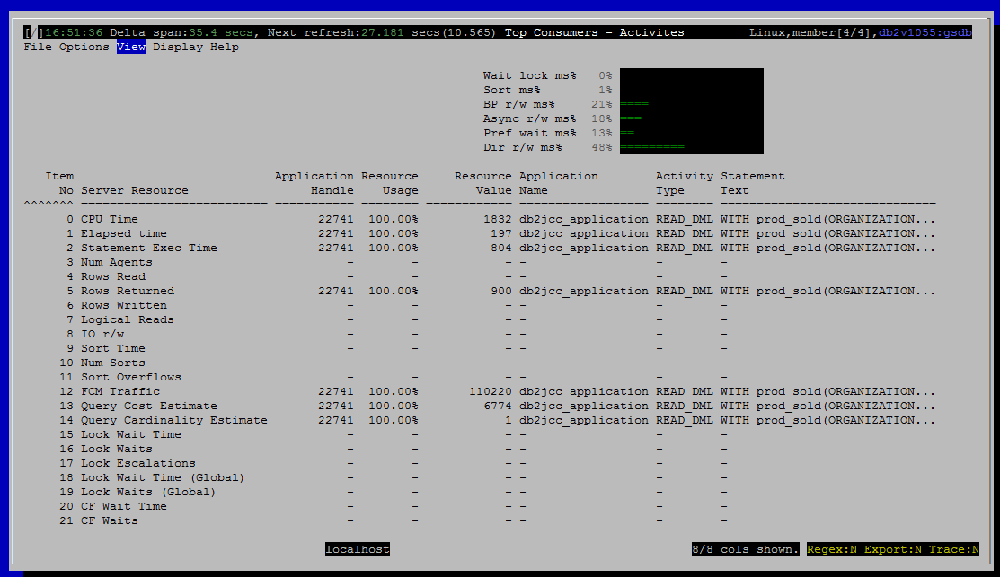

<h2>Purpose</h2>

This view shows the user which activities consume the most resources.  Activities are generally queries, but long running DDL and LOAD activities are also included here.

<h2>Summaries and Histograms (Gauges)</h2>

&lt;Link TBD&gt;

<h2>Metrics Shown</h2>

There is a grid with a row for each resource that is tracked.  Each row names the resource and shows

<ul ><li>Item no, so the grid can be restored to its canonical order if the user sorts on a different column</li><li>Server resource (CPU, Rows Read, etc.)</li><li>The application handle for the activity that has consumed the most of that resource</li><li>What percentage of that resource this particular activity has consumed, relative to consumption by other current activities</li><li>How many rows read, CPU seconds used, etc.</li><li>The name of the application that started this activity</li><li>Activity type (READ_DML, LOAD, etc)</li><li>Statement text (for SQL, null for LOAD activities)</li></ul>

The percentage shown in “Resource Usage” is found by adding up that resource across all current activities and dividing the value for the top consuming activity into it.

If a resource is 0 for all activities, then there is no top consumer and we show null (dash in the grid) for all the columns except Item No and Server Resource.

<u>0  CPU Time</u>

Source: <a href="http://www-01.ibm.com/support/knowledgecenter/SSEPGG_10.5.0/com.ibm.db2.luw.sql.rtn.doc/doc/r0060766.html?cp=SSEPGG_10.5.0%2F3-6-1-3-10-10&amp;lang=en">mon_get_activity</a>.total_cpu_time

 
<u>1  Elapsed time</u>

Source: <a href="http://www-01.ibm.com/support/knowledgecenter/SSEPGG_10.5.0/com.ibm.db2.luw.sql.rtn.doc/doc/r0060766.html?cp=SSEPGG_10.5.0%2F3-6-1-3-10-10&amp;lang=en">mon_get_activity</a>.local_start_time

Show the different between local_start_time and current timestamp.

 
<u>2  Statement Exec Time</u>

Source: <a href="http://www-01.ibm.com/support/knowledgecenter/SSEPGG_10.5.0/com.ibm.db2.luw.sql.rtn.doc/doc/r0060766.html?cp=SSEPGG_10.5.0%2F3-6-1-3-10-10&amp;lang=en">mon_get_activity</a>.stmt_exec_time

 
<u>3  Num Agents</u>

Source: <a href="http://www-01.ibm.com/support/knowledgecenter/SSEPGG_10.5.0/com.ibm.db2.luw.sql.rtn.doc/doc/r0060766.html?cp=SSEPGG_10.5.0%2F3-6-1-3-10-10&amp;lang=en">mon_get_activity</a>.num_agents

 
<u>4  Rows Read</u>

Source: <a href="http://www-01.ibm.com/support/knowledgecenter/SSEPGG_10.5.0/com.ibm.db2.luw.sql.rtn.doc/doc/r0060766.html?cp=SSEPGG_10.5.0%2F3-6-1-3-10-10&amp;lang=en">mon_get_activity</a>.rows_read

 
<u>5  Rows Returned</u>

Source: <a href="http://www-01.ibm.com/support/knowledgecenter/SSEPGG_10.5.0/com.ibm.db2.luw.sql.rtn.doc/doc/r0060766.html?cp=SSEPGG_10.5.0%2F3-6-1-3-10-10&amp;lang=en">mon_get_activity</a>.rows_returned

 
<u>6  Rows Written</u>

Source: <a href="http://www-01.ibm.com/support/knowledgecenter/SSEPGG_10.5.0/com.ibm.db2.luw.sql.rtn.doc/doc/r0060766.html?cp=SSEPGG_10.5.0%2F3-6-1-3-10-10&amp;lang=en">mon_get_activity</a>.rows_modified

 
<u>7  Logical Reads</u>

Source: <a href="http://www-01.ibm.com/support/knowledgecenter/SSEPGG_10.5.0/com.ibm.db2.luw.sql.rtn.doc/doc/r0060766.html?cp=SSEPGG_10.5.0%2F3-6-1-3-10-10&amp;lang=en">mon_get_activity</a>

<a href="http://www-01.ibm.com/support/knowledgecenter/SSEPGG_10.5.0/com.ibm.db2.luw.admin.mon.doc/doc/r0001235.html?cp=SSEPGG_10.5.0&amp;lang=en" style="font-family:'courier new' , 'courier' , monospace">pool_data_l_reads</a> + <a href="http://www-01.ibm.com/support/knowledgecenter/SSEPGG_10.5.0/com.ibm.db2.luw.admin.mon.doc/doc/r0001238.html?lang=en" style="font-family:'courier new' , 'courier' , monospace">pool_index_l_reads</a> + <a href="http://www-01.ibm.com/support/knowledgecenter/SSEPGG_10.5.0/com.ibm.db2.luw.admin.mon.doc/doc/r0022731.html?lang=en" style="font-family:'courier new' , 'courier' , monospace">pool_xda_l_reads</a> + <a href="http://www.ibm.com/support/knowledgecenter/SSEPGG_10.5.0/com.ibm.db2.luw.admin.mon.doc/doc/r0060763.html?lang=en">pool_col_l_reads</a> +

<a href="http://www.ibm.com/support/knowledgecenter/SSEPGG_10.5.0/com.ibm.db2.luw.admin.mon.doc/doc/r0011302.html?lang=en">pool_temp_data_l_reads </a>+ <a href="http://www.ibm.com/support/knowledgecenter/SSEPGG_10.5.0/com.ibm.db2.luw.admin.mon.doc/doc/r0011303.html?cp=SSEPGG_10.5.0&amp;lang=en">pool_temp_index_l_reads </a>+ <a href="http://www.ibm.com/support/knowledgecenter/SSEPGG_10.5.0/com.ibm.db2.luw.admin.mon.doc/doc/r0022738.html?cp=SSEPGG_10.5.0&amp;lang=en">pool_temp_xda_l_reads </a>+ <a href="http://www.ibm.com/support/knowledgecenter/SSEPGG_10.5.0/com.ibm.db2.luw.admin.mon.doc/doc/r0060873.html?cp=SSEPGG_10.5.0&amp;lang=en">pool_temp_col_l_reads</a>

 

<u>8  IO r/w</u>

Source: <a href="http://www-01.ibm.com/support/knowledgecenter/SSEPGG_10.5.0/com.ibm.db2.luw.sql.rtn.doc/doc/r0060766.html?cp=SSEPGG_10.5.0%2F3-6-1-3-10-10&amp;lang=en">mon_get_activity</a>

pool_data_l_reads + pool_index_l_reads + pool_xda_l_reads + <a href="http://www.ibm.com/support/knowledgecenter/SSEPGG_10.5.0/com.ibm.db2.luw.admin.mon.doc/doc/r0060763.html?lang=en">pool_col_l_reads </a>+ 

<a href="http://www.ibm.com/support/knowledgecenter/SSEPGG_10.5.0/com.ibm.db2.luw.admin.mon.doc/doc/r0011302.html?lang=en">pool_temp_data_l_reads </a>+ pool_temp_index_l_reads + pool_temp_xda_l_reads + pool_temp_col_l_reads +

pool_data_writes + pool_index_writes + pool_xda_writes + pool_col_writes

 
<u>9  Sort Time</u>

Source: <a href="http://www-01.ibm.com/support/knowledgecenter/SSEPGG_10.5.0/com.ibm.db2.luw.sql.rtn.doc/doc/r0060766.html?cp=SSEPGG_10.5.0%2F3-6-1-3-10-10&amp;lang=en">mon_get_activity</a>.total_section_sort_time

 
<u>10 Num Sorts</u>

Source: <a href="http://www-01.ibm.com/support/knowledgecenter/SSEPGG_10.5.0/com.ibm.db2.luw.sql.rtn.doc/doc/r0060766.html?cp=SSEPGG_10.5.0%2F3-6-1-3-10-10&amp;lang=en">mon_get_activity</a>.total_sorts

 
<u>11 Sort Overflows</u>

Source: <a href="http://www-01.ibm.com/support/knowledgecenter/SSEPGG_10.5.0/com.ibm.db2.luw.sql.rtn.doc/doc/r0060766.html?cp=SSEPGG_10.5.0%2F3-6-1-3-10-10&amp;lang=en">mon_get_activity</a>.sort_overflows

 
<u>12 FCM Traffic</u>

Source: <a href="http://www-01.ibm.com/support/knowledgecenter/SSEPGG_10.5.0/com.ibm.db2.luw.sql.rtn.doc/doc/r0060766.html?cp=SSEPGG_10.5.0%2F3-6-1-3-10-10&amp;lang=en">mon_get_activity</a>

fcm_send_volume + fcm_recv_volume

 
<u>13 Query Cost Estimate</u>

Source: <a href="http://www-01.ibm.com/support/knowledgecenter/SSEPGG_10.5.0/com.ibm.db2.luw.sql.rtn.doc/doc/r0060766.html?cp=SSEPGG_10.5.0%2F3-6-1-3-10-10&amp;lang=en">mon_get_activity</a>.<a href="http://www.ibm.com/support/knowledgecenter/SSEPGG_10.5.0/com.ibm.db2.luw.admin.mon.doc/doc/r0001357.html?cp=SSEPGG_10.5.0&amp;lang=en">query_cost_estimate</a>

 
<u>14 Query Cardinality Estimate</u>

Source: <a href="http://www-01.ibm.com/support/knowledgecenter/SSEPGG_10.5.0/com.ibm.db2.luw.sql.rtn.doc/doc/r0060766.html?cp=SSEPGG_10.5.0%2F3-6-1-3-10-10&amp;lang=en">mon_get_activity</a>.<a href="http://www.ibm.com/support/knowledgecenter/SSEPGG_10.5.0/com.ibm.db2.luw.admin.mon.doc/doc/r0001356.html?cp=SSEPGG_10.5.0&amp;lang=en">query_card_estimate</a>

 
<u>15 Lock Wait Time</u>

Source: <a href="http://www-01.ibm.com/support/knowledgecenter/SSEPGG_10.5.0/com.ibm.db2.luw.sql.rtn.doc/doc/r0060766.html?cp=SSEPGG_10.5.0%2F3-6-1-3-10-10&amp;lang=en">mon_get_activity</a>.<a href="http://www.ibm.com/support/knowledgecenter/SSEPGG_10.5.0/com.ibm.db2.luw.admin.mon.doc/doc/r0001294.html?cp=SSEPGG_10.5.0&amp;lang=en">lock_wait_time</a>

 
<u>16 Lock Waits</u>

Source: <a href="http://www-01.ibm.com/support/knowledgecenter/SSEPGG_10.5.0/com.ibm.db2.luw.sql.rtn.doc/doc/r0060766.html?cp=SSEPGG_10.5.0%2F3-6-1-3-10-10&amp;lang=en">mon_get_activity</a>.<a href="http://www.ibm.com/support/knowledgecenter/SSEPGG_10.5.0/com.ibm.db2.luw.admin.mon.doc/doc/r0001293.html?cp=SSEPGG_10.5.0&amp;lang=en">lock_waits</a>

 
<u>17 Lock Escalations</u>

Source: <a href="http://www-01.ibm.com/support/knowledgecenter/SSEPGG_10.5.0/com.ibm.db2.luw.sql.rtn.doc/doc/r0060766.html?cp=SSEPGG_10.5.0%2F3-6-1-3-10-10&amp;lang=en">mon_get_activity</a>.<a href="http://www.ibm.com/support/knowledgecenter/SSEPGG_10.5.0/com.ibm.db2.luw.admin.mon.doc/doc/r0001284.html?cp=SSEPGG_10.5.0&amp;lang=en">lock_escals</a>

 
<u>18 Lock Wait Time (Global)</u>

Source: <a href="http://www-01.ibm.com/support/knowledgecenter/SSEPGG_10.5.0/com.ibm.db2.luw.sql.rtn.doc/doc/r0060766.html?cp=SSEPGG_10.5.0%2F3-6-1-3-10-10&amp;lang=en">mon_get_activity</a>.<a href="http://www.ibm.com/support/knowledgecenter/SSEPGG_10.5.0/com.ibm.db2.luw.admin.mon.doc/doc/r0056234.html?cp=SSEPGG_10.5.0&amp;lang=en">lock_wait_time_global</a>

 
<u>19 Lock Waits (Global)</u>

Source: <a href="http://www-01.ibm.com/support/knowledgecenter/SSEPGG_10.5.0/com.ibm.db2.luw.sql.rtn.doc/doc/r0060766.html?cp=SSEPGG_10.5.0%2F3-6-1-3-10-10&amp;lang=en">mon_get_activity</a>.<a href="http://www.ibm.com/support/knowledgecenter/SSEPGG_10.5.0/com.ibm.db2.luw.admin.mon.doc/doc/r0056233.html?cp=SSEPGG_10.5.0&amp;lang=en">lock_waits_global</a>

 
<u>20 CF Wait Time</u>

Source: <a href="http://www-01.ibm.com/support/knowledgecenter/SSEPGG_10.5.0/com.ibm.db2.luw.sql.rtn.doc/doc/r0060766.html?cp=SSEPGG_10.5.0%2F3-6-1-3-10-10&amp;lang=en">mon_get_activity</a>.<a href="http://www.ibm.com/support/knowledgecenter/SSEPGG_10.5.0/com.ibm.db2.luw.admin.mon.doc/doc/r0056240.html?cp=SSEPGG_10.5.0&amp;lang=en">cf_wait_time</a>

 
<u>21 CF Waits</u>

Source: <a href="http://www-01.ibm.com/support/knowledgecenter/SSEPGG_10.5.0/com.ibm.db2.luw.sql.rtn.doc/doc/r0060766.html?cp=SSEPGG_10.5.0%2F3-6-1-3-10-10&amp;lang=en">mon_get_activity</a>.<a href="http://www.ibm.com/support/knowledgecenter/SSEPGG_10.5.0/com.ibm.db2.luw.admin.mon.doc/doc/r0056239.html?cp=SSEPGG_10.5.0&amp;lang=en">cf_waits</a>

<h2>Default Sort Column</h2>

Item No, ascending

<h2>Navigation</h2>

Keyboard navigation: VBa

Dedicated shortcut key: (none)

<h6>Author: KevinLBeck</h6>