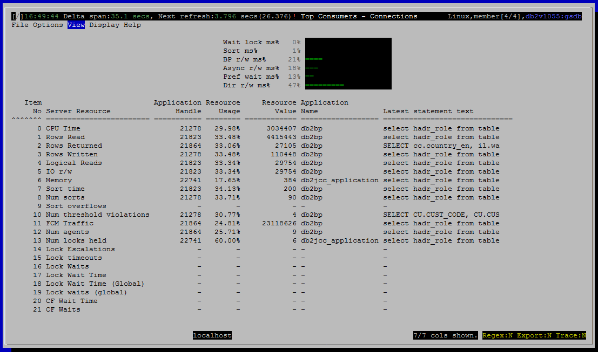

<h2>Purpose</h2>

Find the connections (sessions) that have consumed the most resources over their lifetime.  This view is helpful for diagnosing problems where large numbers of small activities in aggregate are consuming excessive resources.  A common scenario of this type is applications loading data one row at a time using singleton inserts.  This can be very disruptive but each individual insert is tiny and so is the singleton transaction associated with it.  This view will highlight connections engaged in these sort of activities.

Note that this overlaps somewhat in functionality with the <a href="/developerworks/community/wikis/home?lang=en#!/wiki/Text%20Based%20Monitoring%20for%20DB2%20LUW%20-%20dsmtop/page/Sessions%20%28connections%29">Sessions (connections)</a> view.  If you go to the connections view, in counter mode, you could select various columns one at a time and sort by them to find the connections that have consumed the most CPU, read the most rows, etc.  This view provides a convenient way to get similar information in one step.

<h2>Histograms and Summaries (Gauges)</h2>

&lt;link TBD&gt;

<h2>Metrics Shown</h2>

There is a grid, with a row for each resource that is tracked.  Each row names the resource and shows

<ul ><li>Item no, so that the user can use sort to restore the grid to its canonical ordering if it has been sorted on some other column.</li><li>Server resource (CPU, Rows Read, etc.)</li><li>The application handle for the connection that has consumed the most of this resource.</li><li>What percentage of the resource this particular connection has consumed, relative to consumption by other connections.</li><li>How many rows read, CPU seconds used, etc.</li><li>The name of the application associated with this connection.</li><li>SQL text of most recently executed statement, if available.</li></ul>

<u>0  CPU Time</u>

Source: <a href="http://www-01.ibm.com/support/knowledgecenter/SSEPGG_10.5.0/com.ibm.db2.luw.sql.rtn.doc/doc/r0053938.html?cp=SSEPGG_10.5.0%2F3-6-1-3-10-22&amp;lang=en" style="text-decoration:underline;color:rgb( 5 , 56 , 107 );font-family:'courier new' , 'courier' , monospace">mon_get_connection</a>.total_cpu_time

 
<u>1  Rows Read</u>

Source: <a href="http://www-01.ibm.com/support/knowledgecenter/SSEPGG_10.5.0/com.ibm.db2.luw.sql.rtn.doc/doc/r0053938.html?cp=SSEPGG_10.5.0%2F3-6-1-3-10-22&amp;lang=en" style="text-decoration:underline;color:rgb( 5 , 56 , 107 );font-family:'courier new' , 'courier' , monospace">mon_get_connection</a>.rows_read

 
<u>2  Rows Returned</u>

Source: <a href="http://www-01.ibm.com/support/knowledgecenter/SSEPGG_10.5.0/com.ibm.db2.luw.sql.rtn.doc/doc/r0053938.html?cp=SSEPGG_10.5.0%2F3-6-1-3-10-22&amp;lang=en" style="text-decoration:underline;color:rgb( 5 , 56 , 107 );font-family:'courier new' , 'courier' , monospace">mon_get_connection</a>.rows_returned

 
<u>3  Rows Written</u>

Source: <a href="http://www-01.ibm.com/support/knowledgecenter/SSEPGG_10.5.0/com.ibm.db2.luw.sql.rtn.doc/doc/r0053938.html?cp=SSEPGG_10.5.0%2F3-6-1-3-10-22&amp;lang=en" style="text-decoration:underline;color:rgb( 5 , 56 , 107 );font-family:'courier new' , 'courier' , monospace">mon_get_connection</a>.rows_modified

 
<u>4  Logical Reads</u>

Source: <a href="http://www-01.ibm.com/support/knowledgecenter/SSEPGG_10.5.0/com.ibm.db2.luw.sql.rtn.doc/doc/r0053938.html?cp=SSEPGG_10.5.0%2F3-6-1-3-10-22&amp;lang=en" style="text-decoration:underline;color:rgb( 5 , 56 , 107 );font-family:'courier new' , 'courier' , monospace">mon_get_connection</a>

<a href="http://www-01.ibm.com/support/knowledgecenter/SSEPGG_10.5.0/com.ibm.db2.luw.admin.mon.doc/doc/r0001235.html?cp=SSEPGG_10.5.0&amp;lang=en" style="font-family:'courier new' , 'courier' , monospace">pool_data_l_reads</a> + <a href="http://www-01.ibm.com/support/knowledgecenter/SSEPGG_10.5.0/com.ibm.db2.luw.admin.mon.doc/doc/r0001238.html?lang=en" style="font-family:'courier new' , 'courier' , monospace">pool_index_l_reads</a> + <a href="http://www-01.ibm.com/support/knowledgecenter/SSEPGG_10.5.0/com.ibm.db2.luw.admin.mon.doc/doc/r0022731.html?lang=en" style="font-family:'courier new' , 'courier' , monospace">pool_xda_l_reads</a> + <a href="http://www.ibm.com/support/knowledgecenter/SSEPGG_10.5.0/com.ibm.db2.luw.admin.mon.doc/doc/r0060763.html?lang=en">pool_col_l_reads</a> +

<a href="http://www.ibm.com/support/knowledgecenter/SSEPGG_10.5.0/com.ibm.db2.luw.admin.mon.doc/doc/r0011302.html?lang=en">pool_temp_data_l_reads </a>+ <a href="http://www.ibm.com/support/knowledgecenter/SSEPGG_10.5.0/com.ibm.db2.luw.admin.mon.doc/doc/r0011303.html?cp=SSEPGG_10.5.0&amp;lang=en">pool_temp_index_l_reads </a>+ <a href="http://www.ibm.com/support/knowledgecenter/SSEPGG_10.5.0/com.ibm.db2.luw.admin.mon.doc/doc/r0022738.html?cp=SSEPGG_10.5.0&amp;lang=en">pool_temp_xda_l_reads </a>+ <a href="http://www.ibm.com/support/knowledgecenter/SSEPGG_10.5.0/com.ibm.db2.luw.admin.mon.doc/doc/r0060873.html?cp=SSEPGG_10.5.0&amp;lang=en">pool_temp_col_l_reads</a>

 
<u>5  IO r/w</u>

 
<u>6  Memory</u>

 
<u>7  Sort time</u>

Source: <a href="http://www-01.ibm.com/support/knowledgecenter/SSEPGG_10.5.0/com.ibm.db2.luw.sql.rtn.doc/doc/r0053938.html?cp=SSEPGG_10.5.0%2F3-6-1-3-10-22&amp;lang=en" style="text-decoration:underline;color:rgb( 5 , 56 , 107 );font-family:'courier new' , 'courier' , monospace">mon_get_connection</a>.total_section_sort_time

 
<u>8  Num sorts</u>

Source: <a href="http://www-01.ibm.com/support/knowledgecenter/SSEPGG_10.5.0/com.ibm.db2.luw.sql.rtn.doc/doc/r0053938.html?cp=SSEPGG_10.5.0%2F3-6-1-3-10-22&amp;lang=en" style="text-decoration:underline;color:rgb( 5 , 56 , 107 );font-family:'courier new' , 'courier' , monospace">mon_get_connection</a>.total_sorts

 
<u>9  Sort overflows</u>

Source: <a href="http://www-01.ibm.com/support/knowledgecenter/SSEPGG_10.5.0/com.ibm.db2.luw.sql.rtn.doc/doc/r0053938.html?cp=SSEPGG_10.5.0%2F3-6-1-3-10-22&amp;lang=en" style="text-decoration:underline;color:rgb( 5 , 56 , 107 );font-family:'courier new' , 'courier' , monospace">mon_get_connection</a>.sort_overflows

 
<u>10 Num threshold violations</u>

Source: <a href="http://www-01.ibm.com/support/knowledgecenter/SSEPGG_10.5.0/com.ibm.db2.luw.sql.rtn.doc/doc/r0053938.html?cp=SSEPGG_10.5.0%2F3-6-1-3-10-22&amp;lang=en" style="text-decoration:underline;color:rgb( 5 , 56 , 107 );font-family:'courier new' , 'courier' , monospace">mon_get_connection</a>.thresh_violations

 
<u>11 FCM Traffic</u>

Source: <a href="http://www-01.ibm.com/support/knowledgecenter/SSEPGG_10.5.0/com.ibm.db2.luw.sql.rtn.doc/doc/r0053938.html?cp=SSEPGG_10.5.0%2F3-6-1-3-10-22&amp;lang=en" style="text-decoration:underline;color:rgb( 5 , 56 , 107 );font-family:'courier new' , 'courier' , monospace">mon_get_connection</a>

fcm_send_volume + fcm_recv_volume

 
<u>12 Num agents</u>

Source: <a href="http://www-01.ibm.com/support/knowledgecenter/SSEPGG_10.5.0/com.ibm.db2.luw.sql.rtn.doc/doc/r0053938.html?cp=SSEPGG_10.5.0%2F3-6-1-3-10-22&amp;lang=en" style="text-decoration:underline;color:rgb( 5 , 56 , 107 );font-family:'courier new' , 'courier' , monospace">mon_get_connection</a>.num_assoc_agents

 
<u>13 Num locks held</u>

Source: <a href="http://www-01.ibm.com/support/knowledgecenter/SSEPGG_10.5.0/com.ibm.db2.luw.sql.rtn.doc/doc/r0053938.html?cp=SSEPGG_10.5.0%2F3-6-1-3-10-22&amp;lang=en" style="text-decoration:underline;color:rgb( 5 , 56 , 107 );font-family:'courier new' , 'courier' , monospace">mon_get_connection</a>.num_locks_held

 
<u>14 Lock Escalations</u>

Source: <a href="http://www-01.ibm.com/support/knowledgecenter/SSEPGG_10.5.0/com.ibm.db2.luw.sql.rtn.doc/doc/r0053938.html?cp=SSEPGG_10.5.0%2F3-6-1-3-10-22&amp;lang=en" style="text-decoration:underline;color:rgb( 5 , 56 , 107 );font-family:'courier new' , 'courier' , monospace">mon_get_connection</a>.lock_escals

 
<u>15 Lock timeouts</u>

Source: <a href="http://www-01.ibm.com/support/knowledgecenter/SSEPGG_10.5.0/com.ibm.db2.luw.sql.rtn.doc/doc/r0053938.html?cp=SSEPGG_10.5.0%2F3-6-1-3-10-22&amp;lang=en" style="text-decoration:underline;color:rgb( 5 , 56 , 107 );font-family:'courier new' , 'courier' , monospace">mon_get_connection</a>.lock_timeouts

 
<u>16 Lock Waits</u>

Source: <a href="http://www-01.ibm.com/support/knowledgecenter/SSEPGG_10.5.0/com.ibm.db2.luw.sql.rtn.doc/doc/r0053938.html?cp=SSEPGG_10.5.0%2F3-6-1-3-10-22&amp;lang=en" style="text-decoration:underline;color:rgb( 5 , 56 , 107 );font-family:'courier new' , 'courier' , monospace">mon_get_connection</a>.lock_waits

 
<u>17 Lock Wait Time</u>

Source: <a href="http://www-01.ibm.com/support/knowledgecenter/SSEPGG_10.5.0/com.ibm.db2.luw.sql.rtn.doc/doc/r0053938.html?cp=SSEPGG_10.5.0%2F3-6-1-3-10-22&amp;lang=en" style="text-decoration:underline;color:rgb( 5 , 56 , 107 );font-family:'courier new' , 'courier' , monospace">mon_get_connection</a>.lock_wait_time

 
<u>18 Lock Wait Time (Global)</u>

Source: <a href="http://www-01.ibm.com/support/knowledgecenter/SSEPGG_10.5.0/com.ibm.db2.luw.sql.rtn.doc/doc/r0053938.html?cp=SSEPGG_10.5.0%2F3-6-1-3-10-22&amp;lang=en" style="text-decoration:underline;color:rgb( 5 , 56 , 107 );font-family:'courier new' , 'courier' , monospace">mon_get_connection</a>.lock_wait_time_global

 
<u>19 Lock waits (global)</u>

Source: <a href="http://www-01.ibm.com/support/knowledgecenter/SSEPGG_10.5.0/com.ibm.db2.luw.sql.rtn.doc/doc/r0053938.html?cp=SSEPGG_10.5.0%2F3-6-1-3-10-22&amp;lang=en" style="text-decoration:underline;color:rgb( 5 , 56 , 107 );font-family:'courier new' , 'courier' , monospace">mon_get_connection</a>.lock_waits_global

 
<u>20 CF Wait Time</u>

Source: <a href="http://www-01.ibm.com/support/knowledgecenter/SSEPGG_10.5.0/com.ibm.db2.luw.sql.rtn.doc/doc/r0053938.html?cp=SSEPGG_10.5.0%2F3-6-1-3-10-22&amp;lang=en" style="text-decoration:underline;color:rgb( 5 , 56 , 107 );font-family:'courier new' , 'courier' , monospace">mon_get_connection</a>.cf_wait_time

 
<u>21 CF Waits</u>

Source: <a href="http://www-01.ibm.com/support/knowledgecenter/SSEPGG_10.5.0/com.ibm.db2.luw.sql.rtn.doc/doc/r0053938.html?cp=SSEPGG_10.5.0%2F3-6-1-3-10-22&amp;lang=en" style="text-decoration:underline;color:rgb( 5 , 56 , 107 );font-family:'courier new' , 'courier' , monospace">mon_get_connection</a>.cf_waits

<h2>Default Sort Column</h2>

Item No, ascending

<h2>Navigation</h2>

Keyboard navigation: VBc

Dedicated shortcut key: (none)

<h6>Author: KevinLBeck</h6>