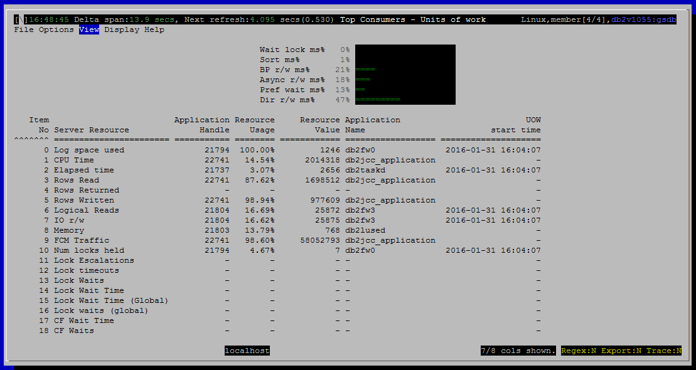

<h2>Purpose</h2>

This view shows the user which units of work are consuming the most resources.  There are some important scenarios that can be difficult to detect unless you look at metrics on transactions.

<u>Transaction left open</u>

If an application starts a transaction, does some work, and then never commits or rolls back, it will pin the log file where it started.  Backup will be unable to free the log file, and depending on how the database is configured a number of bad things can happen, such as filling all available disk space with new log files.

<u>Transaction holding excessive locks</u>

Applications that acquire many locks in a single transaction and are slow to release them impact other work in the database.

<h2>Histograms and Summaries</h2>

&lt;link TBD&gt;

<h2>Metrics Shown</h2>

Normally, every connection (application handle) has one unit of work associated with it.  So we show the associated application handle, rather than the actual identifier for the unit of work.

There is a grid with a row for each resource that is tracked.  Each row names the resource and shows

<ul ><li>The application handle for the unit of work that has consumed the most of that resource</li><li>What percentage of that resource this particular unit of work has consumed, relative to consumption by other current units of work</li><li>How many locks held, how much log space consumed, etc.</li><li>Transaction start time (uow_start_time from mon_get_unit_of_work())</li><li>The name of the application that started this unit of work</li></ul>

The percentage shown in “Resource Usage” is found by adding up that resource across all current units of work and dividing the value for the top consuming unit of work into it.

If a resource is 0 for all units of work, then there is no top consumer and we show null (dash in the grid) for all the columns except Item No and Server Resource.

<u>0  Log space used</u>

Source: <a href="http://www-01.ibm.com/support/knowledgecenter/SSEPGG_10.5.0/com.ibm.db2.luw.sql.rtn.doc/doc/r0053939.html?cp=SSEPGG_10.5.0%2F3-6-1-3-10-62&amp;lang=en">mon_get_unit_of_work</a>.<a href="http://www.ibm.com/support/knowledgecenter/SSEPGG_10.5.0/com.ibm.db2.luw.admin.mon.doc/doc/r0001280.html?lang=en">uow_log_space_used</a>

 
<u>1  CPU Time</u>

Source: <a href="http://www-01.ibm.com/support/knowledgecenter/SSEPGG_10.5.0/com.ibm.db2.luw.sql.rtn.doc/doc/r0053939.html?cp=SSEPGG_10.5.0%2F3-6-1-3-10-62&amp;lang=en" style="font-family:'helvetica neue' , 'helvetica' , 'arial' , sans-serif">mon_get_unit_of_work</a>.<a href="http://www.ibm.com/support/knowledgecenter/SSEPGG_10.5.0/com.ibm.db2.luw.admin.mon.doc/doc/r0054057.html?lang=en">total_cpu_time</a>

 
<u>2  Elapsed time</u>

Source: <a href="http://www-01.ibm.com/support/knowledgecenter/SSEPGG_10.5.0/com.ibm.db2.luw.sql.rtn.doc/doc/r0053939.html?cp=SSEPGG_10.5.0%2F3-6-1-3-10-62&amp;lang=en" style="font-family:'helvetica neue' , 'helvetica' , 'arial' , sans-serif">mon_get_unit_of_work</a>.<a href="http://www.ibm.com/support/knowledgecenter/SSEPGG_10.5.0/com.ibm.db2.luw.admin.mon.doc/doc/r0001189.html?cp=SSEPGG_10.5.0&amp;lang=en">uow_start_time</a>

Subtract uow_start_time from current timestamp

 
<u>3  Rows Read</u>

Source: <a href="http://www-01.ibm.com/support/knowledgecenter/SSEPGG_10.5.0/com.ibm.db2.luw.sql.rtn.doc/doc/r0053939.html?cp=SSEPGG_10.5.0%2F3-6-1-3-10-62&amp;lang=en" style="font-family:'helvetica neue' , 'helvetica' , 'arial' , sans-serif">mon_get_unit_of_work</a>.<a href="http://www.ibm.com/support/knowledgecenter/SSEPGG_10.5.0/com.ibm.db2.luw.admin.mon.doc/doc/r0001317.html?lang=en">rows_read</a>

 
<u>4  Rows Returned</u>

Source: <a href="http://www-01.ibm.com/support/knowledgecenter/SSEPGG_10.5.0/com.ibm.db2.luw.sql.rtn.doc/doc/r0053939.html?cp=SSEPGG_10.5.0%2F3-6-1-3-10-62&amp;lang=en" style="font-family:'helvetica neue' , 'helvetica' , 'arial' , sans-serif">mon_get_unit_of_work</a>.<a href="http://www.ibm.com/support/knowledgecenter/SSEPGG_10.5.0/com.ibm.db2.luw.admin.mon.doc/doc/r0051569.html?cp=SSEPGG_10.5.0&amp;lang=en">rows_returned</a>

 
<u>5  Rows Written</u>

Source: <a href="http://www-01.ibm.com/support/knowledgecenter/SSEPGG_10.5.0/com.ibm.db2.luw.sql.rtn.doc/doc/r0053939.html?cp=SSEPGG_10.5.0%2F3-6-1-3-10-62&amp;lang=en" style="font-family:'helvetica neue' , 'helvetica' , 'arial' , sans-serif">mon_get_unit_of_work</a>.<a href="http://www.ibm.com/support/knowledgecenter/SSEPGG_10.5.0/com.ibm.db2.luw.admin.mon.doc/doc/r0051568.html?cp=SSEPGG_10.5.0&amp;lang=en">rows_modified</a>

 
<u>6  Logical Reads</u>

Source: <a href="http://www-01.ibm.com/support/knowledgecenter/SSEPGG_10.5.0/com.ibm.db2.luw.sql.rtn.doc/doc/r0053939.html?cp=SSEPGG_10.5.0%2F3-6-1-3-10-62&amp;lang=en" style="font-family:'helvetica neue' , 'helvetica' , 'arial' , sans-serif">mon_get_unit_of_work</a>

<a href="http://www-01.ibm.com/support/knowledgecenter/SSEPGG_10.5.0/com.ibm.db2.luw.admin.mon.doc/doc/r0001235.html?cp=SSEPGG_10.5.0&amp;lang=en" style="font-family:'courier new' , 'courier' , monospace">pool_data_l_reads</a> + <a href="http://www-01.ibm.com/support/knowledgecenter/SSEPGG_10.5.0/com.ibm.db2.luw.admin.mon.doc/doc/r0001238.html?lang=en" style="font-family:'courier new' , 'courier' , monospace">pool_index_l_reads</a> + <a href="http://www-01.ibm.com/support/knowledgecenter/SSEPGG_10.5.0/com.ibm.db2.luw.admin.mon.doc/doc/r0022731.html?lang=en" style="font-family:'courier new' , 'courier' , monospace">pool_xda_l_reads</a> + <a href="http://www.ibm.com/support/knowledgecenter/SSEPGG_10.5.0/com.ibm.db2.luw.admin.mon.doc/doc/r0060763.html?lang=en">pool_col_l_reads</a> +

<a href="http://www.ibm.com/support/knowledgecenter/SSEPGG_10.5.0/com.ibm.db2.luw.admin.mon.doc/doc/r0011302.html?lang=en">pool_temp_data_l_reads </a>+ <a href="http://www.ibm.com/support/knowledgecenter/SSEPGG_10.5.0/com.ibm.db2.luw.admin.mon.doc/doc/r0011303.html?cp=SSEPGG_10.5.0&amp;lang=en">pool_temp_index_l_reads </a>+ <a href="http://www.ibm.com/support/knowledgecenter/SSEPGG_10.5.0/com.ibm.db2.luw.admin.mon.doc/doc/r0022738.html?cp=SSEPGG_10.5.0&amp;lang=en">pool_temp_xda_l_reads </a>+ <a href="http://www.ibm.com/support/knowledgecenter/SSEPGG_10.5.0/com.ibm.db2.luw.admin.mon.doc/doc/r0060873.html?cp=SSEPGG_10.5.0&amp;lang=en">pool_temp_col_l_reads</a>

 
<u>7  IO r/w</u>

Source: <a href="http://www-01.ibm.com/support/knowledgecenter/SSEPGG_10.5.0/com.ibm.db2.luw.sql.rtn.doc/doc/r0053939.html?cp=SSEPGG_10.5.0%2F3-6-1-3-10-62&amp;lang=en" style="font-family:'helvetica neue' , 'helvetica' , 'arial' , sans-serif">mon_get_unit_of_work</a>.

 
<u>8  Memory</u>

Source: <a href="http://www-01.ibm.com/support/knowledgecenter/SSEPGG_10.5.0/com.ibm.db2.luw.sql.rtn.doc/doc/r0053939.html?cp=SSEPGG_10.5.0%2F3-6-1-3-10-62&amp;lang=en" style="font-family:'helvetica neue' , 'helvetica' , 'arial' , sans-serif">m</a><a href="http://www-01.ibm.com/support/knowledgecenter/SSEPGG_10.5.0/com.ibm.db2.luw.sql.rtn.doc/doc/r0059464.html?cp=SSEPGG_10.5.0&amp;lang=en">on_get_memory_pool</a>.<a href="http://www-01.ibm.com/support/knowledgecenter/SSEPGG_10.5.0/com.ibm.db2.luw.admin.mon.doc/doc/r0059534.html?cp=SSEPGG_10.5.0&amp;lang=en">memory_pool_used</a>

 
<u>9  FCM Traffic</u>

Source: <a href="http://www-01.ibm.com/support/knowledgecenter/SSEPGG_10.5.0/com.ibm.db2.luw.sql.rtn.doc/doc/r0053939.html?cp=SSEPGG_10.5.0%2F3-6-1-3-10-62&amp;lang=en" style="font-family:'helvetica neue' , 'helvetica' , 'arial' , sans-serif">mon_get_unit_of_work</a>

<a href="http://www.ibm.com/support/knowledgecenter/SSEPGG_10.5.0/com.ibm.db2.luw.admin.mon.doc/doc/r0054029.html?cp=SSEPGG_10.5.0&amp;lang=en">fcm_send_volume</a> + <a href="http://www.ibm.com/support/knowledgecenter/SSEPGG_10.5.0/com.ibm.db2.luw.admin.mon.doc/doc/r0054026.html?cp=SSEPGG_10.5.0&amp;lang=en">fcm_recv_volume</a>

 
<u>10 Num locks held</u>

Source: <a href="http://www-01.ibm.com/support/knowledgecenter/SSEPGG_10.5.0/com.ibm.db2.luw.sql.rtn.doc/doc/r0053939.html?cp=SSEPGG_10.5.0%2F3-6-1-3-10-62&amp;lang=en" style="font-family:'helvetica neue' , 'helvetica' , 'arial' , sans-serif">mon_get_unit_of_work</a>.<a href="http://www.ibm.com/support/knowledgecenter/SSEPGG_10.5.0/com.ibm.db2.luw.admin.mon.doc/doc/r0001281.html?cp=SSEPGG_10.5.0&amp;lang=en">num_locks_held</a>

 
<u>11 Lock Escalations</u>

Source: <a href="http://www-01.ibm.com/support/knowledgecenter/SSEPGG_10.5.0/com.ibm.db2.luw.sql.rtn.doc/doc/r0053939.html?cp=SSEPGG_10.5.0%2F3-6-1-3-10-62&amp;lang=en" style="font-family:'helvetica neue' , 'helvetica' , 'arial' , sans-serif">mon_get_unit_of_work</a>.<a href="http://www.ibm.com/support/knowledgecenter/SSEPGG_10.5.0/com.ibm.db2.luw.admin.mon.doc/doc/r0001284.html?cp=SSEPGG_10.5.0&amp;lang=en">lock_escals</a>

 
<u>12 Lock timeouts</u>

Source: <a href="http://www-01.ibm.com/support/knowledgecenter/SSEPGG_10.5.0/com.ibm.db2.luw.sql.rtn.doc/doc/r0053939.html?cp=SSEPGG_10.5.0%2F3-6-1-3-10-62&amp;lang=en" style="font-family:'helvetica neue' , 'helvetica' , 'arial' , sans-serif">mon_get_unit_of_work</a>.<a href="http://www.ibm.com/support/knowledgecenter/SSEPGG_10.5.0/com.ibm.db2.luw.admin.mon.doc/doc/r0001290.html?lang=en">lock_timeouts</a>

 
<u>13 Lock Waits</u>

Source: <a href="http://www-01.ibm.com/support/knowledgecenter/SSEPGG_10.5.0/com.ibm.db2.luw.sql.rtn.doc/doc/r0053939.html?cp=SSEPGG_10.5.0%2F3-6-1-3-10-62&amp;lang=en" style="font-family:'helvetica neue' , 'helvetica' , 'arial' , sans-serif">mon_get_unit_of_work</a>.<a href="http://www.ibm.com/support/knowledgecenter/SSEPGG_10.5.0/com.ibm.db2.luw.admin.mon.doc/doc/r0001293.html?cp=SSEPGG_10.5.0&amp;lang=en">lock_waits</a>

 
<u>14 Lock Wait Time</u>

Source: <a href="http://www-01.ibm.com/support/knowledgecenter/SSEPGG_10.5.0/com.ibm.db2.luw.sql.rtn.doc/doc/r0053939.html?cp=SSEPGG_10.5.0%2F3-6-1-3-10-62&amp;lang=en" style="font-family:'helvetica neue' , 'helvetica' , 'arial' , sans-serif">mon_get_unit_of_work</a>.<a href="http://www.ibm.com/support/knowledgecenter/SSEPGG_10.5.0/com.ibm.db2.luw.admin.mon.doc/doc/r0001294.html?cp=SSEPGG_10.5.0&amp;lang=en">lock_wait_time</a>

 
<u>15 Lock Wait Time (Global)</u>

Source: <a href="http://www-01.ibm.com/support/knowledgecenter/SSEPGG_10.5.0/com.ibm.db2.luw.sql.rtn.doc/doc/r0053939.html?cp=SSEPGG_10.5.0%2F3-6-1-3-10-62&amp;lang=en" style="font-family:'helvetica neue' , 'helvetica' , 'arial' , sans-serif">mon_get_unit_of_work</a>.<a href="http://www.ibm.com/support/knowledgecenter/SSEPGG_10.5.0/com.ibm.db2.luw.admin.mon.doc/doc/r0056234.html?cp=SSEPGG_10.5.0&amp;lang=en">lock_wait_time_global</a>

 
<u>16 Lock waits (global)</u>

Source: <a href="http://www-01.ibm.com/support/knowledgecenter/SSEPGG_10.5.0/com.ibm.db2.luw.sql.rtn.doc/doc/r0053939.html?cp=SSEPGG_10.5.0%2F3-6-1-3-10-62&amp;lang=en" style="font-family:'helvetica neue' , 'helvetica' , 'arial' , sans-serif">mon_get_unit_of_work</a>.<a href="http://www.ibm.com/support/knowledgecenter/SSEPGG_10.5.0/com.ibm.db2.luw.admin.mon.doc/doc/r0056233.html?cp=SSEPGG_10.5.0&amp;lang=en">lock_waits_global</a>

<u>17 CF Wait Time</u>

Source: <a href="http://www-01.ibm.com/support/knowledgecenter/SSEPGG_10.5.0/com.ibm.db2.luw.sql.rtn.doc/doc/r0053939.html?cp=SSEPGG_10.5.0%2F3-6-1-3-10-62&amp;lang=en" style="font-family:'helvetica neue' , 'helvetica' , 'arial' , sans-serif">mon_get_unit_of_work</a>.<a href="http://www.ibm.com/support/knowledgecenter/SSEPGG_10.5.0/com.ibm.db2.luw.admin.mon.doc/doc/r0056240.html?lang=en">cf_wait_time</a>

 
<u>18 CF Waits</u>

Source: <a href="http://www-01.ibm.com/support/knowledgecenter/SSEPGG_10.5.0/com.ibm.db2.luw.sql.rtn.doc/doc/r0053939.html?cp=SSEPGG_10.5.0%2F3-6-1-3-10-62&amp;lang=en" style="font-family:'helvetica neue' , 'helvetica' , 'arial' , sans-serif">mon_get_unit_of_work</a>.<a href="http://www.ibm.com/support/knowledgecenter/SSEPGG_10.5.0/com.ibm.db2.luw.admin.mon.doc/doc/r0056239.html?cp=SSEPGG_10.5.0&amp;lang=en">cf_waits</a>

<h2>Default Sort Column</h2>

Item No, ascending

<h2>Navigation</h2>

Keyboard navigation: VBB

Dedicated shortcut key: alt-B

<h6>Author: KevinLBeck</h6>